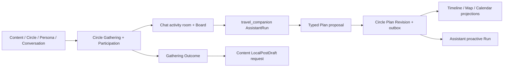

# L1 Design：Gathering 共同旅行体验 (`travel-journey`)

> 对应规格：[L1 spec](./spec.md)

## 1. 背景与设计目标

- 当前上下文：Circle Gathering 已是活动身份、Participation、准入、会话与 Outcome 的唯一 owner；travel-service 的进程、contracts、generated client、App DI、旧页面/路由/Surface 与 Skill 绑定均已删除。仓内迁移控制面已定义 target-only crosswalk 与 receipt 协议，但四环境真实历史数据迁移尚未准出。
- 设计要解决的问题：在生产主链静态退役且源服务永不恢复的前提下，把旅行体验完整装配为 Gathering 上的 Plan、Map、Calendar、Experience 组合，并以真实环境 receipt 完成历史数据 target-only 收敛；Assistant、Chat、Content 与 Integration 只消费目标 owner 公开事实。
- 非设计目标：预订支付、导游交易、连续位置跟踪、复制内容、长期保留 Trip 公共根或构建第二套地点知识库。

## 2. 领域模型与所有权

- 目标活动根：Circle 的 `Gathering`，拥有 Host、root-owned Participation、准入、room binding、lifecycle、Outcome 与可选 Plan reference。
- 目标可选能力：Circle-owned Plan/Revision/item，Map/Timeline projection，Device/User Calendar capability，Experience/Content reference；均不复制活动身份、成员或会话。
- 历史 crosswalk：legacy `TripPlan`、Revision、Membership、Moment、Placement、ShareSnapshot、Template、GuideAssignment 只允许存在于脱敏迁移输入、确定性映射与签名 receipt 中，生产运行时没有源 Reader、Writer、route 或 fallback；环境 receipt 缺失时保持迁移 OPEN。
- 不属于旅行体验的对象：Chat 的 Conversation/Membership/Message/Announcement/AssetIndex，Content 的 Post/Media/LocalPostDraft/Report，User 的 Persona/Follow，Assistant 的 Skill/Run，Integration 的 Connector/Provider。

## 3. 上下文边界与协作

- 同步边界：读取 owner 公开 Reader；写入只由 Circle/Chat/Content/Integration 等目标 owner command 完成。迁移 importer 同样不得直写派生投影。
- 异步边界：Plan Revision、Experience 与 Outcome event 进入 owner durable outbox，由 Assistant trigger、Chat Board、Content draft 和观测消费者幂等处理。
- 一致性边界：Gathering/Participation/lifecycle/Outcome 与 Circle outbox 同属 owner；Plan current Revision 与 item 原子推进，跨域投影携带 source version。
- 权限边界：Gathering Organizer 可确认计划结构，Participant 按政策提议或追加 Experience；公开分享先服务端隐私裁剪，共同参与不自动赋予 Follow/mutual。

## 4. 架构与数据流

Assistant 只能形成提案、解释与 Presentation；Circle 的 Gathering/Plan owner 决定活动与计划事实。Timeline/Map/Calendar 只投影 canonical reference，媒体、内容和地点详情按需从 owner Reader 读取。legacy travel-service 不参与目标运行链。

## 5. 关键决策

### DEC-001 旅行以 Gathering + optional capabilities 组合
- 决策：Gathering 是唯一活动根；当前旅行计划由 Circle-owned Plan 指向不可变 Revision，Map/Timeline/Calendar/Experience 通过 canonical reference 挂接。Chat Message、Assistant artifact 与 Content 不复制活动或计划。
- 理由：多人并发、主动提醒、回看、分享需要稳定 Revision，但成员、会话、取消和 Outcome 已由 Gathering 解决；继续保留 Trip 根只会复制这些不变量。
- 被否决方案：Trip/Gathering 双根、单份可变行程 JSON、Chat Message 作为当前计划、Assistant 保存 Trip 副本、跨域数据库 join/直写。
- 约束与影响：所有更新要求 expected revision 和幂等键，事件包含 source revision 且不包含隐私正文，投影可重建；可选能力 unavailable 不改变 Gathering。
- 关联要求：`REQ-001`、`REQ-002`
- 关联能力：[`collaborative-trip-lifecycle`](./collaborative-trip-lifecycle/spec.md)

### DEC-002 travel-service 生产主链永久退役，历史数据按逐对象 target-only 流迁移

- 决策：travel-service 的生产源码、契约、生成链消费与运行拓扑永久退役；legacy 对象只能通过确定性映射、ID crosswalk、目标 owner command/import seam 与 parity receipt 进入 Circle/Chat/Content/Integration 目标。静态退役与四环境数据迁移分别准出，任一未完成都不得恢复源服务。
- 理由：双读/双写无法为成员、Revision、Placement 和隐私裁剪建立单一答案，也会让回滚继续向旧根写入新增量。
- 被否决方案：长期兼容 shim、按请求 fallback travel-service、源目标双写、用空数据跳过 receipt、切流失败后恢复源写。
- 约束与影响：四环境签名 receipt 分别证明 source inventory、count/digest/orphan/collision、privacy trimming、target readback、parity 与切流结果；本地合成快照只验证协议，不构成环境完成证据。任何审计不一致阻断后续目标数据发布，但不得恢复源进程、contract、App 入口或写入。运行回滚只允许上一目标应用/config 或目标数据快照。
- 关联要求：`REQ-003`
- 迁移能力：[`collaborative-trip-lifecycle`](./collaborative-trip-lifecycle/spec.md)

## 6. 质量与运行约束

- 指标至少覆盖旅行 Gathering 的 Plan 启用/完成时间、revision 冲突/采纳、提醒去重、Experience 归档、Board/地图投影延迟、Calendar unavailable、分享隐私拒绝与回顾生成/发布；历史迁移 receipt 的 count/digest/orphan/collision 仅作为审计完整性证据。
- Gathering/Participant/Place 等 ID 只作为受控属性或 trace link，不进入高基数 label；公开结果与日志不得含敏感住宿、参与名单或精确实时位置。
- 变更事件、投影和跨域 command 采用 outbox/inbox、source version、幂等键和可重放 receipt。
- 体验 SLO 继承 Gathering room/board 主线：Board freshness P95 不超过 60 秒；Plan commit 成功率 30 天不低于 99.9%。
- 迁移 SLO：每个环境 parity 必须 100%，orphan/collision 为零；无真实 inventory/receipt 时状态为 GATE_BLOCK。
- Plan/Experience 写入 100% 审计，普通投影 trace 按受治理策略采样；10 分钟窗口 Plan 成功率低于 99% 或 Board lag 超过 60 秒告警。历史 receipt parity 不一致时阻断新的目标数据发布并人工核验，不存在恢复源服务的切流动作。
- Plan/Map/Calendar/Experience 分别由受治理 feature flag 控制；Circle 值班负责人是体验 rollback owner，Chat/Content/Integration 负责各自子链。不存在 travel cutover 开关或源服务恢复开关。

## 7. 失败与恢复

- 失败类型：Plan revision 冲突、Organizer 权限拒绝、引用失效、Connector/Provider unavailable、隐私裁剪失败、投影延迟或历史 receipt 审计不一致。
- 用户或调用方可见结果：Gathering 与 current Plan Revision 保持不变，并返回冲突 diff、刷新、重新确认、结构化 unavailable 或稍后重试动作。
- 恢复动作：从 canonical Gathering/Plan/event 重放投影或续接 AssistantRun；历史 receipt 审计不一致只暂停新的目标数据发布并进入人工核验，不影响已切流运行，也不从 App cache/聊天摘要回写。
- 不允许的 fallback：覆盖 current Revision、复制 Participation/Post/Media、手工 seed 投影、把未执行提案标为完成、双读 travel-service 或恢复源写。
