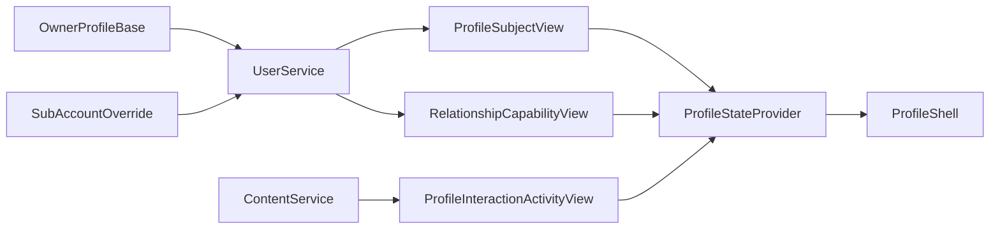

# Owner/SubAccount 一体化个人主页统一改版 — 设计方案

## 设计动因

本 Story 不是单纯的 UI 重绘，而是一次“领域模型收口 + metadata/codegen 收口 + 主页 UI 收口”的设计基线：

- 产品侧已经明确 `OwnerAccount / SubAccount` 双层身份模型，但个人主页仍在 `owner / persona / subAccount / public profile` 多套话语中摇摆。
- 用户主页当前同时跑着 `ProfileShell` 与 `AuthorProfile` 两套实现，滚动、拉伸、按钮矩阵、Tab IA 和互动分类互相打架。
- metadata 已经出现“公开主页、关系能力、互动流”多套半成品契约，App 又在这些半成品之外手写 DTO 和文案，导致端云难以同步。

本设计的核心目标是：先冻结“谁是主页主体、谁拥有哪些字段、谁负责哪些接口、哪些兼容路径暂时保留”，然后再进入 `/dev`。

## 上游输入评审

| 输入 | 结论 |
|------|------|
| L1 `user-identity-profile-relationship/spec.md` | 已冻结 `OwnerAccount` 不是应用世界默认主体，社交/内容/关系默认归属于 `SubAccount` |
| L2 `profile-homepage-redesign/spec.md` | 提供了“统一 ProfileShell”的方向，但 IA 仍停留在 4 Tab 和旧互动流，不可直接进入开发 |
| 现有 `profile-commercial-readiness` Story | 已归档且与新需求冲突，不能继续作为本次真相源 |
| 当前 `contracts/metadata/user/user_profile/*` | 已有 owner/subAccount 基础实体，但缺稳定的主页主体视图、同步写契约、背景图字段 |
| 当前 `contracts/metadata/user/follow_edge/*` | 有 `GetRelationshipCapability` 路由描述，但没有正式的 response entity |
| 当前 `contracts/metadata/content/post/*` | 已有评论、点赞、转发基础操作，但缺统一的个人主页互动活动读契约 |

结论：

- `/design` 可以进入，但必须新建独立 L3 story，不可继续复用已漂移的旧 Story。
- 进入 `/dev` 前需要先裁决 3 个问题：主页主体模型、互动流职责归属、兼容路径边界。

## 对标输入分析

### 对外对标

| 对标对象 | 吸收点 | 本次结论 |
|----------|--------|---------|
| 抖音 / 小红书个人主页 | 头像侵入头图、一级吸顶、二级胶囊筛选、简洁动作区 | 吸收为 UI 规格 |
| 多身份产品中的“主身份 + 分身” | 分身默认继承主身份、允许局部覆写 | 吸收为资料模型 |
| 通用社交产品的互动页 | 点赞/评论/转发是内容域行为，不宜长期堆进用户域 | 吸收为服务边界 |

### 内部对标

| 文档 / 组件 | 可复用点 |
|-------------|---------|
| `user-service-cloud-delivery/design.md` | user-service 的 DDD 分层、契约测试和部署约束 |
| `comment-thread/design.md` | 个人主页评论流、分页、弱网和身份展示策略 |
| `CenteredScrollableTabBar` | 一级 Tab 选中态、字号、下划线和滚动居中语义 |
| `SecondaryCapsuleTabBar` | 二级胶囊的左对齐、胶囊边框和填充语义 |

## 方案对比

### 方案 A：在 user-service 新增物化 `PublicProfile` 聚合，并把互动流也聚合到 user-service

**核心思路**

- 新增独立 `PublicProfile` 实体，owner 和 subAccount 都映射到这个实体。
- user-service 对外暴露“单一主页 API”，内部再聚合关系能力和内容互动。

**优点**

- 客户端调用最简单，单接口即可拿到大部分主页数据。
- `ProfileShell` 更容易一次拿齐首屏数据。

**缺点**

- 引入第三套实体语义，和“没有单独公开主页实体”的产品口径冲突。
- user-service 会越界承担内容互动聚合，和当前 DDD 边界不一致。
- 需要更重的数据迁移与长期双写。

### 方案 B：以 user-service 提供 `ProfileSubjectView`，content-service 继续拥有互动活动读契约，由 App 侧直接编排

**核心思路**

- `owner` 与 `subAccount` 统一抽象为 `ProfileSubject`。
- user-service 提供主页主体视图、继承状态、关系能力和资料同步写入。
- content-service 提供个人主页互动活动读接口。
- App 在 provider 层直接组合两个服务返回。

**优点**

- 和产品模型一致，不需要引入额外 public profile 实体。
- 领域边界清晰：用户域管主体和关系，内容域管互动。
- 迁移成本较低，现有 `GetSubAccountProfile`、评论流都能平滑演进。

**缺点**

- 端侧需要编排多个请求。
- provider 复杂度上升。

### 方案 C：采用方案 B 的服务边界，但在 App 侧新增 `ProfileHomepageRepository` 统一编排

**核心思路**

- 端云边界与方案 B 相同。
- App 不让 UI 直接分别感知 user/content repository，而是由一个新的主页门面仓储统一编排。

**优点**

- 保持服务边界清晰，同时降低 UI 层复杂度。
- 更利于 `ProfileShell` 统一化和后续测试。

**缺点**

- 增加一个新的 App 侧 orchestrator，需要同步 provider 设计。
- 如果定义过厚，可能重复 user/content repository 的职责。

## 选型决策

**选定方案：方案 C**

决策理由：

1. 它保留了方案 B 的正确领域边界，不引入新的“公开主页实体”。
2. 它比方案 B 更利于端侧统一收口，让 `ProfileShell` 只消费明确的主页视图状态，而不是同时理解多个 repository。
3. 它比方案 A 的迁移和回滚成本低很多，不需要新增长期双写的物化聚合。

## 关键设计决策

### KD1: 统一术语与兼容口径

- 产品与设计语义统一使用 `OwnerAccount / SubAccount / ProfileSubject`。
- metadata 和代码中已有的 `Persona` 视为 `SubAccount` 的记录命名兼容层。
- 本 Story 不做全仓 `Persona -> SubAccount` 命名大迁移，但新建视图、字段、任务和文档一律使用 `SubAccount` 语义。
- 兼容退出条件：
  - 端侧不再直接消费 `PersonaDto` 作为主页首屏 DTO。
  - user-service 的新读写链路稳定后，再单开 Story 收缩兼容路由与命名。

### KD2: 主页主体读模型

用户域新增统一主页主体视图，作为首屏和编辑回写后的唯一读真相源。

建议在 [quwoquan_service/contracts/metadata/user/user_profile/fields.yaml](quwoquan_service/contracts/metadata/user/user_profile/fields.yaml) 中新增：

- `ProfileSubjectView`
- `ProfileInheritanceStateView`
- `ProfileSubjectMutation`

`ProfileSubjectView` 字段建议至少包括：

- `profileSubjectId`
- `ownerUserId`
- `subjectType`：`owner | sub_account`
- `subAccountId`
- `username`
- `displayName`
- `avatarUrl`
- `backgroundUrl`
- `bio`
- `followerCount`
- `followingCount`
- `postCount`
- `circleCount`
- `likeCount`
- `profileVisibility`
- `inheritanceState`

设计取舍：

- 不把公开主页挂回 `Persona`，因为它已经不足以承载背景图、继承状态和统计字段。
- `UserProfile` 仍保留 owner 管理视角；`ProfileSubjectView` 才是主页 UI 视角。

### KD3: 资料写入与同步契约

继续复用现有 owner 和 subAccount 的写入入口，但统一 request entity：

- [quwoquan_service/contracts/metadata/user/user_profile/service.yaml](quwoquan_service/contracts/metadata/user/user_profile/service.yaml)
  - `UpdateUserProfile`
  - `UpdateSubAccount`

两条写入链都改为消费 `ProfileSubjectMutation`，新增字段建议：

- `displayName`
- `avatarUrl`
- `backgroundUrl`
- `bio`
- `applyScope`
- `syncTargetIds`
- `fieldsMask`

`applyScope` 建议枚举：

- `current_subject_only`
- `owner_only`
- `all_sub_accounts`
- `selected_subjects`

这样可以直接承接“是否同步给 owner / 其它分身”的交互，不把同步范围藏在 UI 逻辑里。

### KD4: 继承/覆写模型

不采用“为每个主体都落一份完全独立的 public profile 副本”，而是采用：

- owner 保持资料基线。
- subAccount 只记录 override 字段。
- 读模型 `ProfileSubjectView` 在 user-service 侧完成 owner 基线 + subAccount override 的合成。

为此新增 `ProfileInheritanceStateView`，建议字段：

- `inheritsFromOwner`
- `overriddenFields`
- `lastSyncSource`
- `lastSyncAt`

这样既满足“默认继承”，又不需要长期物化双写。

### KD5: 关系能力视图

在 [quwoquan_service/contracts/metadata/user/follow_edge/service.yaml](quwoquan_service/contracts/metadata/user/follow_edge/service.yaml) 中，给 `GetRelationshipCapability` 增加正式 `response_entity`。

在对应 fields 定义中新增 `RelationshipCapabilityView`，建议字段：

- `viewerProfileSubjectId`
- `targetProfileSubjectId`
- `relationState`
- `canFollow`
- `canUnfollow`
- `canMessage`
- `canFollowBack`
- `canStartVoiceCall`
- `canStartVideoCall`
- `isBlocked`
- `isBlockedBy`

`relationState` 建议枚举值：

- `self`
- `not_following`
- `following`
- `followed_by`
- `mutual`

这是这次主页按钮矩阵的直接来源。现有 `_shared/types.yaml` 里的 `RelationTier` 可保留兼容，但本 Story 的 UI 不再依赖 `same_interest / close_friend`。

### KD6: 互动活动读契约

互动活动明确归内容域，不继续堆入 user-service。

在 [quwoquan_service/contracts/metadata/content/post/service.yaml](quwoquan_service/contracts/metadata/content/post/service.yaml) 中新增：

- `ListProfileInteractionActivitiesReceived`
- `ListProfileInteractionActivitiesSent`

建议 path 形态：

- `GET /v1/content/profile-subjects/{profileSubjectId}/interactions/received`
- `GET /v1/content/profile-subjects/{profileSubjectId}/interactions/sent`

新增 `ProfileInteractionActivityView`，字段建议：

- `activityId`
- `activityType`：`like | comment | share`
- `direction`：`received | sent`
- `actorProfileSubjectId`
- `actorDisplayName`
- `actorAvatarUrl`
- `targetProfileSubjectId`
- `targetContentId`
- `targetContentType`
- `targetContentSummary`
- `createdAt`

取舍：

- 本 Story 明确去掉 `favorite`，不再让主页互动流继续消费 `favorite`。
- 评论详情仍可复用已有 comment-thread 能力；这里只做主页活动流视图。

### KD7: 个人主页 UI 配置归属

现有 [quwoquan_service/contracts/metadata/content/post/ui_config.yaml](quwoquan_service/contracts/metadata/content/post/ui_config.yaml) 已经混入 `profile_tabs`，但它属于用户主页 IA，不应继续挂在内容域。

本 Story 设计为：

- 内容身份筛选和作品格式筛选继续留在内容域 `ui_config.yaml`。
- 个人主页的一级/二级 Tab、互动过滤和 route/surface 信息迁移到新的用户域 UI 配置文件：
  - `quwoquan_service/contracts/metadata/user/user_profile/ui_config.yaml`

建议结构：

- `route_id: userProfile`
- `surface_id: userProfileHome`
- `tabs: creations | circles | interaction`
- `creation_filters: all | micro | image | video | article`
- `interaction_filters: like | comment | share`
- `interaction_direction: mine(received,sent) / other(received)`

### KD8: route / request_context / codegen 常量

需要同步修改：

- [quwoquan_service/contracts/metadata/_shared/app_routes.yaml](quwoquan_service/contracts/metadata/_shared/app_routes.yaml)
- [quwoquan_service/contracts/metadata/_shared/request_context.yaml](quwoquan_service/contracts/metadata/_shared/request_context.yaml)

要求：

- 继续保留 `userProfile -> /user/{username}`。
- 新增或补齐以下 operation 的 page id：
  - `GetSubAccountProfile`
  - `GetMeProfile`
  - `GetRelationshipCapability`
  - `ListProfileInteractionActivitiesReceived`
  - `ListProfileInteractionActivitiesSent`

App 侧预期受影响生成物：

- `quwoquan_app/lib/cloud/runtime/generated/user/user_api_metadata.g.dart`
- `quwoquan_app/lib/cloud/runtime/generated/user/user_request_page_ids.g.dart`
- `quwoquan_app/lib/cloud/runtime/generated/user/user_profile_dto.g.dart`
- `quwoquan_app/lib/cloud/runtime/generated/user/persona_dto.g.dart`
- `quwoquan_app/lib/cloud/runtime/generated/content/...`
- 用户域新的 UI config 生成物，文件名以 codegen 实际产物为准

### KD9: App 侧编排边界

App 侧新增一个轻量主页门面编排层，推荐命名：

- `ProfileHomepageRepository` 或在 `profile_state_provider.dart` 内部完成等价编排

它统一组合：

- user-service 的 `ProfileSubjectView`
- user-service 的 `RelationshipCapabilityView`
- content-service 的 `ProfileInteractionActivityView`

UI 层只消费明确的 view model，不直接拼接来自多个 repository 的 raw map。

### KD10: UI 冻结口径

在此 Story 内，以下 UI 规格视为已冻结：

- 一级 Tab：`创作 | 圈子 | 互动`
- 创作二级 Tab：`全部 | 微趣 | 图片 | 视频 | 文字`
- 互动二级 Tab：`赞 | 评论 | 转发`
- 我的主页方向切换：`收到 | 发出`
- 他人主页：仅公开 `收到`
- 一级 Tab 对齐 `CenteredScrollableTabBar`
- 二级 Tab 对齐 `SecondaryCapsuleTabBar`
- 背景图默认高度为屏幕高 `1/4`
- 背景图最大拉伸高度为屏幕高 `1/3`
- 头像侵入背景 `1/3`，其余 `2/3` 落在资料区
- 下拉时拉伸作用于完整 profile 头部，不允许只缩背景
- 上滑时背景、头像、名字、资料区、一级 Tab 与列表整体上卷
- 设置与编辑入口都在统一壳层下重新布局

### KD11: 滚动与吸顶架构

为避免继续出现“背景在动、资料区不动、列表单独被拉走”的结构性错误，个人主页必须建立在**单一主滚动坐标系**上，而不是多个彼此独立的 scroll view / offset 拼接。

设计拆分为三个视觉层，但三者受同一个主滚动驱动：

- `BackgroundLayer`：仅负责背景图绘制、受控拉伸与回弹
- `ProfileSummaryLayer`：负责头像、名字、简介、统计与动作区，并始终锚定背景图底边
- `PrimaryTabLayer`：一级 Tab 在 inline 态属于头部，在 pinned 态固定到工具栏下方

明确不进入壳层吸顶体系的元素：

- 创作二级 Tab
- 互动二级 Tab
- 互动方向切换 `收到 | 发出`

这些元素必须留在各一级 Tab 的内容树中，随内容滚动并在回滑时自然回显，不做伪吸顶。

### KD12: 交互动效状态机

为保证实现可验证，滚动行为冻结为以下状态机：

#### KD12.1 下拉拉伸状态

- `resting`：背景图高度 = `screenHeight * 0.25`
- `stretching`：背景图高度在 `0.25 ~ 0.333` 区间内受控拉伸
- `rebounding`：手势结束后统一回弹到 `resting`

约束：

- 资料区顶部必须始终贴合背景图底边
- 一级 Tab 与当前列表起始位置必须跟随头部整体下移
- 不允许只移动一级 Tab 下的列表内容

#### KD12.2 上滑收拢状态

- `expanded`：大头像、大标题、完整资料区可见
- `identity_pinned`：当头像底部越过顶部工具栏阈值时，工具栏显示小头像 + 用户名
- `primary_tab_pinned`：当一级 Tab 到达顶部工具栏下沿时，一级 Tab 固定在工具栏下方

阈值语义冻结如下：

- `compact_identity_threshold`：头像底部划过工具栏下沿
- `primary_tab_pin_threshold`：一级 Tab 顶部抵达工具栏下沿

状态优先级：

1. 先进入 `identity_pinned`
2. 再进入 `primary_tab_pinned`
3. 回滑时按相反顺序退出

## metadata / codegen 方案

### 用户域

需要修改：

- [quwoquan_service/contracts/metadata/user/user_profile/fields.yaml](quwoquan_service/contracts/metadata/user/user_profile/fields.yaml)
- [quwoquan_service/contracts/metadata/user/user_profile/service.yaml](quwoquan_service/contracts/metadata/user/user_profile/service.yaml)
- [quwoquan_service/contracts/metadata/user/user_profile/errors.yaml](quwoquan_service/contracts/metadata/user/user_profile/errors.yaml)
- `quwoquan_service/contracts/metadata/user/user_profile/ui_config.yaml`（新建）
- [quwoquan_service/contracts/metadata/user/follow_edge/service.yaml](quwoquan_service/contracts/metadata/user/follow_edge/service.yaml)
- `quwoquan_service/contracts/metadata/user/follow_edge/fields.yaml` 或等价字段定义文件
- `quwoquan_service/contracts/metadata/user/follow_edge/errors.yaml`

其中 `user_profile/ui_config.yaml` 不仅承载一级/二级 Tab 与方向过滤，还需要正式承载头部几何与滚动配置真相源，建议最少包括：

- `header_layout.base_height_ratio = 0.25`
- `header_layout.max_stretch_height_ratio = 0.333`
- `header_layout.avatar_overlap_ratio = 0.333`
- `scroll_motion.compact_identity_bar = true`
- `scroll_motion.primary_tab_sticky_below_toolbar = true`
- `scroll_motion.secondary_tab_inline_scroll = true`
- `scroll_motion.rebound_curve` / `scroll_motion.collapse_curve`

### 内容域

需要修改：

- [quwoquan_service/contracts/metadata/content/post/service.yaml](quwoquan_service/contracts/metadata/content/post/service.yaml)
- [quwoquan_service/contracts/metadata/content/post/fields.yaml](quwoquan_service/contracts/metadata/content/post/fields.yaml)
- [quwoquan_service/contracts/metadata/content/post/errors.yaml](quwoquan_service/contracts/metadata/content/post/errors.yaml)
- [quwoquan_service/contracts/metadata/content/post/ui_config.yaml](quwoquan_service/contracts/metadata/content/post/ui_config.yaml)

### 共享层

需要修改：

- [quwoquan_service/contracts/metadata/_shared/app_routes.yaml](quwoquan_service/contracts/metadata/_shared/app_routes.yaml)
- [quwoquan_service/contracts/metadata/_shared/request_context.yaml](quwoquan_service/contracts/metadata/_shared/request_context.yaml)
- [quwoquan_service/contracts/metadata/_shared/types.yaml](quwoquan_service/contracts/metadata/_shared/types.yaml)

建议新增枚举：

- `ProfileSubjectType`
- `ProfileRelationState`
- `ProfileInteractionActivityType`
- `ProfileSyncApplyScope`

codegen 产物需要让 App 侧可以直接消费以下配置常量，而不是在 `ProfileShell` 中硬编码：

- 头图默认高度比例
- 头图最大拉伸比例
- 头像侵入比例
- 一级 Tab 吸顶策略
- 二级 Tab inline scroll 策略

### 错误码与解码口径

本 Story 新增的资料同步、关系能力、互动活动接口不能退化为代码内硬编码错误码或临时解析分支，必须同步冻结 metadata 与解码规则。

需要补齐的错误码 metadata：

- `user_profile/errors.yaml`：资料同步范围非法、同步目标为空、目标主体不存在、继承冲突、同步写入失败
- `follow_edge/errors.yaml`：关系能力不可达、被拉黑、目标不可见、通话门禁不满足
- `content/post/errors.yaml`：互动活动方向非法、主体不可见、活动查询不可用

解码与消费要求：

- 新接口的 `response_entity`、page id、错误码枚举必须由 codegen 产物提供，不允许 App Repository 手写 code 字符串
- 若存在 decoder context 或等价响应上下文常量，必须在 metadata/codegen 中产出，并在 App 侧以常量消费
- `ProfileShell`、`ProfileStateProvider`、`user_profile_repository.dart`、`relationship_capability_repository.dart` 不得再新增临时 map key 解析分支来弥补契约缺失

## 字段演进、迁移/回填与兼容

### 字段演进

- `Persona` 新增 `backgroundUrl` 以及继承/覆写相关字段。
- `UserProfile` 保持 owner 基线字段，不直接承担对外主页首屏读模型。
- 新增 `ProfileSubjectView` 作为读模型，新增 `ProfileSubjectMutation` 作为写模型。

### 迁移 / 回填

- 对已有 subAccount：
  - 默认 `inheritsFromOwner = true`
  - `overriddenFields = []`
- 若当前已有 subAccount 在业务侧已独立维护 `displayName/avatar/bio`，则在回填阶段把这些字段标记为 override。
- `backgroundUrl` 若记录为空，允许回填为 owner 基线或保持空值，不阻塞上线。

### 双读 / 双写

- **读路径**：新 UI 优先消费 `GetMeProfile / GetSubAccountProfile -> ProfileSubjectView`。
- **兼容读路径**：保留旧 `GetUserProfile` 供记录页面或未迁移链路使用。
- **写路径**：不做长期双写 public profile 实体；只保留 owner/subAccount 原始实体写入，并由读模型合成。

## feature flag、观测、SLO 验证与回滚

### feature flag

建议新增：

- `profile_subject_view_enabled`
- `profile_sync_prompt_enabled`
- `profile_interaction_v2_enabled`
- `profile_shell_unified_enabled`
- `profile_motion_v2_enabled`

### 观测

核心指标：

- `profile_subject_read_latency_ms`
- `profile_subject_read_error_total`
- `profile_sync_apply_total`
- `profile_sync_apply_error_total`
- `profile_interaction_query_latency_ms`
- `profile_interaction_query_empty_total`
- `profile_header_stretch_depth_px`
- `profile_identity_pin_enter_total`
- `profile_primary_tab_pin_enter_total`

关键日志：

- 读模型命中的是 `owner` 还是 `subAccount`
- 写入时用户选择的 `applyScope`
- 同步目标数量
- 互动活动查询方向与类型
- 进入 compact identity bar 的阈值与时机
- 一级 Tab 进入 pinned 态的时机

### SLO 验证

- 主页首屏主体读接口 p95 < 800ms（integration）
- 互动活动查询 p95 < 1200ms（integration）
- 资料编辑提交到同步决策完成 p95 < 1500ms（integration）
- 统一 `ProfileShell` 首屏可交互渲染 < 2s（T4 近真机）

### 回滚

按开关回滚，不依赖数据库回滚：

1. 关闭 `profile_shell_unified_enabled`，回退到旧 UI 入口。
2. 关闭 `profile_interaction_v2_enabled`，回退到旧互动流或空态。
3. 关闭 `profile_subject_view_enabled`，回退到旧 `GetUserProfile` 兼容读链路。
4. 关闭 `profile_motion_v2_enabled`，回退到静态头部与旧滚动结构。

## TDD / ATDD 策略

| 验收项 | 测试层 | 策略 |
|--------|--------|------|
| A1 | T1, T3 | metadata schema 校验 + user-service 读接口契约测试 |
| A2 | T1, T2, T3, T4 | 写契约字段校验 + 端侧同步提示 + 端云写入回归 + 真机关键旅程 |
| A3 | T1, T2, T3 | 关系能力视图 schema、按钮矩阵 widget、关系接口契约 |
| A4 | T1, T2, T3 | 互动活动枚举和列表 schema、互动 tab widget、content-service 接口契约 |
| A5 | T1, T2 | route/request_context/ui_config 生成物校验 + UI 常量消费验证 |
| A6 | T1, T3 | verify/codegen/codegen-app 与服务契约回归 |
| A7 | T2, T4 | 初始几何、头像侵入比例、一级/二级 Tab 结构与视觉一致性验证 |
| A8 | T1, T2, T4 | 单主滚动坐标系、下拉拉伸、双阶段吸顶、二级 Tab 回显、feature flag 与回滚验证 |

## Task 与 T1~T4 证据矩阵映射

| Task 组 | 主要任务 | 对应验收 | 测试层 |
|---------|----------|----------|--------|
| G1 | 用户域 metadata 收口 | A1, A2, A5 | T1, T3 |
| G2 | 关系能力与枚举收口 | A3 | T1, T2, T3 |
| G3 | 内容域互动活动契约 | A4 | T1, T2, T3 |
| G4 | codegen 基线与生成物接入 | A5, A6 | T1, T3 |
| G5 | user/content service 业务实现 | A1, A2, A3, A4 | T3 |
| G6 | App repository/provider 收口 | A5, A6 | T2, T3 |
| G7 | ProfileShell UI 统一 | A7, A8 | T2, T4 |
| G8 | 端到端旅程与回滚演练 | A2, A7, A8 | T4 |

## 未来演进

- 完整收缩 `Persona` 记录命名与兼容路由。
- 将 `same_interest / close_friend` 作为独立关系 Story 引入，不再塞回主页基础设计。
- 若后续需要服务端下发主页 IA，可把用户域 `ui_config` 扩展到更完整的 surface 驱动，包括 header motion token 与 sticky threshold。
- 若后续首页、资料页、身份管理页都需要共享同步策略，可抽离 `ProfileSyncCenter` 作为独立 Story。

## 结构图

