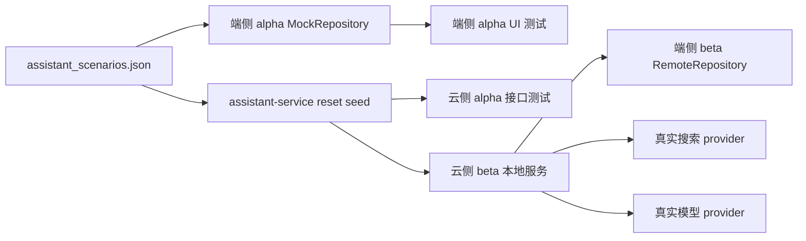

# 助手 Alpha/Beta 真实链路验证规格

## 范围

本规格只覆盖 `assistant-service` 与端侧“找私助”入口。首批场景固定为：

- `stock_sentinel_basic`：股票哨兵。
- `weather_trip_basic`：天气出行。
- `travel_journey_basic`：行程、路况、景点拥堵。

场景输入来自 `quwoquan_service/contracts/metadata/assistant/test_fixtures/scenarios/assistant_scenarios.json`，但该文件在 beta 中只允许提供问题、`seedRefs`、事件与语义断言，不允许提供 canned answer。

## 环境职责

| 环境 | 端侧职责 | 云侧职责 |
|---|---|---|
| 端侧 alpha | `APP_DATA_SOURCE=mock`，使用 `ScenarioMockAssistantRepository` 模拟云端接口 | 不参与端侧 alpha |
| 云侧 alpha | 不参与端侧 alpha | `assistant-service` 自测：reset+seed 到自身 store/cache 后，跑 application/HTTP handler 接口测试 |
| 端侧 beta | `APP_DATA_SOURCE=remote`，通过 gateway 访问本地 `assistant-service` | 提供真实 HTTP/SSE 接口 |
| 云侧 beta | 不允许端侧 mock 或 fake answer | 本地服务启动前 reset+seed，并真实访问模型 provider 与搜索 provider |

## 强制规则

- beta 禁止使用 `ScenarioMockAssistantRepository`。
- beta 禁止使用 `alphaMockStream.finalAnswer` 作为答案来源。
- beta 禁止 `fake_web_search`、`mock_search`、`DeterministicModelProvider` 作为通过条件。
- beta 缺模型配置、搜索配置、provider quota 或云服务不可达时必须失败。
- beta 报告必须包含 run id、turn id、seedRefs、tool calls、search provider、model provider、最终 answer 片段。

## 数据流



## 验收标准

- 端侧 alpha：三类场景通过，且 `APP_DATA_SOURCE=mock`。
- 云侧 alpha：seed 写入自身 store/cache 后，通过 application 与 HTTP handler 测试。
- 端侧 beta：三类场景通过，且 `APP_DATA_SOURCE=remote`。
- 云侧 beta：报告能证明访问真实搜索与模型 provider；不含 `fake_web_search`、`mock_search`、`DeterministicModelProvider`。
- 日志证据：可定位 assistant-service 日志、gateway 日志、run/turn/tool/model/search 证据。

## 执行会话提示

```text
聚焦“助手 Alpha/Beta 真实链路验证”。请基于 assistant_alpha_beta_real_chain_spec.md 实施：alpha 端侧继续用 contract fixture mock 云接口；云侧 alpha 必须 reset+seed 到 assistant-service 自身 store/cache 后测真实接口；beta 端侧必须 RemoteRepository 访问本地 assistant-service，并真实调用模型和搜索 provider。禁止 beta 使用 ScenarioMockAssistantRepository、alphaMockStream、fake_web_search、mock_search 或 DeterministicModelProvider 作为通过条件。完成股票、天气、行程三类端到端验证并输出报告。
```
