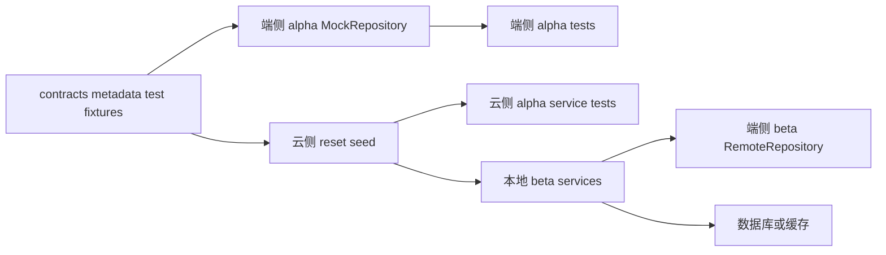

# 业务对象 Alpha/Beta DB Seed 验证规格

## 范围

首批真实 service seed 覆盖以下业务域：

- `content/discovery`：feed、detail、search、reaction 基础读链路。
- `chat`：inbox、conversation detail、messages、members 基础读链路。
- `circle`：list、detail、groups、members、files 基础读链路。

全 App fixture/manifest 覆盖以下业务域：

- `user`：我的主页、作者主页、persona、关系能力、设置。
- `entity`：作者主页、圈子主页、POI/地点主页、认领与选择器。
- `integration`：发布位置 POI。
- `notification`：App 内消息与未读数。
- `rtc`：来电、去电、语音/视频会话与参与人。

过渡期允许 `user/entity/integration/notification/rtc` 先使用本地 beta gateway fixture harness 作为 T3 smoke；正式服务具备本地 HTTP + store 后，必须升级为服务自身 reset+seed。

## 环境职责

| 环境 | 端侧职责 | 云侧职责 |
|---|---|---|
| 端侧 alpha | MockRepository 从 `contracts/metadata/**/test_fixtures` 构建初始数据 | 不访问云服务 |
| 云侧 alpha | 不参与端侧 alpha | 各 service reset+seed 到自身数据库/缓存/测试存储后，跑真实接口测试 |
| 端侧 beta | RemoteRepository 通过本地 gateway/service API 访问云侧 beta | 不允许读取 Dart mock |
| 云侧 beta | 不参与端侧 mock | 本地服务实例启动前 reset+seed 到自身数据库/缓存，并对 App 开放 HTTP API |
| 端侧 gamma | RemoteRepository 访问 gamma gateway | 不允许读取 Dart mock |
| 云侧 gamma | 不参与端侧 mock | 集成环境测试命名空间 reset+seed，并输出 seed report |
| prod/prod-gray | 唯一生产 App 包使用真实数据 | 禁止 test fixture、seedRefs、reset seed、mock 数据源 |

## 强制规则

- contract fixture 是 seed 唯一来源。
- beta 禁止 `Remote*Repository` 委托 `Mock*Repository`。
- beta 禁止从 `ContentMockData`、`ChatMockData`、`CircleMockData`、`PrototypeMockData` 读取业务数据。
- reset/seed 只允许在 alpha/beta/gamma 测试命名空间或测试 harness 中启用，不暴露生产 reset HTTP。
- 服务端报告必须记录 seedRefs、reset 范围、写入数量、目标数据库/缓存。
- `app_alpha_seed_manifest.json`、`app_beta_seed_manifest.json`、`app_gamma_seed_manifest.json` 是测试数据装配入口。
- 人工 beta 必须使用 `app_beta_seed_manifest.json`，不得在脚本或数据库中临时追加业务数据。
- 生产 App 只有一个包，灰度由应用市场分发策略、端侧上下文与云侧灰度策略决定。

## 数据流



## 首批验收链路

| 域 | 云侧 alpha | 端侧 alpha | 云侧 beta | 端侧 beta |
|---|---|---|---|---|
| content | seed posts 到 service store 后测 feed/detail | MockContentRepository fixture seed | 本地 content-service reset+seed | RemoteContentRepository 读 feed/detail |
| chat | seed conversations/messages/members 后测 inbox/messages | MockChatRepository fixture seed | 本地 chat-service reset+seed | RemoteChatRepository 读 inbox/messages |
| circle | seed circles/groups/members/files 后测 list/detail | MockCircleRepository fixture seed | 本地 circle-service reset+seed | RemoteCircleRepository 读 list/detail/groups |
| user/entity/integration/notification/rtc | manifest + fixture contract 校验，逐步升级服务 seed | 端侧 alpha 从 fixture 或 gateway smoke 读取 | 本地 beta gateway fixture harness，后续升级真实服务 reset+seed | Remote smoke 读 fixture API |

## 验收标准

- 端侧 alpha：MockRepository 初始数据来自 contract fixture。
- 云侧 alpha：每个 service 在自身数据库/缓存/测试存储 seed 后，通过接口/contract 测试。
- 端侧 beta：`APP_DATA_SOURCE=remote`，通过真实 HTTP API 获取 fixture seed 数据。
- 云侧 beta：服务日志或报告证明数据写入数据库/缓存；关闭 seed 后测试数据不可见。
- 报告中没有 Dart mock 类名作为数据来源。
- `scripts/verify_app_seed_manifests.py` 通过，证明 manifest 引用的 seedRefs 均存在。
- `scripts/run_app_alpha_beta_seed_matrix.py` 通过，证明 alpha seeded mock 与 beta remote smoke 使用同一套 fixture。

## 执行会话提示

```text
聚焦“业务对象 Alpha/Beta DB Seed 验证”。请基于 business_alpha_beta_db_seed_spec.md 实施：content/chat/circle 的 contract fixture 是唯一 seed 来源；端侧 alpha 从 fixture 构建 MockRepository；云侧 alpha reset+seed 到自身数据库/缓存后测真实接口；端侧 beta 使用 RemoteRepository 访问本地开放的 content/chat/circle 服务；云侧 beta 启动前 reset+seed，并输出 seedRefs、写入数量和目标存储报告。禁止 beta 读 Dart mock 或 Remote 委托 Mock。
```
