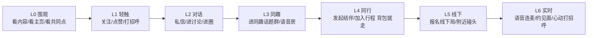
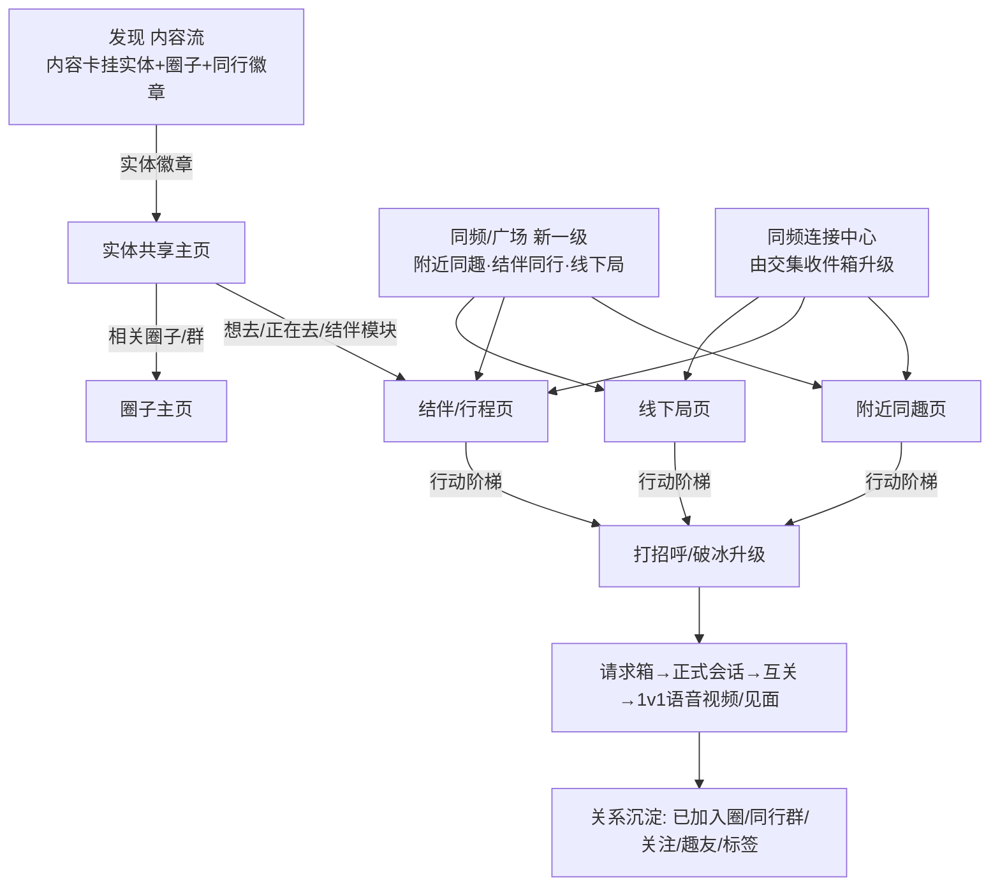

# 交集行动深化与社交信息架构

> 文档类型：产品蓝图 + 社交信息架构定义主文档
>
> 关联主文档：
> - `specs/product/intersection-definition-and-application.md`（交集与影响的定义真相源，本文为其「行动与社交」延伸）
> - `specs/00_PRODUCT_CONCEPT_SYSTEM.md`
> - `specs/00_GLOBAL_TERMINOLOGY.md`
> - `specs/feature-tree/chat-conversation/contact-and-session-governance/spec.md`（关系门禁硬约束 §7）
>
> 契约真相源（本文不复制，只引用）：
> - 交集闭集：`quwoquan_service/contracts/metadata/recommendation/rec_model/intersection_kind_registry.yaml`
> - 端侧 actionKey 常量：`quwoquan_app/lib/cloud/runtime/recommendation/intersection_action_keys.dart`
> - 跨域 Journey：`specs/feature-tree/journey_scenario_registry.yaml#intersection-action-to-companionship`

---

## 1. 文档定位

`intersection-definition-and-application.md` 回答「什么是交集、用户看到哪些交集表达」；**本文回答「看到交集之后能做什么、做到多深、如何安全沉淀成关系」**。

本文是趣我圈「交集行动深化 + 社交信息架构」的定义真相源，回答：

- 交集的「最终行动」有哪些层级，从围观到见面如何分级。
- 内容、实体、位置三条入口如何统一汇聚到「同趣 → 同行 → 线下 → 实时」的行动闭环。
- 关系如何在「只保留关注一个用户动作」的硬约束下，仍提供情感与组织粒度。
- 用户私有「联系人标签」如何定义、管理、应用。
- 信息架构（底栏、同频连接中心、对象页行动区）如何承接这些行动。
- 隐私与风控的默认姿态。

本文不替代：metadata 字段/route/surface/operation 真相源、各 `L1/L2/L3` 设计文档、关系门禁 `contact-and-session-governance` 的契约。

---

## 2. 核心判断（深化的两个空白）

现有交集系统已有充足的 kind 与轻连接行动闭集，但有两个根本局限：

- **时态局限**：`location` 维度只有历史态（`coVisitedEntity` 去过 / `followeeVisited` 关注的人来过），缺**实时态**（此刻在此/附近）与**未来态**（计划同行/都想去）。
- **行动局限**：原 12 个 `actionKey` 全是轻连接（`follow_person / greet_person / message_person / join_circle / open_content / open_route ...`），缺「同行 / 线下 / 实时」重行动。

本蓝图同时补齐这两个空白：补**未来态/实时态 kind**、补**重行动 actionKey**、并把它们组织进统一的行动阶梯与信息架构。

---

## 3. 关系模型（四层分离 · 方案 A）

### 3.1 硬约束精确化

`contact-and-session-governance/spec.md §7` 的硬约束精确化为：**门禁层只认「关注 / 互关 / 拉黑」三类边派生能力位**，禁止新增**参与门禁、产生端云双轨**的关系等级。但**允许**「只读派生称谓（趣友 / 密友）」与「用户私有标签」，二者均**不解锁任何权限**。「想认识 / 心动」实现为带意图的「打招呼」，不是新关系。

### 3.2 四层各管各的

只保留「关注」一个用户动作；分层是系统送的，不是用户要维护的。

| 层 | 名称 | 性质 | 内容 | 是否参与门禁 |
|---|---|---|---|---|
| **L1** | 事实边 | 工程真相源，最小正交 | 关注边 + 拉黑边 + 通讯录边；粉丝 / 我关注的 / 互相关注均由关注边**派生**，不新增持久化等级 | 是（事实输入） |
| **L2** | 门禁能力 | 严守 §7，无双轨 | `canMessage / canCall / canMeetNearby ...` 只由 关注/互关/拉黑 派生；L4+ 重行动再叠加实名/青少年门槛 | 是（唯一门禁来源） |
| **L3** | 系统派生称谓·亲密度 | 只读，不参与门禁 | 趣友 = 互关 + 交集强度 `strength` 达阈值；密友 = 互关 + 互动频率高 或 用户星标。系统自动算、客观省心 | 否（仅 UI 称谓 + 推荐排序） |
| **L4** | 用户私有标签 | 用户可控，对方不可见 | 见 §6 | 否 |

> 关键边界：**L3/L4 永不改变 L2 能解锁的能力**。任何「想见面 / 想认识」都落地为 L1 的「带意图打招呼」，经 L2 门禁与风控，而不是创造新的关系等级。

### 3.3 术语定版

- 人群 / 连接统一用「**同趣**」（替代早期「同好」）；关系称谓用「**趣友**」。
- 与品牌「趣我圈」对齐。
- 代码标识符仍用英文实体名（如 `join_topic_room`、`coPresentHere`），仅用户可见文案改中文。

---

## 4. 交集行动深化模型（7 级阶梯）

交集 = **关系（谁）× 锚点（因为什么）× 时态（何时）× 行动（做什么）**。把「最终行动」按欲望强度分 7 级阶梯（L0 已全有，L3-L6 为本蓝图新增）：

### 4.1 新增 actionKey 闭集

已写入 registry `actionHintLegend` + `actionLabelByKey`，端侧 `intersection_action_keys.dart` 同步常量（详见 §9 复用清单）：

| actionKey | 用户可见文案 | 阶梯 | 备注 |
|---|---|---|---|
| `join_topic_room` | 进同趣群 | L3 | 进同趣话题群 |
| `start_voice_room` | 进语音房 | L3 | 进同趣语音房 |
| `start_companion` | 发起结伴 | L4 | 背包就走 |
| `join_trip` | 加入同行 | L4 | 加入他人行程 |
| `join_meetup` | 报名 | L5 | 报名开放线下局 |
| `meet_nearby` | 附近碰头 | L5 | 默认模糊位置 + 双向同意 |
| `express_interest` | 打个招呼 | L6 | 心动打招呼 = 带意图的 `greet_person` 变体，复用 GreetingRequest，**不新增关系等级** |

> 客户端用 `IntersectionActionKeys.isHeavySocialAction(actionKey)` 标识 L4-L6 重社交行动，用于差异化二次确认 / 实名门槛 / 能力位关闭。

### 4.2 新增交集 kind

写入 registry `kinds`，遵循「先登记后产出」：**无稳定数据源者先 `status: deferred` 占位，禁止产出**。

| kind | 维度 | 时态 | 映射行动 | 状态 | deferred 原因 |
|---|---|---|---|---|---|
| `coPresentHere` | location | 实时 | `meet_nearby / join_meetup / greet_person` | deferred | 需实时位置上报 + 双向同意，当前无稳定实时位置源 |
| `nearbyAffinity` | location | 实时 | `meet_nearby / greet_person / follow_person` | deferred | 需 LBS 在线分布 + 模糊位置策略落地 |
| `coPlannedTrip` | location | 未来 | `start_companion / join_trip` | deferred | 需 trip 对象与「计划出行」数据源 |
| `wantToMeetSameInterest` | intent | — | `express_interest` | deferred | 需「想认识」意图信号源与风控配额 |
| `coWishlistedEntity` | content/intent | 未来 | `start_companion`（约伴入口） | 既有 deferred，本蓝图扩展行动 | 共同想去 → 约伴，待心愿/想去数据源 |

### 4.3 新增 objectKind

写入 registry `objectKinds`：

- `trip`：某人某时段出行意图（区别于已有静态 `route`），`routeId: tripDetail`。
- `meetup`：开放线下局（区别于圈内 `activity`），`routeId: meetupDetail`。

### 4.4 交集 × 时态 × 行动深化矩阵

| 维度 \ 时态 | 历史态 | 实时态（新） | 未来态（新） |
|---|---|---|---|
| **content** | 同看/同赞内容 → 关注/打招呼 | — | 共同想去实体 `coWishlistedEntity` → 发起结伴 |
| **location** | 去过同地 `coVisitedEntity` → 打招呼/进圈 | 此刻同地 `coPresentHere`、附近同趣 `nearbyAffinity` → 附近碰头 | 计划同期出行 `coPlannedTrip` → 加入同行 |
| **interest** | 同兴趣标签 → 进同趣群 | — | — |
| **relationship** | 共同趣友/关注的人去过 `followeeVisited` → 我也去 | 关注的人正在看 `followeeViewing` → 我也看 | — |
| **intent** | — | 想认识同趣 `wantToMeetSameInterest` → 心动打招呼 | — |

---

## 5. 用户旅程图谱（共 7 类 19 条，全部实例化）

**A 内容驱动**
1. 同趣围观 → 关注：刷到游记 → 作者主页「你们都关注 X + 3 共同趣友」→ 关注。
2. 同趣入圈：内容 → 点实体/话题徽章 → 进同趣圈/话题群。
3. 同趣破冰：内容 →「3 个共同趣友」→ 带话题打招呼。

**B 实体驱动（背包就走）**
4. 找搭子同行：内容 → 稻城亚丁实体页 →「5 人下周也去」→ 发起结伴 → 建同行群。
5. 计划匹配：我标「想去稻城」→ 匹配同期想去的人 → 约伴（`coPlannedTrip`）。
6. 线下局：实体页 →「本周拼车/拼住/约拍局」→ 报名 → 进局群。

**C 位置驱动（附近，默认模糊位置）**
7. 附近同趣：同频页 → 附近同兴趣/同圈的人 → 打招呼。
8. 附近同行：附近正去同一目的地的人 → 结伴。
9. 此刻在此：某地点 →「3 个同趣此刻也在」→ 双向同意后碰头（`coPresentHere`）。

**D 人 / 收件箱驱动**
10. 连接中心批量：每天「新增 5 同趣 / 2 同行机会」→ 批量行动。
11. 共同趣友破冰：看某人 →「你们 3 个共同趣友」→ 打招呼。
12. 桥接跟随：关注的人去过/正在看 → 我也去/也看（已有 `followeeVisited / followeeViewing`）。

**E 破冰升级阶梯（贯穿，接现有状态机）**
13. 打招呼 → 回复 → 正式会话 → 互关 → 1v1 语音/视频/线下见面（复用 GreetingRequest + RTC `mutual` 门禁）。

**F 安全与风控（配套，与 positive_plus_controlled 一致）**
14. 反骚扰：打招呼频控 / 请求箱隔离 /「不接收陌生打招呼」开关（已有契约，复用）。
15. 见面安全：线下局/见面前安全提示、行程报备、紧急联系人、举报拉黑。
16. 青少年/实名：青少年模式关闭附近/见面/陌生打招呼；重行动（约见面/附近碰头）需实名门槛。

**G 标签驱动（联系人标签应用）**
17. 按标签建群/约伴：联系人标签视图选「摄影」标签 → 一键拉群或发起约拍局。
18. 按标签分发：发内容/动态时选「稻城同行」标签为可见范围。
19. 标签回流：给多人打「驴友」标签 → 推荐更多趣友/驴友圈/结伴机会（标签回流推荐）。

---

## 6. 联系人标签（L4 用户私有标签）

### 6.1 定义

用户私有、对方不可见、不参与门禁的组织维度。

- **不自动建议、不替用户猜**：系统提供「预定义系统标签集」（metadata 闭集、可运营扩展，如 驴友/摄影/同城/同学/同事/书友/影迷/游戏搭子…），用户打标签时**直接勾选**。
- **自定义页**允许用户自行添加私有标签。
- **管理入口**：消息 → 联系人 tab 内的「标签分组视图」（增删改 / 合并 / 批量 / 查看某标签下的人）。

### 6.2 应用

- 按标签圈人建群 / 约伴。
- 内容分发可见范围（旅程 18）。
- 消息批量置顶 / 免打扰。
- 回流推荐（标签是强信号，旅程 19）。
- 同频连接中心按标签聚合。

### 6.3 边界

- 私有不可见、不解锁权限、metadata-first。
- 与系统兴趣 `tagRef`（标内容/实体）是**不同对象**，但系统标签集可对齐 taxonomy。
- 归属 `user-identity-profile-relationship/persona-follow-graph`（规划 L3 `derived-title-and-contact-label`），与系统 `tagRef` 区分。

---

## 7. 信息架构重构

- **底栏新增一级「同频/广场」**：承接 L4-L6 重行动入口，替换同质化的「精品」二级化。
- **交集收件箱升级为「同频连接中心」**（`IntersectionInboxSummary` + `my_intersection_inbox_page`）：按 tab 分「同趣 / 同行 / 附近 / 局」。
- **对象页交集区**（`object_intersection_section.dart`）从「error/empty 收起的增强位」升级为**常驻行动区**，渲染新 `actionHints`，空态给「发现第一个共同点」引导。

---

## 8. 隐私与风控默认

- **位置**：附近 / 此刻在此默认**模糊位置**（geohash 降精度）；双向同意才精确；位置可一键隐身；不展示精确距离给陌生人。
- **打招呼**：频控 + 请求箱隔离 +「不接收陌生打招呼」开关（复用现有契约）。
- **重行动可见性**：L4+（约见面 / 附近碰头 / 加入行程）对未实名 / 青少年 / 被拉黑用户按能力位关闭。
- **见面安全**：线下局/见面前安全提示、行程报备、紧急联系人、举报拉黑。
- **错误与权限语义统一**：走 `RuntimeFailure` + `RuntimeRecoveryPolicy`，错误码 `MODULE.KIND.REASON` 经 `errors.yaml` codegen，端侧消费结构化失败（遵循 `10-runtime-error-cutover`、`07-error-permission-semantics`）。

---

## 9. 复用清单（复用而非新建，遵循 R24）

| 能力 | 复用对象 | 不新建 |
|---|---|---|
| 破冰升级状态机 | `GreetingRequest`（请求箱 → 正式会话 → 互关） | 不新建第二套打招呼状态机 |
| 风控门禁 | `BlockGate` + 频控 + 「不接收陌生打招呼」 | 不新建第二套反骚扰 |
| 实时通信门禁 | RTC `mutual` 门禁 | 不新建 1v1 语音/视频门禁 |
| 定位与地理编码 | `integration/location` | 不新建 LBS 服务 |
| 收件箱 | `IntersectionInboxSummary` | 不新建第二套连接收件箱 |
| 路线对象 | 已有 `route`（静态线路） | `trip` 仅承载「某人某时段出行意图」 |
| 线下活动 | circle `activity-member-governance`（成员/活动/生命周期） | `meetup` 复用其基座，不新建独立后端服务进程 |
| 群创建 | `start_group_chat`（同行群/局群） | 不新建建群流程 |
| 关系派生 | `persona-follow-graph`（关注/互关/拉黑派生） | 不新建关系等级持久化 |

---

## 10. 特性树归属（已定 · 复用扩展）

> 决策：采用「复用扩展现有领域」，不新建独立后端服务进程（不触部署拓扑），唯一能在不留未实现服务实体的前提下闭环。

- **交集行动阶梯与对象页行动区** → 扩展 `object-homepage-network/intersection-unified-experience`。
- **附近同趣 / 结伴同行 / 线下局** → 挂 `circle-community` 新 L2 `companionship-and-nearby-connection`（规划 L3：`nearby-affinity-discovery` / `companion-trip-formation` / `offline-meetup-gathering`）；附近同趣的发现侧复用 `recommendation-platform` 交集 + `integration/location`。
- **破冰升级 / 风控** → 复用扩展 `chat-conversation/contact-and-session-governance`。
- **派生称谓（趣友/密友）+ 联系人标签** → 扩展 `user-identity-profile-relationship/persona-follow-graph`（规划 L3 `derived-title-and-contact-label`）。
- **跨域 Journey**：`specs/feature-tree/journey_scenario_registry.yaml#intersection-action-to-companionship`（同趣 → 同行 → 线下 → 实时），含 scenario `intersection-action-deepening-on-object` / `companionship-and-nearby-connection` / `contact-label-driven-connection`。

---

## 11. 术语表

| 用户可见 | 代码标识符 | 含义 |
|---|---|---|
| 同趣 | （文案，非标识符） | 因共同兴趣/锚点形成的人群与连接（替代「同好」） |
| 趣友 | 派生称谓（L3） | 互关 + 交集强度达阈值的系统派生称谓，只读不门禁 |
| 密友 | 派生称谓（L3） | 互关 + 高互动频率 或 用户星标，只读不门禁 |
| 联系人标签 | L4 用户私有标签 | 预定义系统标签集 + 自定义，私有不可见、不解锁权限 |
| 进同趣群 | `join_topic_room` | 进同趣话题群 |
| 发起结伴 | `start_companion` | 背包就走，发起结伴 |
| 加入同行 | `join_trip` | 加入他人行程（`trip` 对象） |
| 报名 | `join_meetup` | 报名开放线下局（`meetup` 对象） |
| 附近碰头 | `meet_nearby` | 模糊位置 + 双向同意 |
| 进语音房 | `start_voice_room` | 进同趣语音房 |
| 打个招呼（心动） | `express_interest` | 带意图的打招呼，复用 GreetingRequest |

---

## 12. 落地顺序（metadata-first）

1. ✅ 交集 metadata 闭集扩展（actionKey/objectKind/kind）+ codegen + verify（已完成）。
2. 本蓝图冻结（本文）。
3. registry Journey 草案（已完成）。
4. circle 域 `trip/meetup` 与 user 域联系人标签 metadata 扩展 → codegen → verify。
5. 端侧 IA 壳（底栏 / 同频连接中心 / 对象页行动区）。
6. 端侧新页面（附近同趣 / 结伴 / 线下局）+ Repository 三层 + Provider + Mock fixture。
7. 关系派生称谓 + 联系人标签端云。
8. 风控/合规旅程。
9. 埋点 + 三层测试 + `make gate`。

> 所有 kind/actionKey/objectKind/route/surface/operation/错误码**先改 metadata 再 codegen**，端侧只读分发，不硬编码（遵循 R06 / `08-mock-data-isolation` / `10-runtime-error-cutover`）。
