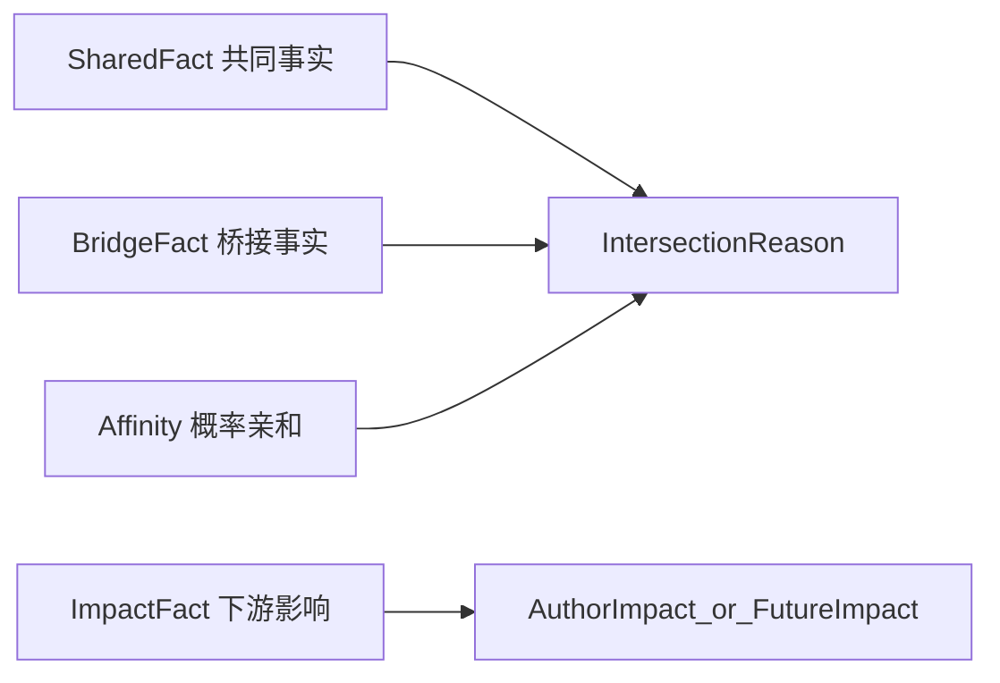

# 交集定义与应用文档

> 文档类型：产品定义 + 契约桥接主文档
>
> 关联主文档：
> - `specs/00_PRODUCT_CONCEPT_SYSTEM.md`
> - `specs/00_GLOBAL_TERMINOLOGY.md`
> - `specs/product/2026H1-positioning-refactor/wp-01-intersection-data-and-expression.md`
>
> 适用范围：
> - `WP-01` 交集事实数据源与表达升级
> - `WP-03` 三对象主页结构统一与影响模块
> - `WP-08` 小趣解释推荐与交集提醒

---

## 1. 文档定位

本文用于定义趣我圈中“交集”与“影响”的完整产品词典、契约承载与应用范围。

它不替代：

- metadata 中的字段、route、surface、operation 真相源
- 各 `WP` 的实施边界与准出要求
- 各 `L1/L2/L3` 的实现设计文档

本文回答的问题是：

- 什么叫交集，什么叫影响，什么只是推荐或亲和力
- 用户真正会看到哪些交集表达
- 每个交集项和影响项分别对应什么证据、什么动作、什么 contract
- 哪些项属于首发 `P0`，哪些属于后续增强 `P1/P2`
- 后续修改 metadata、DTO、seed、UI、小趣时，应以哪套定义为准

一句话说：**本文是趣我圈“交集与影响”的定义真相源，不是某个单页功能说明。**

---

## 2. 交集总定义

### 2.1 交集

`交集` 是我与另一个对象之间，**共同拥有** 或 **由第三方桥接形成** 的、可证、可枚举、可解释、可行动的连接事实。

交集必须同时满足四条件：

1. `可证`：不是模型猜测，必须有真实证据来源。
2. `可枚举`：能下钻到具体点位，而不只是一个总数。
3. `可解释`：用户能理解为什么产生这个交集。
4. `可行动`：看到交集后，能立刻做下一步动作。

任一条件缺失，都不能进入“事实交集”，只能退化为推荐或亲和力。

### 2.2 影响

`影响` 不是交集本身，而是交集被触发、被消费后产生的**可证下游动作**。

影响回答的问题是：

- 因为我，别人发生了什么变化？
- 因为我的内容、我的圈子参与、我的对象绑定，别人建立了什么连接、做出了什么决策、产生了什么传播？

影响必须同样满足：

- 有真实行为证据
- 能枚举来源
- 不下发纯运营指标
- 能解释为“帮助结果”而不是“空热度”

### 2.3 推荐

`推荐` 是系统从交集或影响中，选择“此刻最值得展示”的那一部分，不是事实本身。

推荐可以基于：

- 事实交集的强度、新鲜度、冷却状态
- 概率亲和力的排序分
- 场景上下文（频道、对象页、我的主页）

### 2.4 亲和力

`亲和力` 是当前还不能举证、但模型判断“可能 relevant / 可能合得来”的概率关系。

亲和力：

- 可以推荐
- 不能伪装成事实交集
- 必须与事实分通道展示

---

## 3. 四层模型



### 3.1 共同事实 SharedFact

我和另一个人、内容、圈子、地点或对象，真实共享某个事实。

例子：

- 共同关注的人
- 共同圈子
- 共同收藏
- 同校

### 3.2 桥接事实 BridgeFact

我和对象不一定共享同一个事实，但存在可靠的第三方桥接。

例子：

- 你关注的人正在看
- 你关注的人来过
- 校友在这里
- 你关注的人在这里

### 3.3 影响事实 ImpactFact

因为我，别人产生了新的连接、行动、参与或传播。

例子：

- 12 人收藏了我的内容
- 8 人因为我建立了新连接
- 23 人加入相关圈子

### 3.4 概率亲和 Affinity

只能表达“可能 relevant / 可能合得来 / 推荐认识”，绝不能伪装成共同事实。

---

## 4. 五维闭集

交集的上层维度闭集固定为：

- `identity`
- `location`
- `content`
- `interest`
- `relationship`

这五维是**来源维度**，不是最终用户看到的全部表达。

用户看到的是更具体的母表达和细项；contract 层则用 `dimension + kind/sourceRef` 同时承载。

---

## 5. 关系语言规则

### 5.1 唯一关系概念

趣我圈内唯一社交关系概念是：

- `关注`

允许的派生状态：

- `互相关注`

允许的相关视图或流程词：

- `联系人`
- `打招呼`
- `私信`

### 5.2 禁止项

以下词不得作为结构化关系概念进入产品定义、contract 主命名、标准影响文案：

- `好友`
- `朋友`
- `密友`
- `挚友`
- `同好`

这些词只能出现在：

- UGC 原文
- 非结构化自然语言引用
- 旧 fixture / mock / 测试的迁移兼容阶段

### 5.3 结构化交集的统一关系表达

前台统一使用：

- `共同关注的人`
- `你关注的人在这里`
- `你关注的人来过 / 收藏过 / 正在看`
- `帮助别人建立新连接`

### 5.4 标准名与 legacy alias

为避免一次性打碎存量 fixture / mock / 测试，关系类交集采用双层命名：

#### 标准语义名

- `sharedFollowees`
- `followeeInObject`
- `followeeVisited`
- `followeeFavorited`
- `followeeViewing`

#### legacy alias（迁移兼容，禁止新增扩散）

- `mutualFriend`
- `friendInCircle`
- `friendVisited`
- `friendFavorited`

规则：

- 新规划、新实现优先使用标准名
- 旧名只作为迁移过渡层，不再进入新的产品文案和标准 contract 词表

---

## 6. 七个母表达

七个母表达是用户在首页、我的交集、对象页摘要、内容卡理由位等**紧凑 surfaces** 中看到的一级表达。

它们是：

1. `共同关注的人`
2. `共同圈子`
3. `共同兴趣`
4. `共同地点`
5. `共同校友`
6. `共同收藏`
7. `共同讨论`

### 6.1 母表达不是所有深层证据的总目录

七个母表达的作用是：

- 在首屏、紧凑卡片、spotlight、列表摘要中统一语言
- 帮用户快速理解推荐理由

七个母表达**不要求**覆盖所有深层证据的最细差异。

例如：

- `同公司 / 同团队 / 同行业`
- `共同联系人`
- `共同被关注`

这些可以作为深层对象页证据或下钻条目存在，不强制升级为新的第 8 个母表达。

### 6.2 七个母表达的边界

| 母表达 | 主要维度 | 典型 surfaces | 不是什么 |
|---|---|---|---|
| `共同关注的人` | `relationship` | spotlight、我的交集、他人主页 | 不是“好友关系” |
| `共同圈子` | `relationship/interest` | spotlight、对象页、圈子页 | 不是“都聊过” |
| `共同兴趣` | `interest` | feed 理由位、spotlight | 不是 affinity 猜测 |
| `共同地点` | `location` | 旅行/本地场景、对象页 | 不是“你可能会喜欢这个地方” |
| `共同校友` | `identity` | 校园/职业场景、对象页 | 不等于所有身份类都叫校友 |
| `共同收藏` | `content` | 内容消费、创作者发现 | 不等于“都看过” |
| `共同讨论` | `content/relationship` | 讨论入口、对象页、内容页 | 不等于“共同圈子” |

---

## 7. 交集全量词典

> 以下词典完整保留历史所有维度定义，只在关系语言上做局部修正。

### A. 人与人：共同型事实

#### A1. 共同关注的人

- 母表达：`共同关注的人`
- 标准 kind：`sharedFollowees`
- legacy alias：`mutualFriend`
- 主维度：`relationship`
- 语义：我和 TA 共同关注的第三方用户集合，不是简单互关。
- 用户价值：降低陌生连接风险，增强信任与安全感。
- 创作者价值：让高影响力创作者不只靠粉丝数，而靠真实社交桥接被发现。
- 证据真相源：共同第三方用户 id 集合，可枚举头像与名字。
- 适用 contract：
  - feed / inbox / 推荐：`IntersectionReason + IntersectionPoint`
  - 对象页：`ObjectIntersection + ObjectIntersectionEvidence`
- 动作闭环：
  - 关注
  - 私信
  - 查看这些共同关注的人
  - 进入共同圈子
- 优先级：`P0`

#### A2. 共同被关注

- 母表达：默认不作为一级母表达独立出现；深层证据保留
- 细 kind：`commonFollower`
- 主维度：`relationship`
- 语义：我和 TA 被同一批人关注。
- 用户价值：提示“你们在同一注意力网络中”。
- 创作者价值：帮助发现同赛道创作者或同社群意见节点。
- 证据真相源：共同 follower 集合或数量。
- 适用 contract：`IntersectionReason + IntersectionPoint`，对象页可作为 evidence。
- 动作闭环：
  - 查看共同关注来源
  - 关注 / 互相关注
  - 发起合作或对话
- 优先级：`P1`

#### A3. 共同联系人

- 母表达：默认不作为公开一级母表达；受权限约束
- 细 kind：`commonContact`
- 主维度：`relationship`
- 语义：通讯录或现实联系层面的共同联系人。
- 用户价值：最强现实信任背书。
- 创作者价值：帮助现实关系中的创作者扩散和线下合作。
- 证据真相源：共同联系人映射，必须受权限保护。
- 适用 contract：
  - `IntersectionReason + IntersectionPoint`
  - 需要显式 `visibility/privacyLevel`
- 动作闭环：
  - 打招呼
  - 请共同联系人引荐
  - 查看对应联系人
- 优先级：`P1`

#### A4. 同校 / 同院系 / 同专业 / 同届

- 母表达：`共同校友`
- 细 kind：
  - `sameSchool`
  - `sameDepartment`
  - `sameMajor`
  - `sameCohort`
  - `alumni`
- 主维度：`identity`
- 语义：我和 TA 在教育身份上存在真实共同背景。
- 用户价值：身份锚点极强，特别适合校园与职业迁移场景。
- 创作者价值：帮助垂类创作者建立可信身份带来的扩散力。
- 证据真相源：identity/entity tagRef 或更强 membership 事实。
- 适用 contract：
  - 紧凑 surfaces：可统一归入 `共同校友`
  - 深层证据：通过 `IntersectionPoint.sourceRef` / `sampleText` 区分差异
- 动作闭环：
  - 关注
  - 打招呼
  - 进入校友圈
  - 查看同届讨论
- 优先级：`P0`

#### A5. 同公司 / 同团队 / 同行业

- 母表达：默认不新增第 8 类母表达；在深层 identity 证据中展示
- 细 kind：
  - `sameCompany`
  - `sameTeam`
  - `sameIndustry`
- 主维度：`identity`
- 语义：我和 TA 在职业组织或职业背景上存在共同身份。
- 用户价值：职业协作、内推、共识成本低。
- 创作者价值：专业创作者能更快建立可信行业影响力。
- 证据真相源：organization/entity tagRef、membership。
- 适用 contract：当前挂在 `identity` 维度下，深层 evidence 展示细项。
- 动作闭环：
  - 私信
  - 进入行业圈
  - 查看相关工作内容
- 优先级：`P1`

### B. 人与圈子 / 讨论：共同参与事实

#### B1. 共同圈子

- 母表达：`共同圈子`
- 细 kind：`sharedCircle`
- 主维度：`relationship` 或 `interest`
- 语义：我和 TA 共同加入了同一个圈子。
- 用户价值：代表长期共同兴趣与归属。
- 创作者价值：圈主/活跃创作者可以更可信地被圈内外传播。
- 证据真相源：共同 `circleId` 集合。
- 适用 contract：`IntersectionReason + IntersectionPoint`，对象页可补 `ObjectIntersectionEvidence`。
- 动作闭环：
  - 进入共同圈子
  - 看共同圈内内容
  - 参与共同讨论
- 优先级：`P0`

#### B2. 共同讨论

- 母表达：`共同讨论`
- 细 kind：`sharedDiscussion`
- 主维度：`relationship` / `content`
- 语义：我和 TA 共同参与过某个讨论分区或主题串。
- 用户价值：比“共同圈子”更强的即时共同话题信号。
- 创作者价值：说明内容不是被动浏览，而是引发参与。
- 证据真相源：共同 discussion/thread 参与记录。
- 适用 contract：`IntersectionReason + IntersectionPoint`
- 动作闭环：
  - 回到讨论
  - 继续对话
  - @对方
- 优先级：`P0`

#### B3. 同圈层活跃

- 母表达：通常不作为一级母表达；作为 `共同圈子` 强化证据
- 细 kind：`coMemberCircle`
- 主维度：`interest`
- 语义：不只是都加入，而是在同一圈子里持续活跃。
- 用户价值：从“成员”升级为“同频参与者”。
- 创作者价值：能把创作影响和社群活跃绑定起来。
- 证据真相源：圈内行为频次或活跃阈值。
- 适用 contract：`IntersectionPoint` 或 `ObjectIntersectionEvidence`
- 动作闭环：
  - 进入圈子
  - 看活跃讨论
  - 发起连接
- 优先级：`P1`

### C. 人与内容：共同内容行为事实

#### C1. 共同收藏

- 母表达：`共同收藏`
- 细 kind：`coFavorited`
- 主维度：`content`
- 语义：我和 TA 收藏了同一篇内容或同一组内容。
- 用户价值：比“都看过”更强，代表明确价值判断。
- 创作者价值：是对内容“有用 / 值得回看”的强证据。
- 证据真相源：favorite 行为边。
- 适用 contract：`IntersectionReason + IntersectionPoint`
- 动作闭环：
  - 查看共同收藏内容
  - 收藏同系列内容
  - 关注作者
- 优先级：`P0`

#### C2. 共同讨论内容

- 母表达：`共同讨论`
- 细 kind：`coCommented`
- 主维度：`content`
- 语义：我和 TA 都评论或回复过同一内容或讨论。
- 用户价值：说明真实参与，不只是被动观看。
- 创作者价值：证明内容能引发互动网络。
- 证据真相源：comment/reply 行为边。
- 适用 contract：`IntersectionReason + IntersectionPoint`
- 动作闭环：
  - 回到原内容
  - 继续讨论
  - 关注对方
- 优先级：`P0`

#### C3. 共同转发 / 共同传播

- 母表达：默认不单列一级母表达；可挂在 `共同收藏` 或 `共同讨论` 下的深层项
- 细 kind：`coSharedContent`
- 主维度：`content`
- 语义：我和 TA 都传播过同一内容或同一对象。
- 用户价值：说明价值观或传播取向重叠。
- 创作者价值：直接体现内容扩散能力。
- 证据真相源：share 行为边。
- 适用 contract：`IntersectionPoint` 或 `ObjectIntersectionEvidence`
- 动作闭环：
  - 查看被共同传播的内容源
  - 进入原始内容或对象页
- 优先级：`P1`

#### C4. 共同创作 / 共创参与

- 母表达：默认不单列一级母表达；深层协作证据保留
- 细 kind：`coCreatedContent`
- 主维度：`content`
- 语义：我和 TA 共同参与过同一内容生产或同一作品链路。
- 用户价值：最强协作关系之一。
- 创作者价值：构建作者网络与共同生产关系。
- 证据真相源：共同作者、引用、协作链。
- 适用 contract：`ObjectIntersection` / `ObjectIntersectionEvidence` 优先
- 动作闭环：
  - 关注协作者
  - 查看协作作品
  - 继续共创
- 优先级：`P1`

### D. 人与地点 / 对象：共同对象事实

#### D1. 共同地点

- 母表达：`共同地点`
- 细 kind：`coVisitedPlace`
- 主维度：`location`
- 语义：我和 TA 到过同一个地点 / 景区 / 酒店 / 路线锚点。
- 用户价值：最强现实生活桥接之一，适合旅行、本地生活、校园场景。
- 创作者价值：路线与地点内容的社会证明更强。
- 证据真相源：visit/check-in/favorite/route usage 等地点行为边。
- 适用 contract：`IntersectionReason + IntersectionPoint`
- 动作闭环：
  - 看共同地点内容
  - 发起约伴
  - 进入相关圈子
- 优先级：`P0`

#### D2. 都关注同一对象

- 母表达：默认紧凑 surfaces 常归入 `共同兴趣`
- 细 kind：`sharedEntityAttention`
- 主维度：`interest` / `identity`
- 语义：我和 TA 都关注同一学校、品牌、产品、书、影视、景点等对象。
- 用户价值：比泛兴趣更具体，适合对象页推荐与人物发现。
- 创作者价值：帮助围绕对象建立稳定内容网络。
- 证据真相源：entity follow / favorite / bookmark。
- 适用 contract：`IntersectionReason + IntersectionPoint`
- 动作闭环：
  - 进入对象页
  - 查看共同关注者
  - 参与讨论
- 优先级：`P1`

#### D3. 共同愿望清单 / 共同想去

- 母表达：通常仍归 `共同地点`
- 细 kind：`coWishlistedPlace`
- 主维度：`location`
- 语义：都想去而不是都去过。
- 用户价值：适合约伴和未来计划连接。
- 创作者价值：能把种草内容转成预行动网络。
- 证据真相源：wishlist/save-for-later 行为边。
- 适用 contract：`IntersectionReason + IntersectionPoint`
- 动作闭环：
  - 加入路线圈
  - 收藏攻略
  - 发起同行
- 优先级：`P1`

### E. 桥接型交集（第三方桥接，不一定是共同拥有）

#### E1. 你关注的人在这里

- 母表达：通常通过 `secondaryText` / `connectionSummary` 展示，也可作为独立 point
- 标准 kind：`followeeInObject`
- legacy alias：`friendInCircle`
- 主维度：`relationship`
- 语义：我关注的人已经在这个圈子、对象或讨论里。
- 用户价值：强烈降低陌生进入门槛。
- 创作者价值：帮助创作者把关系网络转化为社群增长。
- 证据真相源：我关注的人与对象的 membership / follow / active 边。
- 适用 contract：`IntersectionReason + IntersectionPoint`
- 动作闭环：
  - 查看这些人
  - 加入圈子
  - 进入讨论
- 优先级：`P0`

#### E2. 你关注的人来过 / 收藏过 / 正在看

- 母表达：
  - `共同地点`（来过）
  - `共同收藏`（收藏过）
  - 桥接型实时消费（正在看）
- 标准 kind：
  - `followeeVisited`
  - `followeeFavorited`
  - `followeeViewing`
- legacy alias：
  - `friendVisited`
  - `friendFavorited`
- 主维度：`relationship` / `location` / `content`
- 用户价值：典型社会证明，尤其适用于地点与内容消费。
- 创作者价值：有助于内容触发“从围观到行动”的扩散。
- 证据真相源：followee 的行为边。
- 适用 contract：`IntersectionReason + IntersectionPoint`
- 动作闭环：
  - 查看这些人的痕迹
  - 打开内容
  - 进入对象页
- 优先级：`P0`

#### E3. 校友在这里 / 同事在这里

- 母表达：`共同校友` 或 identity 深层变体
- 细 kind：
  - `alumniHere`
  - `colleagueHere`
- 主维度：`identity`
- 语义：不是我和对象共享事实，而是和我身份相关的一群人已经在这里。
- 用户价值：强信任桥。
- 创作者价值：适合校友、垂直职业圈内容扩散。
- 证据真相源：身份集合与对象成员/参与记录交叉。
- 适用 contract：`IntersectionReason + IntersectionPoint`
- 动作闭环：
  - 进入对象页
  - 加入相关圈子
- 优先级：`P1`

#### E4. 你关注的人正在讨论

- 母表达：`共同讨论` 的桥接型补充
- 细 kind：`followeeDiscussedThis`
- 主维度：`relationship` / `content`
- 语义：我关注的人正在这个讨论、内容串或对象主题下发言。
- 用户价值：比抽象推荐更容易转化成打开讨论。
- 创作者价值：讨论被关系网络激活。
- 证据真相源：followee 评论 / 发言 / 加入讨论。
- 适用 contract：`IntersectionReason + IntersectionPoint`
- 动作闭环：
  - 进入讨论
  - 跟帖
  - 关注发言者
- 优先级：`P1`

---

## 8. 影响词典

影响不是交集的重复，而是交集被触发后的**下游结果**。

当前契约锚点：

- `AuthorImpactItem`
- `AuthorImpactSummary`

### 8.1 relationship：人际连接影响

- helpType：`relationship`
- 细 action：
  - `followedViaMe`
  - `contactedViaMe`
  - `metViaMe`
  - `reconnectedViaMe`
- 语义：因为我或我的内容，别人和我或彼此建立连接。
- 用户价值：看到“我不是只在发内容，我在连接人”。
- 创作者价值：把影响力从曝光转为“带来关系”。
- 证据真相源：follow / message / mutual follow / invitation / referral。
- UI 示例：`8人因为我建立了新连接`
- 优先级：`P0`

### 8.2 community：社群参与影响

- helpType：`community`
- 细 action：
  - `joinedCircleViaMe`
  - `joinedDiscussionViaMe`
  - `becameActiveViaMe`
- 语义：别人因为我加入圈子、进入讨论、开始活跃。
- 用户价值：我帮助别人找到归属。
- 创作者价值：说明我不只是发帖，而是在组织社区。
- 证据真相源：join event / discussion enter / active threshold。
- UI 示例：
  - `23人加入相关圈子`
  - `14人进入了我发起的讨论`
- 优先级：`P0`

### 8.3 decision：决策影响

- helpType：`decision`
- 细 action：
  - `visitedEntityViaMyContent`
  - `favoritedEntityViaMyContent`
  - `followedEntityViaMyContent`
- 语义：别人因为我的内容对地点或对象做出行动。
- 用户价值：看到内容改变现实决策的力量。
- 创作者价值：这是最接近商业化转化的高质量影响，但不直接展示运营指标。
- 证据真相源：post -> entity -> downstream action attribution。
- UI 示例：`12人因为我的攻略收藏了这条路线`
- 优先级：`P1`

### 8.4 knowledge：知识影响

- helpType：`knowledge`
- 细 action：
  - `savedMyContent`
  - `finishedMyArticle`
  - `referencedMyAnswer`
- 语义：我的内容帮助别人理解、学习、记住。
- 用户价值：形成“我在帮助别人”的长期心智。
- 创作者价值：比点赞更体现高质量沉淀。
- 证据真相源：favorite / completion / quote/reference。
- UI 示例：
  - `12人收藏了我的内容`
  - `7人读完了我的长文`
- 优先级：`P0`

### 8.5 spread：传播影响

- helpType：`spread`
- 细 action：
  - `sharedMyContent`
  - `broughtPeopleToDiscussion`
  - `triggeredCascade`
- 语义：我的内容或行动被别人继续传播，触发更大网络扩散。
- 用户价值：看到自己作为传播节点的作用。
- 创作者价值：从“被看见”进化到“带动网络”。
- 证据真相源：share / repost / downstream join / multi-hop attribution。
- UI 示例：`19人转发了我的内容并带来新的讨论`
- 优先级：`P1`

---

## 9. contract 承载地图

### 9.1 `IntersectionReason`

负责：

- 交集的一句话展示
- 事实 vs 推荐的通道区分
- 目标对象的 surface 级下发

主要适用：

- 首页 spotlight
- 内容卡理由位
- 我的交集摘要
- 对象页交集摘要

### 9.2 `IntersectionPoint`

负责：

- 某条交集 reason 的具体点位
- count / sampleText / sampleAvatarUrls 的真相源

主要适用：

- summary 数字下钻
- 交集点枚举
- UI 里的证据微缩

### 9.3 `ObjectIntersection`

负责：

- 对象页深层事实交集
- 不承担 feed 首句文案的职责

主要适用：

- 他人主页
- 实体主页
- 圈子主页

### 9.4 `ObjectIntersectionEvidence`

负责：

- 对象页某个交集项的可回查证据单元

### 9.5 `AuthorImpactItem / AuthorImpactSummary`

负责：

- “因为我发生了什么”的影响事实
- 帮助结果，而不是运营漏斗

### 9.6 职责边界

| contract | 主要用途 | 不负责什么 |
|---|---|---|
| `IntersectionReason` | 首页、理由位、spotlight、摘要交集 | 不负责对象页深挖 evidence 列表 |
| `IntersectionPoint` | reason 的点位真相源 | 不直接承担对象页完整卡结构 |
| `ObjectIntersection` | 对象页深层事实 | 不直接承担 feed 文案 |
| `ObjectIntersectionEvidence` | 对象页证据项 | 不承担推荐样式 |
| `AuthorImpact*` | 下游影响 | 不承担“共同事实” |

---

## 10. contract card 模板

每一个交集项，必须填写以下 card：

| 字段 | 含义 |
|---|---|
| `母表达` | 用户在紧凑 surfaces 中看到的一级表达 |
| `standardKind` | 新规划标准 kind |
| `legacyAlias` | 迁移兼容别名，可空 |
| `sourceRef` | 数据源标识 |
| `交集层级` | 共同型 / 桥接型 / 影响型 / 概率型 |
| `主维度` | identity/location/content/interest/relationship |
| `主要对象` | 人 / 内容 / 圈子 / 对象 / 讨论 |
| `适用 surfaces` | feed / spotlight / 我的交集 / 对象页 / 影响力卡 / 小趣 |
| `主承载 contract` | `IntersectionReason` / `ObjectIntersection` / `AuthorImpact` 等 |
| `primaryText 模板` | 主结论句 |
| `secondaryText / connectionSummary` | 次级解释或桥接说明 |
| `sampleText / sampleAvatarUrls` | 实例样本要求 |
| `actionTargetId / objectKind` | 跳转目标与对象类型要求 |
| `evidence 真相源` | 真实表、边、投影、事件源 |
| `visibility / privacyLevel` | 权限约束 |
| `freshness TTL` | 新鲜度时长 |
| `推荐 / 冷却策略` | 是否参与冷却、如何重排 |
| `可行动 CTA` | 关注 / 打招呼 / 进入圈子 / 回到内容等 |
| `优先级` | `P0 / P1 / P2` |

### 10.1 填写规则

- 若无法明确 `evidence 真相源`，不得标为事实交集。
- 若无法明确 `actionTargetId / objectKind`，不得进入对象卡型推荐。
- 若属于影响类，必须写明下游动作，不得只写“曝光、浏览、增长”。
- 若使用 legacy alias，必须同时给出标准名。

---

## 11. 数据源与证据分级

### 11.1 `P0`

首发必须优先事实化：

- 共同关注的人
- 共同圈子
- 共同兴趣
- 共同地点（至少去过 / 来过中的一条）
- 共同校友（以同校落地）
- 共同收藏
- 共同讨论
- 你关注的人在这里
- 你关注的人来过 / 收藏过 / 正在看
- relationship / community / knowledge 类影响

### 11.2 `P1`

需新增读模型或更强事实支持：

- 共同被关注
- 共同联系人
- 同公司 / 同团队 / 同行业
- 同圈层活跃
- 共同转发 / 共同传播
- 共同创作 / 共创参与
- 都关注同一对象
- 共同愿望清单 / 共同想去
- 校友在这里 / 同事在这里
- 你关注的人正在讨论
- decision / spread 类影响

### 11.3 `P2`

当前只能先做 affinity 或保留规划：

- 校友图谱级共同校友
- 更复杂的跨对象多跳传播影响
- 无法枚举证据的相似人群发现

---

## 12. 页面应用矩阵

| 页面 / surface | 允许出现的交集层 | 说明 |
|---|---|---|
| 我的交集 | 共同事实 + 桥接事实 | 聚合入口与按维度分组列表 |
| 他人主页 | 共同事实 + 桥接事实 | 强调“你们的连接” |
| 实体主页 | 共同事实 + 桥接事实 | 强调“与你的连接” |
| 圈子主页 | 共同事实 + 桥接事实 | 强调“你关注的人在这里”等 |
| 首页 spotlight | 共同事实 + affinity | 事实优先，推荐明确标注 |
| 内容卡理由位 | 共同事实 + 轻桥接 | 文案必须短、可理解 |
| 影响力卡 | 影响事实 | 不展示共同事实本身 |
| 小趣解释入口 | 共同事实 + 桥接事实 + affinity | 负责把证据解释清楚、引导动作 |

### 12.1 七个母表达的应用原则

- 紧凑 surfaces 优先用 7 个母表达
- 深层 surfaces 允许展示更细的 identity / relationship / content 子类
- 任何深层细项都不能推翻紧凑 surfaces 的母表达统一性

---

## 13. 与 WP-07 的边界说明

你提供的精品浏览器纸张主题分析，应接纳到 `WP-07`，不进入本词典正文的交集 contract。

其原则为：

- `系统推荐 > 作者建议 > 用户覆盖`
- 默认深色纸张体系
- 避免图 / 视频 / 文切换时亮度跳变

它和本文的关系是：

- 交集、对象绑定、影响解释会影响精品页的阅读语境
- 但纸张主题策略不是交集事实结构的一部分

---

## 14. 变更与迁移规则

### 14.1 新增交集项时的顺序

必须遵循：

```text
先更新本文
→ 再更新 metadata / codegen
→ 再更新实现
→ 再更新 seed / 测试 / UI
```

### 14.2 legacy alias 退场规则

- alias 只服务迁移兼容
- 新增实现不得再优先使用 alias
- 当标准名已覆盖 metadata / fixture / mock / 测试后，alias 才能退场

### 14.3 禁止继续新增的表达

不得继续新增：

- `好友`
- `朋友`
- `新朋友`
- `加好友`

作为结构化关系或交集文案。

### 14.4 当前实现的特别校正项

当前 app 侧 [quwoquan_app/lib/components/object_page/evidence_group.dart](quwoquan_app/lib/components/object_page/evidence_group.dart) 仍把 `kind` 折叠成 `dimension`。

后续实现必须保证：

- 排序、高亮、母表达归类可以看维度
- 但细粒度交集身份必须保留 `kind/sourceRef`
- 否则 `coFavorited`、`coCommented`、`followeeVisited` 等会被压扁成粗维度

---

## 15. 最终产物标准

本文被正式采用后，应满足：

1. 能独立回答：
   - 什么叫交集
   - 什么叫影响
   - 什么只是推荐或亲和力
2. 能覆盖历史所有维度的交集与影响定义
3. 能作为 `WP-01 / WP-03 / WP-08` 的共享真相源
4. 能直接指导 metadata、DTO、seed、UI、小趣解释的后续实现
5. 不再让与冻结关系口径冲突的“好友/朋友”表达继续扩散

---

## 16. 后续引用建议

本文落定后，后续应由相关会话同步把以下文档改成“引用本文”，而不是复制本文内容：

- `specs/00_PRODUCT_CONCEPT_SYSTEM.md`
- `specs/00_GLOBAL_TERMINOLOGY.md`
- `specs/product/2026H1-positioning-refactor/00-overview.md`
- `specs/product/2026H1-positioning-refactor/wp-01-intersection-data-and-expression.md`

这样可以保证：

- 主定义简洁
- 词典集中维护
- metadata / 实现 / seed / UI 都有统一的解释桥梁
