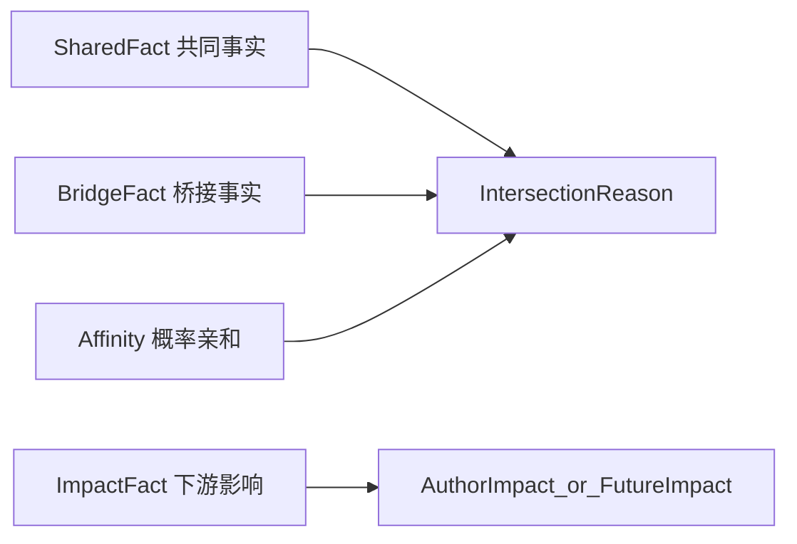

# 交集定义与应用文档

> 文档类型：产品定义 + 契约桥接主文档
>
> 关联主文档：
> - `specs/00_PRODUCT_CONCEPT_SYSTEM.md`
> - `specs/00_GLOBAL_TERMINOLOGY.md`
> - `specs/product/2026H1-positioning-refactor/wp-01-intersection-data-and-expression.md`
>
> 适用范围：
> - `WP-01` 交集事实数据源与表达升级
> - `WP-03` 三对象主页结构统一与影响模块
> - `WP-08` 小趣解释推荐与交集提醒

---

## 1. 文档定位

本文用于定义趣我圈中“交集”与“影响”的完整产品词典、契约承载与应用范围。

它不替代：

- metadata 中的字段、route、surface、operation 真相源
- 各 `WP` 的实施边界与准出要求
- 各 `L1/L2/L3` 的实现设计文档

本文回答的问题是：

- 什么叫交集，什么叫影响，什么只是推荐或亲和力
- 用户真正会看到哪些交集表达
- 每个交集项和影响项分别对应什么证据、什么动作、什么 contract
- 哪些项属于首发 `P0`，哪些属于后续增强 `P1/P2`
- 后续修改 metadata、DTO、seed、UI、小趣时，应以哪套定义为准

一句话说：**本文是趣我圈“交集与影响”的定义真相源，不是某个单页功能说明。**

---

## 2. 交集总定义

### 2.1 交集

`交集` 是我与另一个对象之间，**共同拥有** 或 **由第三方桥接形成** 的、可证、可枚举、可解释、可行动的连接事实。

交集必须同时满足四条件：

1. `可证`：不是模型猜测，必须有真实证据来源。
2. `可枚举`：能下钻到具体点位，而不只是一个总数。
3. `可解释`：用户能理解为什么产生这个交集。
4. `可行动`：看到交集后，能立刻做下一步动作。

任一条件缺失，都不能进入“事实交集”，只能退化为推荐或亲和力。

### 2.2 影响

`影响` 不是交集本身，而是交集被触发、被消费后产生的**可证下游动作**。

影响回答的问题是：

- 因为我，别人发生了什么变化？
- 因为我的内容、我的圈子参与、我的对象绑定，别人建立了什么连接、做出了什么决策、产生了什么传播？

影响必须同样满足：

- 有真实行为证据
- 能枚举来源
- 不下发纯运营指标
- 能解释为“帮助结果”而不是“空热度”

### 2.3 推荐

`推荐` 是系统从交集或影响中，选择“此刻最值得展示”的那一部分，不是事实本身。

推荐可以基于：

- 事实交集的强度、新鲜度、冷却状态
- 概率亲和力的排序分
- 场景上下文（频道、对象页、我的主页）

### 2.4 亲和力

`亲和力` 是当前还不能举证、但模型判断“可能 relevant / 可能合得来”的概率关系。

亲和力：

- 可以推荐
- 不能伪装成事实交集
- 必须与事实分通道展示

---

## 3. 四层模型



### 3.1 共同事实 SharedFact

我和另一个人、内容、圈子、地点或对象，真实共享某个事实。

例子：

- 共同关注的人
- 共同圈子
- 共同讨论
- 同校

### 3.2 桥接事实 BridgeFact

我和对象不一定共享同一个事实，但存在可靠的第三方桥接。

例子：

- 你关注的人正在看
- 你关注的人来过
- 校友在这里
- 你关注的人在这里

### 3.3 影响事实 ImpactFact

因为我，别人产生了新的连接、行动、参与或传播。

例子：

- 7 人读完了我的长文
- 8 人因为我建立了新连接
- 23 人加入相关圈子

### 3.4 概率亲和 Affinity

只能表达“可能 relevant / 可能合得来 / 推荐认识”，绝不能伪装成共同事实。

---

## 4. 五维闭集

交集的上层维度闭集固定为：

- `identity`
- `location`
- `content`
- `interest`
- `relationship`

这五维是**来源维度**，不是最终用户看到的全部表达。

用户看到的是更具体的母表达和细项；contract 层则用 `dimension + kind/sourceRef` 同时承载。

---

## 5. 关系语言规则

### 5.1 唯一关系概念

趣我圈内唯一社交关系概念是：

- `关注`

允许的派生状态：

- `互相关注`

允许的相关视图或流程词：

- `联系人`
- `打招呼`
- `私信`

### 5.2 禁止项

以下词不得作为结构化关系概念进入产品定义、contract 主命名、标准影响文案：

- `好友`
- `朋友`
- `密友`
- `挚友`
- `同好`

这些词只能出现在：

- UGC 原文
- 非结构化自然语言引用
- 旧 fixture / mock / 测试的迁移兼容阶段

### 5.3 结构化交集的统一关系表达

前台统一使用：

- `共同关注的人`
- `你关注的人在这里`
- `你关注的人来过 / 正在看`
- `帮助别人建立新连接`

### 5.4 kind 唯一注册表（无兼容别名）

本节是全仓交集 `kind`（`IntersectionPoint.sourceRef` / 证据组 kind）的**唯一注册表**。规则：

- 只有标准名，**不保留任何兼容别名**；契约、Go、Dart、fixture、mock、测试一次性迁移到标准名，不实现兼容解析。
- 任何 kind 必须先在本注册表登记（含 §7 对应条目的工程五栏：展示入口 / 契约承载 / 数据源 / 计算策略 / 性能口径），才能进入实现。
- 未登记的 kind 在云侧排序中落兜底 rank（不丢弃，便于灰度发现漂移），但禁止新增未登记 kind 的产出。

#### 注册表（标准 kind 全集）

| 标准 kind | 条目 | 维度 | 层级 |
|---|---|---|---|
| `sharedFollowees` | A1 | relationship | 共同型 |
| `commonFollower` | A2 | relationship | 共同型 |
| `commonContact` | A3 | relationship | 共同型 |
| `sameSchool / sameDepartment / sameMajor / sameCohort / alumni` | A4 | identity | 共同型 |
| `sameCompany / sameTeam / sameIndustry` | A5 | identity | 共同型 |
| `sharedCircle` | B1 | relationship/interest | 共同型 |
| `sharedDiscussion` | B2 | relationship/content | 共同型 |
| `coMemberCircle` | B3 | interest | 共同型 |
| `coCommented` | C1 | content | 共同型 |
| `coSharedContent` | C2 | content | 共同型 |
| `coCreatedContent` | C3 | content | 共同型 |
| `coVisitedEntity` | D1 | location | 共同型 |
| `sharedEntityAttention` | D2 | interest/identity | 共同型 |
| `coWishlistedEntity` | D3 | location | 共同型 |
| `sharedTagSample` | （共同兴趣） | interest | 共同型 |
| `followeeInObject` | E1 | relationship | 桥接型 |
| `followeeVisited` | E2 | relationship/location | 桥接型 |
| `followeeViewing` | E2 | relationship/content | 桥接型 |
| `alumniHere / colleagueHere` | E3 | identity | 桥接型 |
| `followeeDiscussedThis` | E4 | relationship/content | 桥接型 |

#### 一次性迁移映射（旧名 → 标准名，迁移后旧名零残留）

| 旧名（代码 / fixture / mock 现存） | 标准名 | 说明 |
|---|---|---|
| `mutualFriend` | `sharedFollowees` | 互关判断升级为真实第三方共同关注集合 |
| `commonFollow` | `sharedFollowees` | 与 mutualFriend 合并 |
| `friendInCircle` / `contactInCircle` / `friendActiveHere` | `followeeInObject` | 去好友化 + 桥接统一 |
| `friendVisited` / `contactVisited` | `followeeVisited` | 去好友化 |
| `friendJoinedRelatedCircle` | `followeeInObject` | 并入对象桥接 |
| `coVisitedEntity`（保留） / `coVisitedPlace`（规格旧名） | `coVisitedEntity` | 以实体口径定名（地点是实体子类） |
| `coCollectedEntity` | `coWishlistedEntity` | 「想去/愿望」是对象级意图，与内容收藏无关 |
| `coLiked` | 废弃（不登记） | 点赞是轻态度，不构成交集事实 |
| `coFavorited` / `coFollowedContent` | 废弃（不登记） | 内容无长期动作，无对应交集 |
| `followeeFollowedContent` / `friendFavorited` | 废弃（不登记） | 同上 |
| `coCity` / `coEra` / `coCohort` / `sameOrg` / `sameBrand` / `youInteracted` | 并入注册表近义标准名或废弃 | 迁移时逐个裁决：`coCity`→`coVisitedEntity`（城市实体）、`coCohort`→`sameCohort`、`sameOrg`→`sameCompany`、`sameBrand`→`sharedEntityAttention`、`coEra`/`youInteracted`→废弃 |

---

## 6. 六个母表达

六个母表达是用户在首页、我的交集、对象页摘要、内容卡理由位等**紧凑 surfaces** 中看到的一级表达。

它们是：

1. `共同关注的人`
2. `共同圈子`
3. `共同兴趣`
4. `共同地点`
5. `共同校友`
6. `共同讨论`

### 6.0 为什么没有「共同收藏 / 共同关注内容」

内容上没有长期动作（内容只有 赞 / 评 / 转），因此不存在「双方都收藏 / 都长期关注同一内容」这类交集事实。内容维度的交集全部来自**连接型行为**：

- 都在同一内容下讨论过（`coCommented`）
- 都传播过同一内容（`coSharedContent`）
- 都参与过同一创作链（`coCreatedContent`）
- 你关注的人正在看 / 正在讨论（`followeeViewing` / `followeeDiscussedThis`）

交集叙事重点从「收藏行为」转向「连接关系」：「来自AI产品圈」「2位校友正在讨论」「与你关注的对象相关」。

### 6.1 母表达不是所有深层证据的总目录

六个母表达的作用是：

- 在首屏、紧凑卡片、spotlight、列表摘要中统一语言
- 帮用户快速理解推荐理由

六个母表达**不要求**覆盖所有深层证据的最细差异。

例如：

- `同公司 / 同团队 / 同行业`
- `共同联系人`
- `共同被关注`

这些可以作为深层对象页证据或下钻条目存在，不强制升级为新的第 7 个母表达。

### 6.2 六个母表达的边界

| 母表达 | 主要维度 | 典型 surfaces | 不是什么 |
|---|---|---|---|
| `共同关注的人` | `relationship` | spotlight、我的交集、他人主页 | 不是“好友关系” |
| `共同圈子` | `relationship/interest` | spotlight、对象页、圈子页 | 不是“都聊过” |
| `共同兴趣` | `interest` | feed 理由位、spotlight | 不是 affinity 猜测 |
| `共同地点` | `location` | 旅行/本地场景、对象页 | 不是“你可能会喜欢这个地方” |
| `共同校友` | `identity` | 校园/职业场景、对象页 | 不等于所有身份类都叫校友 |
| `共同讨论` | `content/relationship` | 讨论入口、对象页、内容页 | 不等于“共同圈子”，也不是收藏/浏览行为交集 |

---

## 7. 交集全量词典

> 以下词典完整保留既往所有维度定义，关系语言已统一为关注口径，kind 只用 §5.4 注册表标准名。
>
> **工程五栏说明**（每条必填，是「确保可落地」的强制口径）：
>
> - `展示入口`：spotlight（首页频道交集模块 `intersection_spotlight_module.dart`，消费 `GET /v1/content/feed/intersections`）/ feed 理由位（`feed_intersection_mixer.go` 70/20/10 附着 → `intersection_reason_chip.dart`）/ 收件箱（我的交集 `my_intersection_inbox_page.dart`，summary+list API）/ 对象页交集卡（`object_intersection_card.dart` + entity bundle 预附着）。
> - `契约承载`：`IntersectionPoint.sourceRef` 取标准 kind；reason 级 `dimension/objectKind/relationKind/actionType` 按条目注明。
> - `数据源`：Mongo 读模型边表（`follow_edges` / `circle_members` / `rm_behavior_events` 行为边真相源 / `rec_learning_events` 推荐学习投影 / `rm_entity_tags` 对象标签 / 通讯录映射）。
>   - **分层口径**：用户行为写入 `rm_behavior_events`（content-service 行为边唯一写侧）；推荐管线消费后投影到 `rec_learning_events` 供排序/特征；交集事实计算优先读 `rm_behavior_events` 与关系边，禁止把两集合混称为同一真相源。
> - `计算策略`：三选一——`请求期边表查询`（现状默认，`intersection_source.go`）/ `投影预计算`（高频聚合，需新增 projector）/ `推荐通道复用`（affinity）。
> - `性能口径`：单请求边表查询次数与索引、集合上限、聚合缓存 `cache:viewer_intersections`（TTL 900s）、曝光冷却 `rec:icool`（14d，仅推荐位，收件箱/对象页不冷却）。

### A. 人与人：共同型事实

#### A1. 共同关注的人

- 母表达：`共同关注的人`
- 标准 kind：`sharedFollowees`
- 主维度：`relationship`
- 语义：我和 TA 共同关注的第三方用户集合，不是简单互关。
- 用户价值：降低陌生连接风险，增强信任与安全感。
- 创作者价值：让高影响力创作者不只靠粉丝数，而靠真实社交桥接被发现。
- 证据真相源：共同第三方用户 id 集合，可枚举头像与名字。
- 适用 contract：
  - feed / inbox / 推荐：`IntersectionReason + IntersectionPoint`
  - 对象页：`ObjectIntersection + ObjectIntersectionEvidence`
- 动作闭环：关注 / 私信 / 查看这些共同关注的人 / 进入共同圈子
- 工程五栏：
  - 展示入口：spotlight、收件箱（relationship 维度）、他人主页交集卡。
  - 契约承载：`sourceRef=sharedFollowees`；`dimension=relationship`、`objectKind=person`、`actionType=follow`。
  - 数据源：`follow_edges`（我的关注集 ∩ TA 的关注集）。
  - 计算策略：请求期边表查询（两次 userId 索引查询 + 内存交集）。
  - 性能口径：单边关注集取上限（建议 ≤1000，超限取最近边）；结果进 `viewer_intersections` 缓存 900s；points 枚举分页下钻，summary 只带 count + ≤3 头像。
- 优先级：`P0`

#### A2. 共同被关注

- 母表达：默认不作为一级母表达独立出现；深层证据保留
- 标准 kind：`commonFollower`
- 主维度：`relationship`
- 语义：我和 TA 被同一批人关注。
- 用户价值：提示“你们在同一注意力网络中”。
- 创作者价值：帮助发现同赛道创作者或同社群意见节点。
- 证据真相源：共同 follower 集合或数量。
- 适用 contract：`IntersectionReason + IntersectionPoint`，对象页可作为 evidence。
- 动作闭环：查看共同关注来源 / 关注 / 发起合作或对话
- 工程五栏：
  - 展示入口：对象页交集卡深层证据（不进 spotlight）。
  - 契约承载：`sourceRef=commonFollower`；`dimension=relationship`、`objectKind=person`。
  - 数据源：`follow_edges` 反向边（粉丝集交集）。
  - 计算策略：**投影预计算**（粉丝集可能极大，请求期全量交集不可行；先落 follower 计数桶投影，无投影前不实现）。
  - 性能口径：禁止请求期对大 V 粉丝集做全量交集；P1 实现前置条件是 follower 投影就位。
- 优先级：`P1`

#### A3. 共同联系人

- 母表达：默认不作为公开一级母表达；受权限约束
- 标准 kind：`commonContact`
- 主维度：`relationship`
- 语义：通讯录或现实联系层面的共同联系人。
- 用户价值：最强现实信任背书。
- 创作者价值：帮助现实关系中的创作者扩散和线下合作。
- 证据真相源：共同联系人映射，必须受权限保护。
- 适用 contract：
  - `IntersectionReason + IntersectionPoint`
  - 需要显式 `visibility/privacyLevel`
- 动作闭环：打招呼 / 请共同联系人引荐 / 查看对应联系人
- 工程五栏：
  - 展示入口：他人主页交集卡（双方均授权通讯录时）；不进 feed/spotlight。
  - 契约承载：`sourceRef=commonContact`；`relationKind=contact`、`visibility` 必填（默认 mutual-only）。
  - 数据源：通讯录映射表（contact 边，独立于 `follow_edges`）。
  - 计算策略：请求期边表查询（双方 contact 集交集，集合小）。
  - 性能口径：单请求 2 次点查；结果不进共享缓存（隐私），仅会话内缓存。
- 优先级：`P1`

#### A4. 同校 / 同院系 / 同专业 / 同届

- 母表达：`共同校友`
- 标准 kind：`sameSchool` / `sameDepartment` / `sameMajor` / `sameCohort` / `alumni`
- 主维度：`identity`
- 语义：我和 TA 在教育身份上存在真实共同背景。
- 用户价值：身份锚点极强，特别适合校园与职业迁移场景。
- 创作者价值：帮助垂类创作者建立可信身份带来的扩散力。
- 证据真相源：identity/entity tagRef 或更强 membership 事实。
- 适用 contract：
  - 紧凑 surfaces：可统一归入 `共同校友`
  - 深层证据：通过 `IntersectionPoint.sourceRef` / `sampleText` 区分差异
- 动作闭环：关注 / 打招呼 / 进入校友圈 / 查看同届讨论
- 工程五栏：
  - 展示入口：spotlight（campusSpotlight 策略频道）、收件箱（identity 维度）、他人主页交集卡。
  - 契约承载：`sourceRef` 取细 kind；`dimension=identity`、`objectKind=person|school`、`tagRefs` 携带学校 tagRef。
  - 数据源：用户 identity tagRef（`rm_entity_tags` / 用户身份标签投影）。
  - 计算策略：请求期标签比对（双方身份标签集合交集，O(标签数)）。
  - 性能口径：标签集合小（<50），无需额外缓存；同校聚合计数（「N位校友」）复用 E3 口径。
- 优先级：`P0`

#### A5. 同公司 / 同团队 / 同行业

- 母表达：默认不新增第 7 类母表达；在深层 identity 证据中展示
- 标准 kind：`sameCompany` / `sameTeam` / `sameIndustry`
- 主维度：`identity`
- 语义：我和 TA 在职业组织或职业背景上存在共同身份。
- 用户价值：职业协作、内推、共识成本低。
- 创作者价值：专业创作者能更快建立可信行业影响力。
- 证据真相源：organization/entity tagRef、membership。
- 适用 contract：当前挂在 `identity` 维度下，深层 evidence 展示细项。
- 动作闭环：私信 / 进入行业圈 / 查看相关工作内容
- 工程五栏：
  - 展示入口：他人主页交集卡深层证据。
  - 契约承载：`sourceRef` 取细 kind；`dimension=identity`、`objectKind=enterprise`。
  - 数据源：用户职业身份 tagRef（同 A4 通道）。
  - 计算策略：请求期标签比对。
  - 性能口径：同 A4。
- 优先级：`P1`

### B. 人与圈子 / 讨论：共同参与事实

#### B1. 共同圈子

- 母表达：`共同圈子`
- 标准 kind：`sharedCircle`
- 主维度：`relationship` 或 `interest`
- 语义：我和 TA 共同加入了同一个圈子。
- 用户价值：代表长期共同兴趣与归属。
- 创作者价值：圈主/活跃创作者可以更可信地被圈内外传播。
- 证据真相源：共同 `circleId` 集合。
- 适用 contract：`IntersectionReason + IntersectionPoint`，对象页可补 `ObjectIntersectionEvidence`。
- 动作闭环：进入共同圈子 / 看共同圈内内容 / 参与共同讨论
- 工程五栏：
  - 展示入口：spotlight、收件箱（relationship 维度）、他人主页与圈子页交集卡。
  - 契约承载：`sourceRef=sharedCircle`；`dimension=relationship`、`objectKind=circle`、`actionType=join|view_object`。
  - 数据源：`circle_members`（双方圈子集合交集）。
  - 计算策略：请求期边表查询（两次 userId 索引查询 + 内存交集）。
  - 性能口径：用户圈子数有限（通常 <100）；结果进 `viewer_intersections` 缓存 900s。
- 优先级：`P0`

#### B2. 共同讨论（讨论分区参与）

- 母表达：`共同讨论`
- 标准 kind：`sharedDiscussion`
- 主维度：`relationship` / `content`
- 语义：我和 TA 共同参与过某个讨论分区或主题串。
- 用户价值：比“共同圈子”更强的即时共同话题信号。
- 创作者价值：说明内容不是被动浏览，而是引发参与。
- 证据真相源：共同 discussion/thread 参与记录。
- 适用 contract：`IntersectionReason + IntersectionPoint`
- 动作闭环：回到讨论 / 继续对话 / @对方
- 工程五栏：
  - 展示入口：spotlight、收件箱（content 维度）、对象页交集卡。
  - 契约承载：`sourceRef=sharedDiscussion`；`dimension=content`、`actionType=view_object`（跳讨论）。
  - 数据源：`rec_learning_events` 发言/评论行为边（按 discussionId 聚合）。
  - 计算策略：请求期边表查询，限时间窗（建议 90 天）；若 p95 超标升级为 user→discussion 参与集投影。
  - 性能口径：索引 `(userId, action, ts)`；窗口外不计；结果进 `viewer_intersections` 缓存。
- 优先级：`P0`

#### B3. 同圈层活跃

- 母表达：通常不作为一级母表达；作为 `共同圈子` 强化证据
- 标准 kind：`coMemberCircle`
- 主维度：`interest`
- 语义：不只是都加入，而是在同一圈子里持续活跃。
- 用户价值：从“成员”升级为“同频参与者”。
- 创作者价值：能把创作影响和社群活跃绑定起来。
- 证据真相源：圈内行为频次或活跃阈值。
- 适用 contract：`IntersectionPoint` 或 `ObjectIntersectionEvidence`
- 动作闭环：进入圈子 / 看活跃讨论 / 发起连接
- 工程五栏：
  - 展示入口：圈子页交集卡强化证据（在 B1 之上叠加「都很活跃」sampleText）。
  - 契约承载：`sourceRef=coMemberCircle`；作为 B1 reason 下的附加 point。
  - 数据源：圈内行为频次聚合（`circle_tag_aggregates` / 活跃度投影）。
  - 计算策略：**投影预计算**（活跃阈值依赖滚动窗口聚合，请求期不可行）。
  - 性能口径：P1 实现前置条件是圈子活跃度投影就位；请求期只点查投影结果。
- 优先级：`P1`

### C. 人与内容：连接型内容行为事实

> 内容无长期动作（无收藏 / 无关注内容），本节交集全部来自连接型行为：讨论、传播、共创。浏览/足迹行为**永不**产生交集（私有）。

#### C1. 共同讨论内容

- 母表达：`共同讨论`
- 标准 kind：`coCommented`
- 主维度：`content`
- 语义：我和 TA 都评论或回复过同一内容或讨论。
- 用户价值：说明真实参与，不只是被动观看。
- 创作者价值：证明内容能引发互动网络。
- 证据真相源：comment/reply 行为边。
- 适用 contract：`IntersectionReason + IntersectionPoint`
- 动作闭环：回到原内容 / 继续讨论 / 关注对方
- 工程五栏：
  - 展示入口：spotlight、feed 理由位、收件箱（content 维度）、他人主页交集卡。
  - 契约承载：`sourceRef=coCommented`；`dimension=content`、`actionType=view_object`（回内容）。
  - 数据源：`rm_behavior_events` comment 行为边（按 postId 聚合）；`rec_learning_events` 仅作推荐特征投影，非交集事实唯一源。
  - 计算策略：请求期边表查询（双方评论过的 postId 集合交集，窗口 90 天）。
  - 性能口径：索引 `(userId, action=comment, ts)`；单边集合上限（最近 500 条评论）；结果进 `viewer_intersections` 缓存 900s；feed 理由位经 `rec:icool` 冷却。
- 优先级：`P0`

#### C2. 共同转发 / 共同传播

- 母表达：默认不单列一级母表达；挂在 `共同讨论` 下的深层项
- 标准 kind：`coSharedContent`
- 主维度：`content`
- 语义：我和 TA 都传播过同一内容或同一对象。
- 用户价值：说明价值观或传播取向重叠。
- 创作者价值：直接体现内容扩散能力。
- 证据真相源：share 行为边。
- 适用 contract：`IntersectionPoint` 或 `ObjectIntersectionEvidence`
- 动作闭环：查看被共同传播的内容源 / 进入原始内容或对象页
- 工程五栏：
  - 展示入口：对象页交集卡深层证据、收件箱下钻。
  - 契约承载：`sourceRef=coSharedContent`；`dimension=content`。
  - 数据源：`rec_learning_events` share 行为边。
  - 计算策略：请求期边表查询（同 C1 口径，share 边稀疏、成本更低）。
  - 性能口径：同 C1；share 频次低，无需单独缓存策略。
- 优先级：`P1`

#### C3. 共同创作 / 共创参与

- 母表达：默认不单列一级母表达；深层协作证据保留
- 标准 kind：`coCreatedContent`
- 主维度：`content`
- 语义：我和 TA 共同参与过同一内容生产或同一作品链路。
- 用户价值：最强协作关系之一。
- 创作者价值：构建作者网络与共同生产关系。
- 证据真相源：共同作者、引用、协作链。
- 适用 contract：`ObjectIntersection` / `ObjectIntersectionEvidence` 优先
- 动作闭环：关注协作者 / 查看协作作品 / 继续共创
- 工程五栏：
  - 展示入口：他人主页交集卡深层证据。
  - 契约承载：`sourceRef=coCreatedContent`；`dimension=content`。
  - 数据源：post 协作/引用字段（内容读模型，非行为边）。
  - 计算策略：请求期内容读模型查询（双方作品集合的协作关系比对）。
  - 性能口径：协作链稀疏；按作者 id 索引点查；P1 实现。
- 优先级：`P1`

### D. 人与地点 / 对象：共同对象事实

#### D1. 共同地点

- 母表达：`共同地点`
- 标准 kind：`coVisitedEntity`
- 主维度：`location`
- 语义：我和 TA 到过同一个地点 / 景区 / 酒店 / 路线锚点（地点是实体子类，故以实体口径定名）。
- 用户价值：最强现实生活桥接之一，适合旅行、本地生活、校园场景。
- 创作者价值：路线与地点内容的社会证明更强。
- 证据真相源：visit/check-in/route usage 等地点行为边。
- 适用 contract：`IntersectionReason + IntersectionPoint`
- 动作闭环：看共同地点内容 / 发起约伴 / 进入相关圈子
- 工程五栏：
  - 展示入口：spotlight（travel 频道）、收件箱（location 维度）、他人主页与地点对象页交集卡。
  - 契约承载：`sourceRef=coVisitedEntity`；`dimension=location`、`objectKind=place`、`tagRefs` 携带 geoTagRef。
  - 数据源：`rec_learning_events` visit/check-in 行为边 + geoTagRef。
  - 计算策略：请求期边表查询（双方到访实体集合交集，窗口 365 天）。
  - 性能口径：索引 `(userId, action=visit, ts)`；单边集合上限 500；结果进 `viewer_intersections` 缓存。
- 优先级：`P0`

#### D2. 都关注同一对象

- 母表达：默认紧凑 surfaces 常归入 `共同兴趣`
- 标准 kind：`sharedEntityAttention`
- 主维度：`interest` / `identity`
- 语义：我和 TA 都关注同一学校、品牌、产品、书、影视、景点等对象。
- 用户价值：比泛兴趣更具体，适合对象页推荐与人物发现；也是「与你关注的对象相关」叙事的事实源。
- 创作者价值：帮助围绕对象建立稳定内容网络。
- 证据真相源：entity follow 边（对象级关注，持续连接动作）。
- 适用 contract：`IntersectionReason + IntersectionPoint`
- 动作闭环：进入对象页 / 查看共同关注的对象 / 参与讨论
- 工程五栏：
  - 展示入口：spotlight、feed 理由位（「与你关注的对象相关」）、对象页交集卡。
  - 契约承载：`sourceRef=sharedEntityAttention`；`dimension=interest`、`objectKind=place|enterprise|school`、`actionType=follow|view_object`。
  - 数据源：`follow_edges`（objectKind=entity 的关注边）。
  - 计算策略：请求期边表查询（双方实体关注集交集）。
  - 性能口径：同 A1 口径（关注集上限 + `viewer_intersections` 缓存）。
- 优先级：`P1`

#### D3. 共同愿望清单 / 共同想去

- 母表达：通常仍归 `共同地点`
- 标准 kind：`coWishlistedEntity`
- 主维度：`location`
- 语义：都想去而不是都去过；「想去」是**对象级**未来意图（实体维度的持续连接前置态），与内容收藏无关。
- 用户价值：适合约伴和未来计划连接。
- 创作者价值：能把种草内容转成预行动网络。
- 证据真相源：对象级「想去」标记行为边。
- 适用 contract：`IntersectionReason + IntersectionPoint`
- 动作闭环：加入路线圈 / 关注对象 / 发起同行
- 工程五栏：
  - 展示入口：地点对象页交集卡、travel 频道 spotlight。
  - 契约承载：`sourceRef=coWishlistedEntity`；`dimension=location`、`objectKind=place`。
  - 数据源：对象级想去标记边（独立行为类型，不是内容 favorite）。
  - 计算策略：请求期边表查询。
  - 性能口径：想去集合小；同 D1 口径。
- 优先级：`P1`

### E. 桥接型交集（第三方桥接，不一定是共同拥有）

#### E1. 你关注的人在这里

- 母表达：通常通过 `secondaryText` / `connectionSummary` 展示，也可作为独立 point
- 标准 kind：`followeeInObject`
- 主维度：`relationship`
- 语义：我关注的人已经在这个圈子、对象或讨论里。
- 用户价值：强烈降低陌生进入门槛。
- 创作者价值：帮助创作者把关系网络转化为社群增长。
- 证据真相源：我关注的人与对象的 membership / follow / active 边。
- 适用 contract：`IntersectionReason + IntersectionPoint`
- 动作闭环：查看这些人 / 加入圈子 / 进入讨论
- 工程五栏：
  - 展示入口：圈子页与实体页交集卡（entity bundle 预附着）、spotlight。
  - 契约承载：`sourceRef=followeeInObject`；`dimension=relationship`、`relationKind=follow`、`actionType=join|view_object`。
  - 数据源：`follow_edges`（我的关注集）×`circle_members`/entity follower 边（membership 点查）。
  - 计算策略：请求期「小集合驱动点查」——以我的关注集（小）逐个点查对象 membership，禁止反向扫对象成员全集；entity bundle 由 entity-service 经 HTTP 预附着（3s 超时回落默认 reasons）。
  - 性能口径：我的关注集上限 1000；批量 `$in` 点查一次完成；对象页结果进 `viewer_intersections` 缓存 900s。
- 优先级：`P0`

#### E2. 你关注的人来过 / 正在看

- 母表达：
  - `共同地点`（来过）
  - 桥接型实时消费（正在看）
- 标准 kind：
  - `followeeVisited`
  - `followeeViewing`
- 主维度：`relationship` / `location` / `content`
- 语义：我关注的人到访过这个对象，或正在消费这个内容；不存在「关注过这篇内容」桥接（内容无长期动作）。
- 用户价值：典型社会证明，尤其适用于地点与内容消费。
- 创作者价值：有助于内容触发“从围观到行动”的扩散。
- 证据真相源：followee 的来过 / 正在看行为边。
- 适用 contract：`IntersectionReason + IntersectionPoint`
- 动作闭环：查看这些人的痕迹 / 打开内容 / 进入对象页
- 工程五栏：
  - 展示入口：地点对象页交集卡（followeeVisited）、feed 理由位与内容页（followeeViewing）。
  - 契约承载：`sourceRef=followeeVisited|followeeViewing`；`relationKind=follow`。
  - 数据源：followeeVisited=`rec_learning_events` visit 边；followeeViewing=实时在看集合（短 TTL Redis，会话级信号）。
  - 计算策略：followeeVisited=请求期小集合驱动点查（同 E1）；followeeViewing=实时通道（推荐管线在看信号），不落长期存储。
  - 性能口径：viewing 信号 TTL ≤5 分钟、只进 feed 理由位不进收件箱；visited 同 E1 缓存口径。
- 优先级：`P0`

#### E3. 校友在这里 / 同事在这里

- 母表达：`共同校友` 或 identity 深层变体
- 标准 kind：`alumniHere` / `colleagueHere`
- 主维度：`identity`
- 语义：不是我和对象共享事实，而是和我身份相关的一群人已经在这里。
- 用户价值：强信任桥。
- 创作者价值：适合校友、垂直职业圈内容扩散。
- 证据真相源：身份集合与对象成员/参与记录交叉。
- 适用 contract：`IntersectionReason + IntersectionPoint`
- 动作闭环：进入对象页 / 加入相关圈子
- 工程五栏：
  - 展示入口：对象卡（「2位校友在这里」）、campusSpotlight、对象页交集卡。
  - 契约承载：`sourceRef=alumniHere|colleagueHere`；`dimension=identity`、`tagRefs` 携带学校/公司 tagRef。
  - 数据源：身份标签集合 × 对象成员/到访记录交叉。
  - 计算策略：**投影预计算**（对象×学校聚合计数，请求期交叉成本高；首发可用受限请求期实现——对象成员 ≤500 时实时数，超限收起）。
  - 性能口径：聚合计数投影按 join/visit 事件增量更新；展示时只点查计数 + 样本 ≤3 人。
- 优先级：`P1`

#### E4. 你关注的人正在讨论

- 母表达：`共同讨论` 的桥接型补充
- 标准 kind：`followeeDiscussedThis`
- 主维度：`relationship` / `content`
- 语义：我关注的人正在这个讨论、内容串或对象主题下发言。
- 用户价值：比抽象推荐更容易转化成打开讨论；「N位校友正在讨论」「来自AI产品圈的讨论」类叙事的事实源之一。
- 创作者价值：讨论被关系网络激活。
- 证据真相源：followee 评论 / 发言 / 加入讨论。
- 适用 contract：`IntersectionReason + IntersectionPoint`
- 动作闭环：进入讨论 / 跟帖 / 关注发言者
- 工程五栏：
  - 展示入口：feed 理由位、讨论入口卡、对象页交集卡。
  - 契约承载：`sourceRef=followeeDiscussedThis`；`relationKind=follow`、`actionType=view_object`（跳讨论）。
  - 数据源：`rec_learning_events` comment/发言边（followee 集过滤，窗口 7 天保鲜）。
  - 计算策略：请求期小集合驱动点查（同 E1），按 `freshAt` 保鲜过滤。
  - 性能口径：窗口短（7 天）+ followee 集上限；feed 理由位经 `rec:icool` 冷却。
- 优先级：`P1`

---

## 8. 影响词典

影响不是交集的重复，而是交集被触发后的**下游结果**。

当前契约锚点：

- `AuthorImpactItem`
- `AuthorImpactSummary`

### 8.1 relationship：人际连接影响

- helpType：`relationship`
- 细 action：
  - `followedViaMe`
  - `contactedViaMe`
  - `metViaMe`
  - `reconnectedViaMe`
- 语义：因为我或我的内容，别人和我或彼此建立连接。
- 用户价值：看到“我不是只在发内容，我在连接人”。
- 创作者价值：把影响力从曝光转为“带来关系”。
- 证据真相源：follow / message / mutual follow / invitation / referral。
- UI 示例：`8人因为我建立了新连接`
- 优先级：`P0`

### 8.2 community：社群参与影响

- helpType：`community`
- 细 action：
  - `joinedCircleViaMe`
  - `joinedDiscussionViaMe`
  - `becameActiveViaMe`
- 语义：别人因为我加入圈子、进入讨论、开始活跃。
- 用户价值：我帮助别人找到归属。
- 创作者价值：说明我不只是发帖，而是在组织社区。
- 证据真相源：join event / discussion enter / active threshold。
- UI 示例：
  - `23人加入相关圈子`
  - `14人进入了我发起的讨论`
- 优先级：`P0`

### 8.3 decision：决策影响

- helpType：`decision`
- 细 action：
  - `visitedEntityViaMyContent`
  - `followedEntityViaMyContent`
  - `wishlistedEntityViaMyContent`
- 语义：别人因为我的内容对地点或对象做出行动（到访、关注对象、标记想去）。
- 用户价值：看到内容改变现实决策的力量。
- 创作者价值：这是最接近商业化转化的高质量影响，但不直接展示运营指标。
- 证据真相源：post -> entity -> downstream action attribution。
- UI 示例：`12人因为我的攻略开始关注这条路线`（对象级关注，非内容收藏）
- 优先级：`P1`

### 8.4 knowledge：知识影响

- helpType：`knowledge`
- 细 action：
  - `finishedMyArticle`
  - `referencedMyAnswer`
  - `broughtDiscussionToMyContent`
- 语义：我的内容帮助别人理解、学习、记住（完读、引用、带来讨论）；不存在「持续关注我的内容」类影响（内容无长期动作）。
- 用户价值：形成“我在帮助别人”的长期心智。
- 创作者价值：比点赞更体现高质量沉淀。
- 证据真相源：completion / quote/reference / comment 行为边。
- UI 示例：
  - `7人读完了我的长文`
  - `5人引用了我的回答`
- 优先级：`P0`

### 8.5 spread：传播影响

- helpType：`spread`
- 细 action：
  - `sharedMyContent`
  - `broughtPeopleToDiscussion`
  - `triggeredCascade`
- 语义：我的内容或行动被别人继续传播，触发更大网络扩散。
- 用户价值：看到自己作为传播节点的作用。
- 创作者价值：从“被看见”进化到“带动网络”。
- 证据真相源：share / repost / downstream join / multi-hop attribution。
- UI 示例：`19人转发了我的内容并带来新的讨论`
- 优先级：`P1`

---

## 9. contract 承载地图

### 9.1 `IntersectionReason`

负责：

- 交集的一句话展示
- 事实 vs 推荐的通道区分
- 目标对象的 surface 级下发

主要适用：

- 首页 spotlight
- 内容卡理由位
- 我的交集摘要
- 对象页交集摘要

### 9.2 `IntersectionPoint`

负责：

- 某条交集 reason 的具体点位
- count / sampleText / sampleAvatarUrls 的真相源

主要适用：

- summary 数字下钻
- 交集点枚举
- UI 里的证据微缩

### 9.3 `AuthorImpactItem / AuthorImpactSummary`

负责：

- “因为我发生了什么”的影响事实
- 帮助结果，而不是运营漏斗
- 结论句字段 `primaryText`（与 IntersectionReason G2 单通道对齐）

> **已删除**独立 `ObjectIntersection` / `ObjectIntersectionEvidence` projection。对象页深层事实与 evidence 统一由 `IntersectionReason` + `IntersectionPoint`（含 `sourceRef`）承载。

### 9.4 职责边界

| contract | 主要用途 | 不负责什么 |
|---|---|---|
| `IntersectionReason` | 首页、理由位、spotlight、摘要、**对象页交集卡** | 不承担运营漏斗数字 |
| `IntersectionPoint` | reason 的点位真相源（含对象页 evidence 微缩） | 不单独承担完整卡 UI 结构 |
| `AuthorImpact*` | 下游影响 | 不承担“共同事实” |

---

## 10. contract card 模板

每一个交集项，必须填写以下 card：

| 字段 | 含义 |
|---|---|
| `母表达` | 用户在紧凑 surfaces 中看到的一级表达 |
| `standardKind` | §5.4 注册表标准 kind（唯一命名，无 alias） |
| `sourceRef` | 数据源标识 |
| `交集层级` | 共同型 / 桥接型 / 影响型 / 概率型 |
| `主维度` | identity/location/content/interest/relationship |
| `主要对象` | 人 / 内容 / 圈子 / 对象 / 讨论 |
| `适用 surfaces` | feed / spotlight / 我的交集 / 对象页 / 影响力卡 / 小趣 |
| `主承载 contract` | `IntersectionReason` / `ObjectIntersection` / `AuthorImpact` 等 |
| `primaryText 模板` | 主结论句 |
| `secondaryText / connectionSummary` | 次级解释或桥接说明 |
| `sampleText / sampleAvatarUrls` | 实例样本要求 |
| `actionTargetId / objectKind` | 跳转目标与对象类型要求 |
| `evidence 真相源` | 真实表、边、投影、事件源 |
| `visibility / privacyLevel` | 权限约束 |
| `freshness TTL` | 新鲜度时长 |
| `推荐 / 冷却策略` | 是否参与冷却、如何重排 |
| `可行动 CTA` | 关注 / 打招呼 / 进入圈子 / 回到内容等 |
| `展示入口` | spotlight / feed 理由位 / 收件箱 / 对象页交集卡（工程五栏之一） |
| `计算策略` | 请求期边表查询 / 投影预计算 / 推荐通道复用（工程五栏之一） |
| `性能口径` | 查询次数、集合上限、缓存与冷却（工程五栏之一） |
| `优先级` | `P0 / P1 / P2` |

### 10.1 填写规则

- 若无法明确 `evidence 真相源`，不得标为事实交集。
- 若无法明确 `actionTargetId / objectKind`，不得进入对象卡型推荐。
- 若属于影响类，必须写明下游动作，不得只写“曝光、浏览、增长”。
- kind 必须是 §5.4 注册表标准名；禁止引入任何 alias 或第二命名。
- 若计算策略为「投影预计算」，实现前置条件是对应 projector 就位；未就位前该条目不得上线（不得用请求期全量扫描顶替）。

---

## 11. 数据源与证据分级

### 11.1 `P0`

首发必须优先事实化：

- 共同关注的人
- 共同圈子
- 共同兴趣
- 共同地点（至少去过 / 来过中的一条）
- 共同校友（以同校落地）
- 共同讨论
- 你关注的人在这里
- 你关注的人来过 / 正在看
- relationship / community / knowledge 类影响

### 11.2 `P1`

需新增读模型或更强事实支持：

- 共同被关注（前置：follower 投影）
- 共同联系人
- 同公司 / 同团队 / 同行业
- 同圈层活跃（前置：圈子活跃度投影）
- 共同转发 / 共同传播
- 共同创作 / 共创参与
- 都关注同一对象
- 共同愿望清单 / 共同想去
- 校友在这里 / 同事在这里（前置：对象×身份聚合投影，或受限请求期实现）
- 你关注的人正在讨论
- decision / spread 类影响

### 11.3 `P2`

当前只能先做 affinity 或保留规划：

- 校友图谱级共同校友
- 更复杂的跨对象多跳传播影响
- 无法枚举证据的相似人群发现

---

## 12. 页面应用矩阵

| 页面 / surface | 允许出现的交集层 | 说明 |
|---|---|---|
| 我的交集 | 共同事实 + 桥接事实 | 聚合入口与按维度分组列表 |
| 他人主页 | 共同事实 + 桥接事实 | 强调“你们的连接” |
| 我的主页 | 共同事实 + 桥接事实 + 影响 | 「我的连接」列表入口 +「我的影响力」 |
| 实体主页 | 共同事实 + 桥接事实 | 强调“与你的连接” |
| 圈子主页 | 共同事实 + 桥接事实 | 强调“你关注的人在这里”等 |
| 全局搜索 | 共同事实 + affinity（发现区） | 「交集」Tab / 激发搜索 / 发现区分组；已连接区不展示交集句 |
| 首页 spotlight | 共同事实 + affinity | 事实优先，推荐明确标注 |
| 内容卡理由位 | 共同事实 + 轻桥接 | 文案必须短、可理解 |
| 影响力卡 | 影响事实 | 不展示共同事实本身 |
| 小趣解释入口 | 共同事实 + 桥接事实 + affinity | 负责把证据解释清楚、引导动作 |

### 12.1 六个母表达的应用原则

- 紧凑 surfaces 优先用 6 个母表达
- 深层 surfaces 允许展示更细的 identity / relationship / content 子类
- 任何深层细项都不能推翻紧凑 surfaces 的母表达统一性
- 「我的足迹」不是交集 surface：足迹数据私有、永不进入任何交集层与影响数字

---

## 13. 与 WP-07 的边界说明

你提供的精品浏览器纸张主题分析，应接纳到 `WP-07`，不进入本词典正文的交集 contract。

其原则为：

- `系统推荐 > 作者建议 > 用户覆盖`
- 默认深色纸张体系
- 避免图 / 视频 / 文切换时亮度跳变

它和本文的关系是：

- 交集、对象绑定、影响解释会影响精品页的阅读语境
- 但纸张主题策略不是交集事实结构的一部分

---

## 14. 变更与迁移规则

### 14.1 新增交集项时的顺序

必须遵循：

```text
先更新本文
→ 再更新 metadata / codegen
→ 再更新实现
→ 再更新 seed / 测试 / UI
```

### 14.2 一次性迁移规则（不留兼容）

- 本次升级**不保留任何兼容别名**：契约、Go、Dart、fixture、mock、测试按 §5.4 迁移映射一次性切到标准名。
- 不实现 alias 解析层、不保留兼容路由、不做灰度双写；迁移完成的判据是全仓 grep 旧名零残留。
- 后续新增 kind 必须先登记注册表（含工程五栏），再 metadata → codegen → 实现。

### 14.3 禁止继续新增的表达

不得继续新增：

- `好友` / `朋友` / `新朋友` / `加好友`（结构化关系或交集文案）
- `收藏` / `收藏夹` / `关注内容` / `稍后看`（内容动作语境）

### 14.4 当前实现的特别校正项

当前 app 侧 [quwoquan_app/lib/components/object_page/evidence_group.dart](quwoquan_app/lib/components/object_page/evidence_group.dart) 仍把 `kind` 折叠成 `dimension`。

后续实现必须保证：

- 排序、高亮、母表达归类可以看维度
- 但细粒度交集身份必须保留 `kind/sourceRef`
- 否则 `coCommented`、`followeeVisited` 等会被压扁成粗维度

同时 fixtures `intersection_core` 段当前 reason 级 `source` 只有维度词、未铺 point 级 `sourceRef` 细 kind，需按注册表补齐（WP-01 Stage 4 交付）。

---

## 14A. favorite 全链路退场清单（Stage 3–6 执行真相源）

> 原则：不留兼容。删除而非废弃标记；无兼容路由、无字段 alias、无灰度开关。点赞心形图标 `Icons.favorite / favorite_border`（Material 命名，语义=点赞）豁免，逐处确认语义后保留。

### 14A.1 contracts/metadata

- [ ] `content/post/service.yaml`：删 `FavoritePost` / `UnfavoritePost` 路由；`GetReactionState` 返回去掉 `favorited`；`ReportBehaviors` 描述去 favorite 口径。
- [ ] `_shared/request_context.yaml`：删 `FavoritePost/UnfavoritePost → page_id` 两条映射。
- [ ] `content/post/fields.yaml`：删 `favoriteCount`（Post stats）、`favorited` / `favoritedAt`（ContentReaction）。
- [ ] `content/post/behaviors.yaml`：删 `type: favorite` 行为定义与训练样本权重。
- [ ] `content/post/events.yaml`：`ContentReacted` payload 去 `favorited`。
- [ ] `content/post/storage.yaml`：删 `idx_reactions_user_favorited` 索引。
- [ ] `content/post/aggregate.yaml`：删 `favorite` counter。
- [ ] `_shared/types.yaml`：`BehaviorEventType` 删 `favorite`。
- [ ] `_shared/redis_keyspace.yaml`：互动状态缓存描述去 favorite。
- [ ] 5 个投影 yaml（discovery_feed / photo / video / article / micro）：删 `favoriteCount` 字段及 `savesCount/bookmarks/favorite_count` aliases。
- [ ] `content/post/projections/author_impact_item.yaml`：示例文案改连接型（无「N人收藏」）。
- [ ] `content/post/ui_config.yaml`：action_bar_items 删 `favorite`；删 `interaction_config.favorite`、`show_favorite_count` 与悬空 `error_favorite_failed` 引用。
- [ ] `recommendation/rec_model/projections/learning_events.yaml`：eventType 删 `favorite`。
- [ ] `assistant/assistant_run/fields.yaml`：删 `favoritedAnswer`（收藏回答同退场，不做替代）。
- [ ] `content/post/tests/contract.yaml`：删 favorite 契约测试登记。
- [ ] fixtures：`content_scenarios.json`（72 处）+ `.lite` / `.gamma-curated` 变体删 `favoriteCount/favorited` 与「N人收藏」displayText。

### 14A.2 Go 云侧

- [ ] content-service：删 `handleFavoritePost/handleUnfavoritePost`、`post_service.go` 的 `FavoritePost/UnfavoritePost`、counter key、Popularity 中 FavoriteCount 项、`GetReactionState` favorited、`feed_service.go` 的 `SaveCount`、`behavior_service.go` 的 favorite→decision 分支。
- [ ] codegen 产物（generated_routes.go / contracts.go）经 metadata + `make codegen` 刷新。
- [ ] 推荐管线：`hotpath.go` 权重表、`feature.go` 的 `TotalFavorites/FavoriteLevel`、`metrics.go`、`recommend_feature.go`、`discovery_projector.go`、`mongo_source.go`、`static_source.go`、`social_infra.go`、`daily_metrics_store.go` 逐项清除。
- [ ] rec-model-service（Python）与 `scripts/ml/**`：特征、权重、训练样本同步删除。
- [ ] assistant-service：删 `FavoritedAnswer` 链路。
- [ ] 信号替代：长期价值信号使用足迹侧既有行为（完读 / 复访 / 转发），不引入新行为类型。

### 14A.3 Dart 端

- [ ] UI 入口（约 15 处）：discovery_page、works_immersive_viewer、comment_toolbar、comment_viewer_modal、immersive_comment_split_sheet、media_post_card、image/video viewer、more_actions_popup、media_viewer_interaction_bridge。
- [ ] 本地状态：`app_providers.dart` 的 `savedPostIds/bookmarkCounts/isSaved/setSaved/enqueuePostSave`、`discovery_state.baseBookmarksCount`、`circle_hub_feed_post_entry.bookmarkCount`。
- [ ] 鉴权与文案：`AuthGateReason.favorite`、`TestKeys.favorite*`、UITextConstants 收藏常量族（favorite/savePost/savedLabel/bookmarks/assistantBookmarked/authGate*Favorite）、`app_strings.saveFeatureDeveloping`、l10n 收藏条目。
- [ ] Repository：`quwoquan_cloud_contracts` 删 `favoritePost/unfavoritePost`，Remote/Mock/缓存装饰器同步；`BehaviorEventType.favorite` 删除。
- [ ] DTO：`post_base_dto.favoriteCount` 及各 `*_post_dto.g.dart`（codegen 刷新）、`content_reaction_state.favorited`、`post_engagement_counters.favoriteCount`。
- [ ] 我的页：登出态「收藏」tab 占位改「足迹」。

### 14A.4 我的足迹（替代承载）

- 只读契约：`GET /v1/content/footprint?type&cursor`（type=viewed|liked|commented|shared），数据源=既有行为边，**无新写路径**。
- route/surface：`myFootprint`（`_shared/ui_surfaces.yaml` + app_routes 登记）。
- 端侧：`lib/ui/user/pages/my_footprint_page.dart` 只读列表，仅本人可见。
- 约束：足迹不产生交集与影响（测试断言）；前台不出现「收藏 / 稍后看」文案。

---

## 15. 最终产物标准

本文被正式采用后，应满足：

1. 能独立回答：
   - 什么叫交集
   - 什么叫影响
   - 什么只是推荐或亲和力
2. 能覆盖既往所有维度的交集与影响定义
3. 能作为 `WP-01 / WP-03 / WP-08` 的共享真相源
4. 能直接指导 metadata、DTO、seed、UI、小趣解释的后续实现
5. 不再让与冻结关系口径冲突的“好友/朋友”表达继续扩散

---

## 16. 后续引用建议

本文落定后，后续应由相关会话同步把以下文档改成“引用本文”，而不是复制本文内容：

- `specs/00_PRODUCT_CONCEPT_SYSTEM.md`
- `specs/00_GLOBAL_TERMINOLOGY.md`
- `specs/product/2026H1-positioning-refactor/00-overview.md`
- `specs/product/2026H1-positioning-refactor/wp-01-intersection-data-and-expression.md`

这样可以保证：

- 主定义简洁
- 词典集中维护
- metadata / 实现 / seed / UI 都有统一的解释桥梁

---

## 17. 主谓宾交集句表达规范（2026 端侧优化）

> 本章是「交集句」在所有紧凑/列表 surfaces 的**统一表达真相源**，是 §6 母表达在「一句话」层面的具体收敛。六场景落地范围见 §17.4；G2 裁决见 §18.1。

### 17.1 统一句式（主谓宾，一句话）

交集句统一格式：

```text
主语[数量 N 位 + 关系限定] + 谓语[行为动词] + 宾语[对象]
```

- 端只读云侧 `IntersectionReason.primaryText`，**禁止本地拼装事实**（§14.4 / G2）。`primaryText` 即主谓宾整句；`source` / `IntersectionPoint.sourceRef` 取 §5.4 注册表标准 kind。
- 句子必须可被一行容纳（超出省略），不依赖图标列表/标签堆叠传达语义。

示例（均为合规口径，关系语言遵循 §5.1）：

- `你的8位校友关注了 Claude Code`（identity + 对象关注）
- `你关注的3人讨论了这篇内容`（content / 桥接）
- `你和8人共同关注了 Claude Code`（`sharedEntityAttention`，事实）
- `4位校友正在讨论 AI产品`（`alumniHere` / `followeeDiscussedThis`）
- `你们共同加入了3个圈子`（`sharedCircle`）

### 17.2 两类 surface 的句式层次（避免误判约束）

| surface 类别 | 典型位置 | 允许句式 |
|---|---|---|
| 紧凑 surface | 首页内容卡、spotlight 卡 | **严格一条主谓宾句，无副句** |
| 列表入口 | 我的连接 / 为什么推荐TA / 我的影响力 | 每行 = **一条主谓宾结论句 + 至多一条灰色辅助说明**（≤2 行/项）+「查看更多」 |

`secondaryText` / `connectionSummary` **只允许**作为列表入口的灰色辅助说明出现，禁止进入紧凑 surface 与结论句同屏堆叠。

### 17.3 UX 强约束（强制门禁项）

```text
✔ 只允许一条交集句（结论句）
❌ 多交集并列展示
❌ 标签列表
❌ 浮层交集
❌ 三行解释
```

### 17.4 六场景应用矩阵（主谓宾落地）

| 场景 | 页面 / 模块 | 句式 surface | P0/P1 | 本期 |
|---|---|---|---|---|
| S1 首页推荐 | 内容卡交集句 / spotlight | 紧凑 | P0 | ✅ |
| S2 他人主页 | 「为什么推荐TA」/「TA帮助了很多人」 | 列表入口 | P0 | ✅ |
| S3 我的主页 | 「我的连接」/「我的影响力」 | 列表入口 | P0 | ✅ |
| S4 圈子主页 | 「为什么推荐这个圈子」/ 记录流卡内交集句 | 列表入口 + 紧凑 | P0 | ✅ |
| S5 实体主页 | 「为什么推荐这里」/ 记录流卡内交集句 | 列表入口 + 紧凑 | P0 | ✅ |
| S6 全局搜索 | 搜索首页「今日交集」/ 结果页「交集」Tab / 发现区分组 | 紧凑 + 列表入口 | P0 | ✅ |

> 圈子/实体/用户主页记录流（瀑布卡）属紧凑 surface，卡内严格一条主谓宾句（同首页内容卡）；「为什么推荐X」属列表入口（结论句 + 灰色辅助说明 + 查看更多）。全局搜索「交集」Tab 每张卡必须携带 `intersectionReason.primaryText`；搜索分组编排消费 `connectionState`，不得端侧推断交集文案。

### 17.5 高保图文案冲突裁决（2026-06，用户已确认）

高保图为视觉示意，下列示意文案落地必须收敛到合规口径：

| 高保示意（不合规） | 合规收敛 | 依据 |
|---|---|---|
| `3位朋友收藏了这篇内容` | 删除（收藏已退场）或 `你关注的3人讨论了这篇内容` | §5.1 去好友化 + §14A 收藏退场 |
| `8人通过他认识了新朋友` | `8人通过TA建立了新连接` | §5.1 / §8.1 |
| `你和8位同趣都关注了 Claude Code` | `你和8人共同关注了 Claude Code` | §3.4 同趣=affinity 概率，「都关注同一对象」才是事实 |
| `4位同趣喜爱双冲浪` | `你关注的4人去过这片浪点` 或标注「推荐」 | §3.4 / §7.D1 |

裁决原则：**事实交集通道禁止出现「朋友/好友/收藏/同趣」**；affinity（概率）必须分通道、明确标注「推荐」，不得伪装成共同事实。

### 17.6 关系/概念冻结再确认

- 「朋友 / 密友 / 挚友 / 新朋友」叫法废除，统一「关注 / 互相关注」（§5.1/§5.2）。
- 「收藏」能力已退场（§14A），不存在「N 人收藏」交集或影响。
- 「同趣 / 兴趣相似」是 affinity 概率推荐（§2.4/§3.4），非事实交集。

### 17.7 圈子主页 / 实体主页落地口径（2026 端侧优化）

> 五页面统一结构：`身份 → 为什么推荐 → 价值说明 → 记录`。圈子/实体主页沿用他人主页同壳同口径，本期端侧 + alpha mock，云侧契约预留。

**统一语言体系（用户可见，禁用产品术语）**：

| 页面 | 「为什么推荐」标题 | 价值说明 / 介绍标题 | 一级 tab |
|---|---|---|---|
| 他人主页 | 为什么推荐TA | TA帮助了很多人 | 记录 · 圈子 · 互动 |
| 我的主页 | 我的连接 | 我的影响力 | 记录 · 圈子 · 互动 |
| 圈子主页 | 为什么推荐这个圈子 | 这个圈子帮助了很多人 | 记录 · 讨论 · 成员 |
| 实体主页 | 为什么推荐这里 | 关于这里 | 记录 · 讨论 · 相关圈子 |

**用户可见禁词**（产品术语不外露，对齐圈子/实体规格 §8）：

```text
交集 / 实体 / Entity / Circle / 影响力 / 兴趣圈
```

用户语言只出现：`为什么推荐 / 这里 / 学校 / 景区 / 地点 / 公司 / 产品 / 圈子 / 记录 / 讨论 / 成员 / 相关圈子 / 帮助了很多人`。

**圈子主页结构**：封面 → 圈子头像 → 名称 + 认证标识 → 一句简介 → 头像簇 +「N 成员」单计数 → 加入圈子 / 私信 →「为什么推荐这个圈子」列表入口 →「这个圈子帮助了很多人」价值卡 → 记录 | 讨论 | 成员 → 记录流（双列瀑布，卡内唯一交集句）。

**实体主页结构**：封面 → 实体头像 → 名称 + 认证标识 → 基础信息（地点 · 类型 · 年份）→ 头像簇 +「N 关注」单计数 → 关注 / 私信 →「为什么推荐这里」列表入口 →「关于这里」摘要卡（2~4 行 + 缩略图 + 查看更多介绍进详情页）→ 记录 | 讨论 | 相关圈子 → 记录流（双列瀑布，卡内唯一交集句）。

**头部统计形态**：人页用「粉丝」、实体页用「关注」、圈子页用「成员」的头像簇 + 单一计数行（可点进列表），不挂 4 列统计行（规格 §4.3「不要成员数/帖子数作主信息」）。

**统一记录卡范式**（圈子/实体/用户主页一致）：`封面 + 唯一交集句 + 标题 + 作者 + 点赞`；禁止交集覆盖封面、多条交集、复杂标签。

**圈子/实体高保图冲突裁决（补 §17.5）**：

| 高保示意（不合规） | 合规收敛 | 依据 |
|---|---|---|
| `42个实体正在被讨论` | `42个话题正在被讨论` | §8 禁用「实体」 |
| `N位同趣关注了这里`（作事实计数） | 头部计数用「N 关注」（事实）；affinity 句须标注「推荐」 | §3.4 同趣=affinity |
| `兴趣圈` tab | `相关圈子` | §8 禁用「兴趣圈」 |
| 影响项「N人认识新朋友」 | `N人建立了新连接` | §5.1 去好友化 |

---

## 18. 六场景优先级、G2 裁决与契约收口（2026 交集统一规格）

> 本章是六场景并行实现会话的**优先级与门禁真相源**。云侧 Explain/Ranking 全链路愿景见 §19。

### 18.1 G2 全局裁决（GATE_BLOCK）

```text
端侧禁止本地拼装任何事实交集结论句。
唯一用户可见结论句来源：`IntersectionReason.primaryText`（含对象页、搜索 hit、影响句 `AuthorImpactItem.primaryText`）。
禁止 displayText / label / shortLabel / evidenceLabel 等第二文案通道。
禁止保留 `ObjectIntersection` 独立 projection；对象页/搜索/feed 统一 `List<IntersectionReason>` + `IntersectionPoint`。
禁止用 intersectionPoints / EvidenceGroup 本地拼接主/副句。
affinity 必须分通道（intersectionClass=affinity + confidenceLabel），不得伪装 fact。
无 primaryText → 不展示（不占位、不造假）。
```

契约收口（零兼容，一次性迁移）：

| 契约 | 保留 | 删除 |
|---|---|---|
| `intersection_reason.yaml` | `primaryText`, `secondaryText`, `connectionSummary`, points 枚举 | `displayText`, `label`, `sharedCount` |
| `author_impact_item.yaml` | `primaryText` | `displayText` |
| `circle_impact_item.yaml` | `primaryText` | `displayText`（与 author_impact_item 对称，影响结论句单通道） |
| `object_page_bundle.yaml` | `intersectionReasons` 单通道 | `intersections` 并行通道；`object_intersection.yaml` 独立 projection 已删除 |
| `search_contract.yaml` + hits | `connectionState`, `intersectionReason` 子集 | UI 推断 connectionState / 文案 |

> **IntersectionPoint 边界澄清（防误删，本轮收口确认）**：`IntersectionPoint` **保留** `count` / `sampleText` /
> `sampleAvatarUrls` / `displayText` / `label`（云侧下发的单个证据组名词，≤6 汉字，端只读直出证据明细）。
> 这**不属于** G2 禁止的「reason 级结论句第二文案通道」——reason 级用户可见结论句唯一来源仍是 `primaryText`。
> 端禁止用多个 IntersectionPoint 在本地拼接 reason 结论句，但可逐条直出单个证据组的名词 + count + 头像簇。
> 收口表只删 `intersection_reason.yaml` 的 reason 级 `displayText` / `label` / `sharedCount`，不动 `intersection_point.yaml`。

### 18.2 六场景 P0/P1 矩阵

| 场景 ID | L3 Story | P0 交付 | P1 增强 |
|---|---|---|---|
| S1 | `home-recommend-intersection-redesign` | feed 卡 + spotlight 单句 primaryText；去 displayText 回退 | 频道专属 spotlight 数据质量 |
| S2a | `user-profile-intersection-redesign`（他人） | 「为什么推荐TA」列表入口 + AuthorImpact 去好友化 | 深层 evidence 下钻 |
| S2b | `user-profile-intersection-redesign`（我的） | 「我的连接」红点 + 「我的影响力」isMine | viewer_object_intersections 读模型 |
| S3 | `entity-homepage-intersection-redesign` | ObjectIntersectionSection + 记录流单句 | bundle 云侧真实填充 |
| S4 | `circle-homepage-intersection-redesign` | 圈子交集列表入口 + 记录流单句 | 成员头像簇桥接 |
| S5 | `search-intersection-consumption` | 搜索交集 Tab + connectionState 分组 + primaryText | 已连接区稳定读模型 |
| 横切 | `intersection-sentence-unification` | IntersectionReasonChip 单句组件 + G2 门禁 | secondaryText 仅列表入口 |

### 18.3 并行会话分工索引

完整 dispatch 清单与 acceptance checklist 见 `specs/product/intersection-unification-dispatch-index.md`。

---

## 19. 端到端算法闭环（Feature / Ranking / Explain / Event）

> 用户决策（2026-06-15）：**本会话规格与契约必须完备算法闭环**，与 `discovery-content/feed-orchestration-recommendation/personalized-ranking--ranking-signal-fusion` 对齐，**禁止第二套排序真相源**。

### 19.1 北极星与差异化 KPI

| 指标 | 定义 | 对标 |
|---|---|---|
| 交集解释点击率 | 含 primaryText 的交集曝光 → 点击对象/内容 | vs 小红书「推荐理由」点击率 |
| 交集驱动连接转化率 | 点击后 7 日内 follow/join/message | vs 微信关系链转化 |
| connection-formed-via-intersection | 归因链上带 intersectionId/sourceRef 的新连接 | 趣我圈独有 |

### 19.2 Event Layer（metadata 真相源）

行为管道必须携带 `intersectionId` + `intersectionDimension` + `intersectionClass` + **`intersectionSourceRef`**（§5.4 标准 kind）：

- `impression` / `click`（content behaviors，已登记）
- `intersection_expand`（列表入口「查看更多」展开，新增 behavior event）
- `follow` / `join_circle` 转化（已有 intersectionDimension/tagRefs，补 sourceRef）

### 19.3 Feature Layer

`recommend_feature.yaml` → `socialFeatures.intersection`：

- `sharedFolloweesCount` / `sharedCircleCount` / `coCommentedCount` / `coVisitedEntityCount`（事实计数）
- `followeeInObjectActive` / `followeeViewingActive`（桥接 freshness）
- `affinityIntersectionScore`（概率，与 fact 分字段）

`scripts/ml/feature_registry.yaml` 同步登记，供 rec-model-service 训练与在线推理。

### 19.4 Ranking Layer

交集信号经 **ranking-signal-fusion** 注入既有 feed 排序，权重与 `policy.yaml` 可配：

- 事实交集 strength + freshness → boost
- affinity intersectionClass → 独立通道，权重低于 fact
- 冷却 `rec:icool` 在排序后附着层（feed_intersection_mixer）仍生效

### 19.5 Explain Layer

`primaryText` **唯一产出归属**：content-service `IntersectionService` Explain 管线（模板 + kind 注册表 + 实例样本），禁止 `hydrateDisplayLanguage` 回退旧 displayText/label。

输入：`IntersectionReason` + `IntersectionPoint.sourceRef` + 枚举样本；输出：`primaryText` / `secondaryText` / `connectionSummary`。

### 19.6 职责边界（D7）

| 能力 | 负责 | 不负责 |
|---|---|---|
| `intersection-unified-experience` | 事实计算、Explain 文案、交集展示契约、冷却/保鲜 | 独立 feed 召回模型 |
| `feed-orchestration-recommendation` | 召回、ranking-signal-fusion、feed 混排 | 交集 kind 注册表、primaryText 文案 |

最终定位：交集系统是「关系解释系统（Relational Intelligence System）」——解释「为什么连接发生」，排序只是让解释在正确时刻出现。
