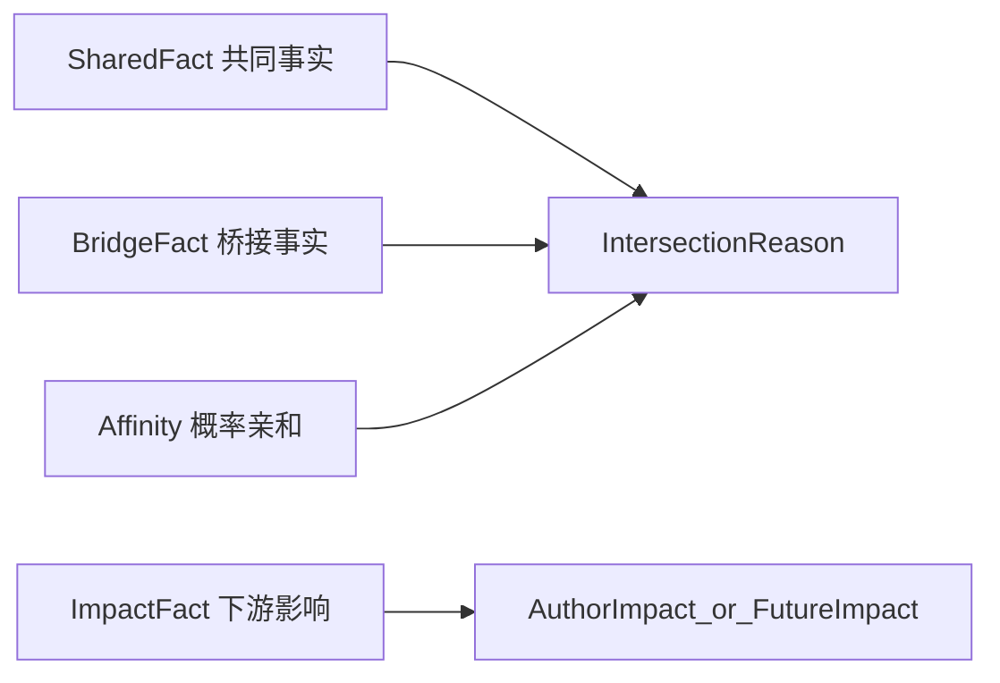
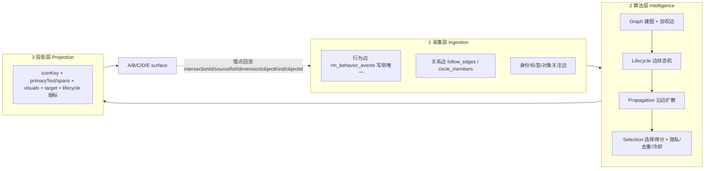

# 交集定义与应用文档

> 文档类型：产品定义 + 契约桥接主文档
>
> 关联主文档：
> - `specs/00_PRODUCT_CONCEPT_SYSTEM.md`
> - `specs/00_GLOBAL_TERMINOLOGY.md`
> - `specs/product/2026H1-positioning-refactor/wp-01-intersection-data-and-expression.md`
>
> 适用范围：
> - `WP-01` 交集事实数据源与表达升级
> - `WP-03` 三对象主页结构统一与影响模块
> - `WP-08` 小趣解释推荐与交集提醒

---

## 1. 文档定位

本文用于定义趣我圈中“交集”与“影响”的完整产品词典、契约承载与应用范围。

它不替代：

- metadata 中的字段、route、surface、operation 真相源
- 各 `WP` 的实施边界与准出要求
- 各 `L1/L2/L3` 的实现设计文档

本文回答的问题是：

- 什么叫交集，什么叫影响，什么只是推荐或亲和力
- 用户真正会看到哪些交集表达
- 每个交集项和影响项分别对应什么证据、什么动作、什么 contract
- 哪些项属于首发 `P0`，哪些属于后续增强 `P1/P2`
- 后续修改 metadata、DTO、seed、UI、小趣时，应以哪套定义为准

一句话说：**本文是趣我圈“交集与影响”的定义真相源，不是某个单页功能说明。**

---

## 2. 交集总定义

### 2.1 交集

`交集` 是我与另一个对象之间，**共同拥有** 或 **由第三方桥接形成** 的、可证、可枚举、可解释、可行动的连接事实。

交集必须同时满足四条件：

1. `可证`：不是模型猜测，必须有真实证据来源。
2. `可枚举`：能下钻到具体点位，而不只是一个总数。
3. `可解释`：用户能理解为什么产生这个交集。
4. `可行动`：看到交集后，能立刻做下一步动作。

任一条件缺失，都不能进入“事实交集”，只能退化为推荐或亲和力。

### 2.2 影响

`影响` 不是交集本身，而是交集被触发、被消费后产生的**可证下游动作**。

影响回答的问题是：

- 因为我，别人发生了什么变化？
- 因为我的内容、我的圈子参与、我的对象绑定，别人建立了什么连接、做出了什么决策、产生了什么传播？

影响必须同样满足：

- 有真实行为证据
- 能枚举来源
- 不下发纯运营指标
- 能解释为“帮助结果”而不是“空热度”

### 2.3 推荐

`推荐` 是系统从交集或影响中，选择“此刻最值得展示”的那一部分，不是事实本身。

推荐可以基于：

- 事实交集的强度、新鲜度、冷却状态
- 概率亲和力的排序分
- 场景上下文（频道、对象页、我的主页）

### 2.4 亲和力

`亲和力` 是当前还不能举证、但模型判断“可能 relevant / 可能合得来”的概率关系。

亲和力：

- 可以推荐
- 不能伪装成事实交集
- 必须与事实分通道展示

---

## 3. 四层模型



### 3.1 共同事实 SharedFact

我和另一个人、内容、圈子、地点或对象，真实共享某个事实。

例子：

- 共同关注的人
- 共同圈子
- 共同讨论
- 同校

### 3.2 桥接事实 BridgeFact

我和对象不一定共享同一个事实，但存在可靠的第三方桥接。

例子：

- 你关注的人正在看
- 你关注的人来过
- 校友在这里
- 你关注的人在这里

### 3.3 影响事实 ImpactFact

因为我，别人产生了新的连接、行动、参与或传播。

例子：

- 7 人读完了我的长文
- 8 人因为我建立了新连接
- 23 人加入相关圈子

### 3.4 概率亲和 Affinity

只能表达“可能 relevant / 可能合得来 / 推荐认识”，绝不能伪装成共同事实。

---

## 4. 五维闭集

交集的上层维度闭集固定为：

- `identity`
- `location`
- `content`
- `interest`
- `relationship`

这五维是**来源维度**，不是最终用户看到的全部表达。

用户看到的是更具体的母表达和细项；contract 层则用 `dimension + kind/sourceRef` 同时承载。

---

## 5. 关系语言规则

### 5.1 唯一关系概念

趣我圈内唯一社交关系概念是：

- `关注`

允许的派生状态：

- `互相关注`

允许的相关视图或流程词：

- `联系人`
- `打招呼`
- `私信`

### 5.2 禁止项

以下词不得作为结构化关系概念进入产品定义、contract 主命名、标准影响文案：

- `好友`
- `朋友`
- `密友`
- `挚友`
- `同好`

这些词只能出现在：

- UGC 原文
- 非结构化自然语言引用
- 旧 fixture / mock / 测试的迁移兼容阶段

### 5.3 结构化交集的统一关系表达

前台统一使用：

- `共同关注的人`
- `你关注的人在这里`
- `你关注的人来过 / 正在看`
- `帮助别人建立新连接`

### 5.4 kind 唯一注册表（无兼容别名）

> **机器可读真相源（Phase 0 §20d 收口）**：本节人类可读表的**机器可读单一真相源**为
> [`quwoquan_service/contracts/metadata/recommendation/rec_model/intersection_kind_registry.yaml`](../../quwoquan_service/contracts/metadata/recommendation/rec_model/intersection_kind_registry.yaml)，
> 其中登记每个 kind 的 `dimension/objectKind/countObjectKind/valueTier(T1-T4)/computability(R1-R4)/`
> `confidenceThreshold/privacyScope/dedupeKey/timeWindowDays/evidenceRank/sampleVisualsRequired/status`。
> 云侧 `intersection_service.go` 的 `evidenceKindRank` 必须与注册表 `evidenceRank` 逐项对齐；
> 门禁：`quwoquan_service/scripts/recommendation/verify_intersection_kind_registry.py`（已并入 `make verify`）。
> 本 markdown 表仅作人类导览，新增/改 kind 一律先改 YAML 注册表。

本节是全仓交集 `kind`（`IntersectionPoint.sourceRef` / 证据组 kind）的**唯一注册表**。规则：

- 只有标准名，**不保留任何兼容别名**；契约、Go、Dart、fixture、mock、测试一次性迁移到标准名，不实现兼容解析。
- 任何 kind 必须先在本注册表登记（含 §7 对应条目的工程五栏：展示入口 / 契约承载 / 数据源 / 计算策略 / 性能口径），才能进入实现。
- 未登记的 kind 在云侧排序中落兜底 rank（不丢弃，便于灰度发现漂移），但禁止新增未登记 kind 的产出。

#### 注册表（标准 kind 全集）

| 标准 kind | 条目 | 维度 | 层级 |
|---|---|---|---|
| `sharedFollowees` | A1 | relationship | 共同型 |
| `commonFollower` | A2 | relationship | 共同型 |
| `commonContact` | A3 | relationship | 共同型 |
| `sameSchool / sameDepartment / sameMajor / sameCohort / alumni` | A4 | identity | 共同型 |
| `sameCompany / sameTeam / sameIndustry` | A5 | identity | 共同型 |
| `sharedCircle` | B1 | relationship/interest | 共同型 |
| `sharedDiscussion` | B2 | relationship/content | 共同型 |
| `coMemberCircle` | B3 | interest | 共同型 |
| `coCommented` | C1 | content | 共同型 |
| `coSharedContent` | C2 | content | 共同型 |
| `coCreatedContent` | C3 | content | 共同型 |
| `coVisitedEntity` | D1 | location | 共同型 |
| `sharedEntityAttention` | D2 | interest/identity | 共同型 |
| `coWishlistedEntity` | D3 | location | 共同型 |
| `sharedTagSample` | （共同兴趣） | interest | 共同型 |
| `followeeInObject` | E1 | relationship | 桥接型 |
| `followeeVisited` | E2 | relationship/location | 桥接型 |
| `followeeViewing` | E2 | relationship/content | 桥接型 |
| `alumniHere / colleagueHere` | E3 | identity | 桥接型 |
| `followeeDiscussedThis` | E4 | relationship/content | 桥接型 |

#### 一次性迁移映射（旧名 → 标准名，迁移后旧名零残留）

| 旧名（代码 / fixture / mock 现存） | 标准名 | 说明 |
|---|---|---|
| `mutualFriend` | `sharedFollowees` | 互关判断升级为真实第三方共同关注集合 |
| `commonFollow` | `sharedFollowees` | 与 mutualFriend 合并 |
| `friendInCircle` / `contactInCircle` / `friendActiveHere` | `followeeInObject` | 去好友化 + 桥接统一 |
| `friendVisited` / `contactVisited` | `followeeVisited` | 去好友化 |
| `friendJoinedRelatedCircle` | `followeeInObject` | 并入对象桥接 |
| `coVisitedEntity`（保留） / `coVisitedPlace`（规格旧名） | `coVisitedEntity` | 以实体口径定名（地点是实体子类） |
| `coCollectedEntity` | `coWishlistedEntity` | 「想去/愿望」是对象级意图，与内容收藏无关 |
| `coLiked`（恢复） | `coLiked` | 2026-06-18 裁决恢复：赞作为 T4 最低权重轻量交集事实（§21.9）；性能受限（禁请求期全量、走预投影/采样/上限），仅无更高价值交集时露出 |
| `coFavorited` / `coFollowedContent` | 废弃（不登记） | 内容无长期动作，无对应交集 |
| `followeeFollowedContent` / `friendFavorited` | 废弃（不登记） | 同上 |
| `coCity` / `coEra` / `coCohort` / `sameOrg` / `sameBrand` / `youInteracted` | 并入注册表近义标准名或废弃 | 迁移时逐个裁决：`coCity`→`coVisitedEntity`（城市实体）、`coCohort`→`sameCohort`、`sameOrg`→`sameCompany`、`sameBrand`→`sharedEntityAttention`、`coEra`/`youInteracted`→废弃 |

---

## 6. 六个母表达

六个母表达是用户在首页、我的交集、对象页摘要、内容卡理由位等**紧凑 surfaces** 中看到的一级表达。

它们是：

1. `共同关注的人`
2. `共同圈子`
3. `共同兴趣`
4. `共同地点`
5. `共同校友`
6. `共同讨论`

### 6.0 为什么没有「共同收藏 / 共同关注内容」

内容上没有长期动作（内容只有 赞 / 评 / 转），因此不存在「双方都收藏 / 都长期关注同一内容」这类交集事实。内容维度的交集全部来自**连接型行为**：

- 都在同一内容下讨论过（`coCommented`）
- 都传播过同一内容（`coSharedContent`）
- 都参与过同一创作链（`coCreatedContent`）
- 你关注的人正在看 / 正在讨论（`followeeViewing` / `followeeDiscussedThis`）
- 都给同一内容点过赞（`coLiked`，T4 最低权重轻量交集，§21.9 恢复；仍非「共同收藏 / 共同关注内容」）

交集叙事重点从「收藏行为」转向「连接关系」：「来自AI产品圈」「2位校友正在讨论」「与你关注的对象相关」。点赞作为轻态度共鸣的补充交集存在，但权重最低、性能受限。

### 6.1 母表达不是所有深层证据的总目录

六个母表达的作用是：

- 在首屏、紧凑卡片、spotlight、列表摘要中统一语言
- 帮用户快速理解推荐理由

六个母表达**不要求**覆盖所有深层证据的最细差异。

例如：

- `同公司 / 同团队 / 同行业`
- `共同联系人`
- `共同被关注`

这些可以作为深层对象页证据或下钻条目存在，不强制升级为新的第 7 个母表达。

### 6.2 六个母表达的边界

| 母表达 | 主要维度 | 典型 surfaces | 不是什么 |
|---|---|---|---|
| `共同关注的人` | `relationship` | spotlight、我的交集、他人主页 | 不是“好友关系” |
| `共同圈子` | `relationship/interest` | spotlight、对象页、圈子页 | 不是“都聊过” |
| `共同兴趣` | `interest` | feed 理由位、spotlight | 不是 affinity 猜测 |
| `共同地点` | `location` | 旅行/本地场景、对象页 | 不是“你可能会喜欢这个地方” |
| `共同校友` | `identity` | 校园/职业场景、对象页 | 不等于所有身份类都叫校友 |
| `共同讨论` | `content/relationship` | 讨论入口、对象页、内容页 | 不等于“共同圈子”，也不是收藏/浏览行为交集 |

---

## 7. 交集全量词典

> 以下词典完整保留既往所有维度定义，关系语言已统一为关注口径，kind 只用 §5.4 注册表标准名。
>
> **工程五栏说明**（每条必填，是「确保可落地」的强制口径）：
>
> - `展示入口`：spotlight（首页频道交集模块 `intersection_spotlight_module.dart`，消费 `GET /v1/content/feed/intersections`）/ feed 理由位（`feed_intersection_mixer.go` 70/20/10 附着 → `intersection_reason_chip.dart`）/ 收件箱（我的交集 `my_intersection_inbox_page.dart`，summary+list API）/ 对象页交集卡（`object_intersection_card.dart` + entity bundle 预附着）。
> - `契约承载`：`IntersectionPoint.sourceRef` 取标准 kind；reason 级 `dimension/objectKind/relationKind/actionType` 按条目注明。
> - `数据源`：Mongo 读模型边表（`follow_edges` / `circle_members` / `rm_behavior_events` 行为边真相源 / `rec_learning_events` 推荐学习投影 / `rm_entity_tags` 对象标签 / 通讯录映射）。
>   - **分层口径**：用户行为写入 `rm_behavior_events`（content-service 行为边唯一写侧）；推荐管线消费后投影到 `rec_learning_events` 供排序/特征；交集事实计算优先读 `rm_behavior_events` 与关系边，禁止把两集合混称为同一真相源。
> - `计算策略`：三选一——`请求期边表查询`（现状默认，`intersection_source.go`）/ `投影预计算`（高频聚合，需新增 projector）/ `推荐通道复用`（affinity）。
> - `性能口径`：单请求边表查询次数与索引、集合上限、聚合缓存 `cache:viewer_intersections`（TTL 900s）、曝光冷却 `rec:icool`（14d，仅推荐位，收件箱/对象页不冷却）。

### A. 人与人：共同型事实

#### A1. 共同关注的人

- 母表达：`共同关注的人`
- 标准 kind：`sharedFollowees`
- 主维度：`relationship`
- 语义：我和 TA 共同关注的第三方用户集合，不是简单互关。
- 用户价值：降低陌生连接风险，增强信任与安全感。
- 创作者价值：让高影响力创作者不只靠粉丝数，而靠真实社交桥接被发现。
- 证据真相源：共同第三方用户 id 集合，可枚举头像与名字。
- 适用 contract：
  - feed / inbox / 推荐：`IntersectionReason + IntersectionPoint`
  - 对象页：`ObjectIntersection + ObjectIntersectionEvidence`
- 动作闭环：关注 / 私信 / 查看这些共同关注的人 / 进入共同圈子
- 工程五栏：
  - 展示入口：spotlight、收件箱（relationship 维度）、他人主页交集卡。
  - 契约承载：`sourceRef=sharedFollowees`；`dimension=relationship`、`objectKind=person`、`actionType=follow`。
  - 数据源：`follow_edges`（我的关注集 ∩ TA 的关注集）。
  - 计算策略：请求期边表查询（两次 userId 索引查询 + 内存交集）。
  - 性能口径：单边关注集取上限（建议 ≤1000，超限取最近边）；结果进 `viewer_intersections` 缓存 900s；points 枚举分页下钻，summary 只带 count + ≤3 头像。
- 优先级：`P0`

#### A2. 共同被关注

- 母表达：默认不作为一级母表达独立出现；深层证据保留
- 标准 kind：`commonFollower`
- 主维度：`relationship`
- 语义：我和 TA 被同一批人关注。
- 用户价值：提示“你们在同一注意力网络中”。
- 创作者价值：帮助发现同赛道创作者或同社群意见节点。
- 证据真相源：共同 follower 集合或数量。
- 适用 contract：`IntersectionReason + IntersectionPoint`，对象页可作为 evidence。
- 动作闭环：查看共同关注来源 / 关注 / 发起合作或对话
- 工程五栏：
  - 展示入口：对象页交集卡深层证据（不进 spotlight）。
  - 契约承载：`sourceRef=commonFollower`；`dimension=relationship`、`objectKind=person`。
  - 数据源：`follow_edges` 反向边（粉丝集交集）。
  - 计算策略：**投影预计算**（粉丝集可能极大，请求期全量交集不可行；先落 follower 计数桶投影，无投影前不实现）。
  - 性能口径：禁止请求期对大 V 粉丝集做全量交集；P1 实现前置条件是 follower 投影就位。
- 优先级：`P1`

#### A3. 共同联系人

- 母表达：默认不作为公开一级母表达；受权限约束
- 标准 kind：`commonContact`
- 主维度：`relationship`
- 语义：通讯录或现实联系层面的共同联系人。
- 用户价值：最强现实信任背书。
- 创作者价值：帮助现实关系中的创作者扩散和线下合作。
- 证据真相源：共同联系人映射，必须受权限保护。
- 适用 contract：
  - `IntersectionReason + IntersectionPoint`
  - 需要显式 `visibility/privacyLevel`
- 动作闭环：打招呼 / 请共同联系人引荐 / 查看对应联系人
- 工程五栏：
  - 展示入口：他人主页交集卡（双方均授权通讯录时）；不进 feed/spotlight。
  - 契约承载：`sourceRef=commonContact`；`relationKind=contact`、`visibility` 必填（默认 mutual-only）。
  - 数据源：通讯录映射表（contact 边，独立于 `follow_edges`）。
  - 计算策略：请求期边表查询（双方 contact 集交集，集合小）。
  - 性能口径：单请求 2 次点查；结果不进共享缓存（隐私），仅会话内缓存。
- 优先级：`P1`

#### A4. 同校 / 同院系 / 同专业 / 同届

- 母表达：`共同校友`
- 标准 kind：`sameSchool` / `sameDepartment` / `sameMajor` / `sameCohort` / `alumni`
- 主维度：`identity`
- 语义：我和 TA 在教育身份上存在真实共同背景。
- 用户价值：身份锚点极强，特别适合校园与职业迁移场景。
- 创作者价值：帮助垂类创作者建立可信身份带来的扩散力。
- 证据真相源：identity/entity tagRef 或更强 membership 事实。
- 适用 contract：
  - 紧凑 surfaces：可统一归入 `共同校友`
  - 深层证据：通过 `IntersectionPoint.sourceRef` / `sampleText` 区分差异
- 动作闭环：关注 / 打招呼 / 进入校友圈 / 查看同届讨论
- 工程五栏：
  - 展示入口：spotlight（campusSpotlight 策略频道）、收件箱（identity 维度）、他人主页交集卡。
  - 契约承载：`sourceRef` 取细 kind；`dimension=identity`、`objectKind=person|school`、`tagRefs` 携带学校 tagRef。
  - 数据源：用户 identity tagRef（`rm_entity_tags` / 用户身份标签投影）。
  - 计算策略：请求期标签比对（双方身份标签集合交集，O(标签数)）。
  - 性能口径：标签集合小（<50），无需额外缓存；同校聚合计数（「N位校友」）复用 E3 口径。
- 优先级：`P0`

#### A5. 同公司 / 同团队 / 同行业

- 母表达：默认不新增第 7 类母表达；在深层 identity 证据中展示
- 标准 kind：`sameCompany` / `sameTeam` / `sameIndustry`
- 主维度：`identity`
- 语义：我和 TA 在职业组织或职业背景上存在共同身份。
- 用户价值：职业协作、内推、共识成本低。
- 创作者价值：专业创作者能更快建立可信行业影响力。
- 证据真相源：organization/entity tagRef、membership。
- 适用 contract：当前挂在 `identity` 维度下，深层 evidence 展示细项。
- 动作闭环：私信 / 进入行业圈 / 查看相关工作内容
- 工程五栏：
  - 展示入口：他人主页交集卡深层证据。
  - 契约承载：`sourceRef` 取细 kind；`dimension=identity`、`objectKind=enterprise`。
  - 数据源：用户职业身份 tagRef（同 A4 通道）。
  - 计算策略：请求期标签比对。
  - 性能口径：同 A4。
- 优先级：`P1`

### B. 人与圈子 / 讨论：共同参与事实

#### B1. 共同圈子

- 母表达：`共同圈子`
- 标准 kind：`sharedCircle`
- 主维度：`relationship` 或 `interest`
- 语义：我和 TA 共同加入了同一个圈子。
- 用户价值：代表长期共同兴趣与归属。
- 创作者价值：圈主/活跃创作者可以更可信地被圈内外传播。
- 证据真相源：共同 `circleId` 集合。
- 适用 contract：`IntersectionReason + IntersectionPoint`，对象页可补 `ObjectIntersectionEvidence`。
- 动作闭环：进入共同圈子 / 看共同圈内内容 / 参与共同讨论
- 工程五栏：
  - 展示入口：spotlight、收件箱（relationship 维度）、他人主页与圈子页交集卡。
  - 契约承载：`sourceRef=sharedCircle`；`dimension=relationship`、`objectKind=circle`、`actionType=join|view_object`。
  - 数据源：`circle_members`（双方圈子集合交集）。
  - 计算策略：请求期边表查询（两次 userId 索引查询 + 内存交集）。
  - 性能口径：用户圈子数有限（通常 <100）；结果进 `viewer_intersections` 缓存 900s。
- 优先级：`P0`

#### B2. 共同讨论（讨论分区参与）

- 母表达：`共同讨论`
- 标准 kind：`sharedDiscussion`
- 主维度：`relationship` / `content`
- 语义：我和 TA 共同参与过某个讨论分区或主题串。
- 用户价值：比“共同圈子”更强的即时共同话题信号。
- 创作者价值：说明内容不是被动浏览，而是引发参与。
- 证据真相源：共同 discussion/thread 参与记录。
- 适用 contract：`IntersectionReason + IntersectionPoint`
- 动作闭环：回到讨论 / 继续对话 / @对方
- 工程五栏：
  - 展示入口：spotlight、收件箱（content 维度）、对象页交集卡。
  - 契约承载：`sourceRef=sharedDiscussion`；`dimension=content`、`actionType=view_object`（跳讨论）。
  - 数据源：`rec_learning_events` 发言/评论行为边（按 discussionId 聚合）。
  - 计算策略：请求期边表查询，限时间窗（建议 90 天）；若 p95 超标升级为 user→discussion 参与集投影。
  - 性能口径：索引 `(userId, action, ts)`；窗口外不计；结果进 `viewer_intersections` 缓存。
- 优先级：`P0`

#### B3. 同圈层活跃

- 母表达：通常不作为一级母表达；作为 `共同圈子` 强化证据
- 标准 kind：`coMemberCircle`
- 主维度：`interest`
- 语义：不只是都加入，而是在同一圈子里持续活跃。
- 用户价值：从“成员”升级为“同频参与者”。
- 创作者价值：能把创作影响和社群活跃绑定起来。
- 证据真相源：圈内行为频次或活跃阈值。
- 适用 contract：`IntersectionPoint` 或 `ObjectIntersectionEvidence`
- 动作闭环：进入圈子 / 看活跃讨论 / 发起连接
- 工程五栏：
  - 展示入口：圈子页交集卡强化证据（在 B1 之上叠加「都很活跃」sampleText）。
  - 契约承载：`sourceRef=coMemberCircle`；作为 B1 reason 下的附加 point。
  - 数据源：圈内行为频次聚合（`circle_tag_aggregates` / 活跃度投影）。
  - 计算策略：**投影预计算**（活跃阈值依赖滚动窗口聚合，请求期不可行）。
  - 性能口径：P1 实现前置条件是圈子活跃度投影就位；请求期只点查投影结果。
- 优先级：`P1`

### C. 人与内容：连接型内容行为事实

> 内容无长期动作（无收藏 / 无关注内容），本节交集全部来自连接型行为：讨论、传播、共创、点赞（赞为 T4 最低权重轻量交集，§21.9 恢复）。浏览/足迹行为**永不**产生交集（私有）。

#### C1. 共同讨论内容

- 母表达：`共同讨论`
- 标准 kind：`coCommented`
- 主维度：`content`
- 语义：我和 TA 都评论或回复过同一内容或讨论。
- 用户价值：说明真实参与，不只是被动观看。
- 创作者价值：证明内容能引发互动网络。
- 证据真相源：comment/reply 行为边。
- 适用 contract：`IntersectionReason + IntersectionPoint`
- 动作闭环：回到原内容 / 继续讨论 / 关注对方
- 工程五栏：
  - 展示入口：spotlight、feed 理由位、收件箱（content 维度）、他人主页交集卡。
  - 契约承载：`sourceRef=coCommented`；`dimension=content`、`actionType=view_object`（回内容）。
  - 数据源：`rm_behavior_events` comment 行为边（按 postId 聚合）；`rec_learning_events` 仅作推荐特征投影，非交集事实唯一源。
  - 计算策略：请求期边表查询（双方评论过的 postId 集合交集，窗口 90 天）。
  - 性能口径：索引 `(userId, action=comment, ts)`；单边集合上限（最近 500 条评论）；结果进 `viewer_intersections` 缓存 900s；feed 理由位经 `rec:icool` 冷却。
- 优先级：`P0`

#### C2. 共同转发 / 共同传播

- 母表达：默认不单列一级母表达；挂在 `共同讨论` 下的深层项
- 标准 kind：`coSharedContent`
- 主维度：`content`
- 语义：我和 TA 都传播过同一内容或同一对象。
- 用户价值：说明价值观或传播取向重叠。
- 创作者价值：直接体现内容扩散能力。
- 证据真相源：share 行为边。
- 适用 contract：`IntersectionPoint` 或 `ObjectIntersectionEvidence`
- 动作闭环：查看被共同传播的内容源 / 进入原始内容或对象页
- 工程五栏：
  - 展示入口：对象页交集卡深层证据、收件箱下钻。
  - 契约承载：`sourceRef=coSharedContent`；`dimension=content`。
  - 数据源：`rec_learning_events` share 行为边。
  - 计算策略：请求期边表查询（同 C1 口径，share 边稀疏、成本更低）。
  - 性能口径：同 C1；share 频次低，无需单独缓存策略。
- 优先级：`P1`

#### C3. 共同创作 / 共创参与

- 母表达：默认不单列一级母表达；深层协作证据保留
- 标准 kind：`coCreatedContent`
- 主维度：`content`
- 语义：我和 TA 共同参与过同一内容生产或同一作品链路。
- 用户价值：最强协作关系之一。
- 创作者价值：构建作者网络与共同生产关系。
- 证据真相源：共同作者、引用、协作链。
- 适用 contract：`ObjectIntersection` / `ObjectIntersectionEvidence` 优先
- 动作闭环：关注协作者 / 查看协作作品 / 继续共创
- 工程五栏：
  - 展示入口：他人主页交集卡深层证据。
  - 契约承载：`sourceRef=coCreatedContent`；`dimension=content`。
  - 数据源：post 协作/引用字段（内容读模型，非行为边）。
  - 计算策略：请求期内容读模型查询（双方作品集合的协作关系比对）。
  - 性能口径：协作链稀疏；按作者 id 索引点查；P1 实现。
- 优先级：`P1`

#### C4. 共同点赞内容（T4 轻量交集，§21.9 恢复）

- 母表达：默认不单列一级母表达；最低权重轻量交集，仅在缺更高价值交集时露出
- 标准 kind：`coLiked`
- 主维度：`content`
- 语义：我和 TA 都给同一内容点过赞（轻态度共鸣）。
- 用户价值：轻量共鸣信号，体量大但单条价值低，作 T4 补充。
- 创作者价值：反映内容引发的广泛轻互动面。
- 证据真相源：like 行为边（`rm_behavior_events` action=like）。
- 适用 contract：`IntersectionReason + IntersectionPoint`
- 动作闭环：回到原内容 / 关注对方
- 工程五栏：
  - 展示入口：对象页交集卡深层证据、收件箱下钻（content 维度）；紧凑 surface 仅在缺更高价值交集时露出。
  - 契约承载：`sourceRef=coLiked`；`dimension=content`、`objectKind=person`、`countObjectKind=content`、`weightTier=light`、`iconKey=like`。
  - 数据源：`rm_behavior_events` like 行为边（按 postId 聚合）。
  - 计算策略：**投影预计算 / 采样**（like 超高频大集合，§21.7 禁请求期全量求交）。
  - 性能口径：禁请求期全量；预投影 + 严格上限 + 采样；排序永远在 T1–T3 之后。
- 优先级：`P2`（云侧预投影就位后）
- 价值层级：`T4`（最低）

### D. 人与地点 / 对象：共同对象事实

#### D1. 共同地点

- 母表达：`共同地点`
- 标准 kind：`coVisitedEntity`
- 主维度：`location`
- 语义：我和 TA 到过同一个地点 / 景区 / 酒店 / 路线锚点（地点是实体子类，故以实体口径定名）。
- 用户价值：最强现实生活桥接之一，适合旅行、本地生活、校园场景。
- 创作者价值：路线与地点内容的社会证明更强。
- 证据真相源：visit/check-in/route usage 等地点行为边。
- 适用 contract：`IntersectionReason + IntersectionPoint`
- 动作闭环：看共同地点内容 / 发起约伴 / 进入相关圈子
- 工程五栏：
  - 展示入口：spotlight（travel 频道）、收件箱（location 维度）、他人主页与地点对象页交集卡。
  - 契约承载：`sourceRef=coVisitedEntity`；`dimension=location`、`objectKind=place`、`tagRefs` 携带 geoTagRef。
  - 数据源：`rec_learning_events` visit/check-in 行为边 + geoTagRef。
  - 计算策略：请求期边表查询（双方到访实体集合交集，窗口 365 天）。
  - 性能口径：索引 `(userId, action=visit, ts)`；单边集合上限 500；结果进 `viewer_intersections` 缓存。
- 优先级：`P0`

#### D2. 都关注同一对象

- 母表达：默认紧凑 surfaces 常归入 `共同兴趣`
- 标准 kind：`sharedEntityAttention`
- 主维度：`interest` / `identity`
- 语义：我和 TA 都关注同一学校、品牌、产品、书、影视、景点等对象。
- 用户价值：比泛兴趣更具体，适合对象页推荐与人物发现；也是「与你关注的对象相关」叙事的事实源。
- 创作者价值：帮助围绕对象建立稳定内容网络。
- 证据真相源：entity follow 边（对象级关注，持续连接动作）。
- 适用 contract：`IntersectionReason + IntersectionPoint`
- 动作闭环：进入对象页 / 查看共同关注的对象 / 参与讨论
- 工程五栏：
  - 展示入口：spotlight、feed 理由位（「与你关注的对象相关」）、对象页交集卡。
  - 契约承载：`sourceRef=sharedEntityAttention`；`dimension=interest`、`objectKind=place|enterprise|school`、`actionType=follow|view_object`。
  - 数据源：`follow_edges`（objectKind=entity 的关注边）。
  - 计算策略：请求期边表查询（双方实体关注集交集）。
  - 性能口径：同 A1 口径（关注集上限 + `viewer_intersections` 缓存）。
- 优先级：`P1`

#### D3. 共同愿望清单 / 共同想去

- 母表达：通常仍归 `共同地点`
- 标准 kind：`coWishlistedEntity`
- 主维度：`location`
- 语义：都想去而不是都去过；「想去」是**对象级**未来意图（实体维度的持续连接前置态），与内容收藏无关。
- 用户价值：适合约伴和未来计划连接。
- 创作者价值：能把种草内容转成预行动网络。
- 证据真相源：对象级「想去」标记行为边。
- 适用 contract：`IntersectionReason + IntersectionPoint`
- 动作闭环：加入路线圈 / 关注对象 / 发起同行
- 工程五栏：
  - 展示入口：地点对象页交集卡、travel 频道 spotlight。
  - 契约承载：`sourceRef=coWishlistedEntity`；`dimension=location`、`objectKind=place`。
  - 数据源：对象级想去标记边（独立行为类型，不是内容 favorite）。
  - 计算策略：请求期边表查询。
  - 性能口径：想去集合小；同 D1 口径。
- 优先级：`P1`

### E. 桥接型交集（第三方桥接，不一定是共同拥有）

#### E1. 你关注的人在这里

- 母表达：通常通过 `secondaryText` / `connectionSummary` 展示，也可作为独立 point
- 标准 kind：`followeeInObject`
- 主维度：`relationship`
- 语义：我关注的人已经在这个圈子、对象或讨论里。
- 用户价值：强烈降低陌生进入门槛。
- 创作者价值：帮助创作者把关系网络转化为社群增长。
- 证据真相源：我关注的人与对象的 membership / follow / active 边。
- 适用 contract：`IntersectionReason + IntersectionPoint`
- 动作闭环：查看这些人 / 加入圈子 / 进入讨论
- 工程五栏：
  - 展示入口：圈子页与实体页交集卡（entity bundle 预附着）、spotlight。
  - 契约承载：`sourceRef=followeeInObject`；`dimension=relationship`、`relationKind=follow`、`actionType=join|view_object`。
  - 数据源：`follow_edges`（我的关注集）×`circle_members`/entity follower 边（membership 点查）。
  - 计算策略：请求期「小集合驱动点查」——以我的关注集（小）逐个点查对象 membership，禁止反向扫对象成员全集；entity bundle 由 entity-service 经 HTTP 预附着（3s 超时回落默认 reasons）。
  - 性能口径：我的关注集上限 1000；批量 `$in` 点查一次完成；对象页结果进 `viewer_intersections` 缓存 900s。
- 优先级：`P0`

#### E2. 你关注的人来过 / 正在看

- 母表达：
  - `共同地点`（来过）
  - 桥接型实时消费（正在看）
- 标准 kind：
  - `followeeVisited`
  - `followeeViewing`
- 主维度：`relationship` / `location` / `content`
- 语义：我关注的人到访过这个对象，或正在消费这个内容；不存在「关注过这篇内容」桥接（内容无长期动作）。
- 用户价值：典型社会证明，尤其适用于地点与内容消费。
- 创作者价值：有助于内容触发“从围观到行动”的扩散。
- 证据真相源：followee 的来过 / 正在看行为边。
- 适用 contract：`IntersectionReason + IntersectionPoint`
- 动作闭环：查看这些人的痕迹 / 打开内容 / 进入对象页
- 工程五栏：
  - 展示入口：地点对象页交集卡（followeeVisited）、feed 理由位与内容页（followeeViewing）。
  - 契约承载：`sourceRef=followeeVisited|followeeViewing`；`relationKind=follow`。
  - 数据源：followeeVisited=`rec_learning_events` visit 边；followeeViewing=实时在看集合（短 TTL Redis，会话级信号）。
  - 计算策略：followeeVisited=请求期小集合驱动点查（同 E1）；followeeViewing=实时通道（推荐管线在看信号），不落长期存储。
  - 性能口径：viewing 信号 TTL ≤5 分钟、只进 feed 理由位不进收件箱；visited 同 E1 缓存口径。
- 优先级：`P0`

#### E3. 校友在这里 / 同事在这里

- 母表达：`共同校友` 或 identity 深层变体
- 标准 kind：`alumniHere` / `colleagueHere`
- 主维度：`identity`
- 语义：不是我和对象共享事实，而是和我身份相关的一群人已经在这里。
- 用户价值：强信任桥。
- 创作者价值：适合校友、垂直职业圈内容扩散。
- 证据真相源：身份集合与对象成员/参与记录交叉。
- 适用 contract：`IntersectionReason + IntersectionPoint`
- 动作闭环：进入对象页 / 加入相关圈子
- 工程五栏：
  - 展示入口：对象卡（「2位校友在这里」）、campusSpotlight、对象页交集卡。
  - 契约承载：`sourceRef=alumniHere|colleagueHere`；`dimension=identity`、`tagRefs` 携带学校/公司 tagRef。
  - 数据源：身份标签集合 × 对象成员/到访记录交叉。
  - 计算策略：**投影预计算**（对象×学校聚合计数，请求期交叉成本高；首发可用受限请求期实现——对象成员 ≤500 时实时数，超限收起）。
  - 性能口径：聚合计数投影按 join/visit 事件增量更新；展示时只点查计数 + 样本 ≤3 人。
- 优先级：`P1`

#### E4. 你关注的人正在讨论

- 母表达：`共同讨论` 的桥接型补充
- 标准 kind：`followeeDiscussedThis`
- 主维度：`relationship` / `content`
- 语义：我关注的人正在这个讨论、内容串或对象主题下发言。
- 用户价值：比抽象推荐更容易转化成打开讨论；「N位校友正在讨论」「来自AI产品圈的讨论」类叙事的事实源之一。
- 创作者价值：讨论被关系网络激活。
- 证据真相源：followee 评论 / 发言 / 加入讨论。
- 适用 contract：`IntersectionReason + IntersectionPoint`
- 动作闭环：进入讨论 / 跟帖 / 关注发言者
- 工程五栏：
  - 展示入口：feed 理由位、讨论入口卡、对象页交集卡。
  - 契约承载：`sourceRef=followeeDiscussedThis`；`relationKind=follow`、`actionType=view_object`（跳讨论）。
  - 数据源：`rec_learning_events` comment/发言边（followee 集过滤，窗口 7 天保鲜）。
  - 计算策略：请求期小集合驱动点查（同 E1），按 `freshAt` 保鲜过滤。
  - 性能口径：窗口短（7 天）+ followee 集上限；feed 理由位经 `rec:icool` 冷却。
- 优先级：`P1`

---

## 8. 影响词典

影响不是交集的重复，而是交集被触发后的**下游结果**。

当前契约锚点：

- `AuthorImpactItem`
- `AuthorImpactSummary`

### 8.1 relationship：人际连接影响

- helpType：`relationship`
- 细 action：
  - `followedViaMe`
  - `contactedViaMe`
  - `metViaMe`
  - `reconnectedViaMe`
- 语义：因为我或我的内容，别人和我或彼此建立连接。
- 用户价值：看到“我不是只在发内容，我在连接人”。
- 创作者价值：把影响力从曝光转为“带来关系”。
- 证据真相源：follow / message / mutual follow / invitation / referral。
- UI 示例：`8人因为我建立了新连接`
- 优先级：`P0`

### 8.2 community：社群参与影响

- helpType：`community`
- 细 action：
  - `joinedCircleViaMe`
  - `joinedDiscussionViaMe`
  - `becameActiveViaMe`
- 语义：别人因为我加入圈子、进入讨论、开始活跃。
- 用户价值：我帮助别人找到归属。
- 创作者价值：说明我不只是发帖，而是在组织社区。
- 证据真相源：join event / discussion enter / active threshold。
- UI 示例：
  - `23人加入相关圈子`
  - `14人进入了我发起的讨论`
- 优先级：`P0`

### 8.3 decision：决策影响

- helpType：`decision`
- 细 action：
  - `visitedEntityViaMyContent`
  - `followedEntityViaMyContent`
  - `wishlistedEntityViaMyContent`
- 语义：别人因为我的内容对地点或对象做出行动（到访、关注对象、标记想去）。
- 用户价值：看到内容改变现实决策的力量。
- 创作者价值：这是最接近商业化转化的高质量影响，但不直接展示运营指标。
- 证据真相源：post -> entity -> downstream action attribution。
- UI 示例：`12人因为我的攻略开始关注这条路线`（对象级关注，非内容收藏）
- 优先级：`P1`

### 8.4 knowledge：知识影响

- helpType：`knowledge`
- 细 action：
  - `finishedMyArticle`
  - `referencedMyAnswer`
  - `broughtDiscussionToMyContent`
- 语义：我的内容帮助别人理解、学习、记住（完读、引用、带来讨论）；不存在「持续关注我的内容」类影响（内容无长期动作）。
- 用户价值：形成“我在帮助别人”的长期心智。
- 创作者价值：比点赞更体现高质量沉淀。
- 证据真相源：completion / quote/reference / comment 行为边。
- UI 示例：
  - `7人读完了我的长文`
  - `5人引用了我的回答`
- 优先级：`P0`

### 8.5 spread：传播影响

- helpType：`spread`
- 细 action：
  - `sharedMyContent`
  - `broughtPeopleToDiscussion`
  - `triggeredCascade`
- 语义：我的内容或行动被别人继续传播，触发更大网络扩散。
- 用户价值：看到自己作为传播节点的作用。
- 创作者价值：从“被看见”进化到“带动网络”。
- 证据真相源：share / repost / downstream join / multi-hop attribution。
- UI 示例：`19人转发了我的内容并带来新的讨论`
- 优先级：`P1`

---

## 9. contract 承载地图

### 9.1 `IntersectionReason`

负责：

- 交集的一句话展示
- 事实 vs 推荐的通道区分
- 目标对象的 surface 级下发

主要适用：

- 首页 spotlight
- 内容卡理由位
- 我的交集摘要
- 对象页交集摘要

### 9.2 `IntersectionPoint`

负责：

- 某条交集 reason 的具体点位
- count / sampleText / sampleAvatarUrls 的真相源

主要适用：

- summary 数字下钻
- 交集点枚举
- UI 里的证据微缩

### 9.3 `AuthorImpactItem / AuthorImpactSummary`

负责：

- “因为我发生了什么”的影响事实
- 帮助结果，而不是运营漏斗
- 结论句字段 `primaryText`（与 IntersectionReason G2 单通道对齐）

> **已删除**独立 `ObjectIntersection` / `ObjectIntersectionEvidence` projection。对象页深层事实与 evidence 统一由 `IntersectionReason` + `IntersectionPoint`（含 `sourceRef`）承载。

### 9.4 职责边界

| contract | 主要用途 | 不负责什么 |
|---|---|---|
| `IntersectionReason` | 首页、理由位、spotlight、摘要、**对象页交集卡** | 不承担运营漏斗数字 |
| `IntersectionPoint` | reason 的点位真相源（含对象页 evidence 微缩） | 不单独承担完整卡 UI 结构 |
| `AuthorImpact*` | 下游影响 | 不承担“共同事实” |
| `IntersectionRepresentativeActor` | 人数句前的代表人锚点（头像/名字/可点击目标/隐私态） | 不替代完整证据列表，不用于本地拼装结论句 |
| `IntersectionActionHint` | 交集或影响的下一步建议（关注、打招呼、进入圈子、查看路线等） | 不承载事实证据，不决定排序 |

---

## 10. contract card 模板

每一个交集项，必须填写以下 card：

| 字段 | 含义 |
|---|---|
| `母表达` | 用户在紧凑 surfaces 中看到的一级表达 |
| `standardKind` | §5.4 注册表标准 kind（唯一命名，无 alias） |
| `sourceRef` | 数据源标识 |
| `交集层级` | 共同型 / 桥接型 / 影响型 / 概率型 |
| `主维度` | identity/location/content/interest/relationship |
| `主要对象` | 人 / 内容 / 圈子 / 对象 / 讨论 |
| `适用 surfaces` | feed / spotlight / 我的交集 / 对象页 / 影响力卡 / 小趣 |
| `主承载 contract` | `IntersectionReason` / `ObjectIntersection` / `AuthorImpact` 等 |
| `primaryText 模板` | 主结论句 |
| `representativeActor` | 人数句前代表人；必须来自同一证据快照 |
| `secondaryText / connectionSummary` | 次级解释或桥接说明 |
| `sampleText / sampleAvatarUrls` | 实例样本要求 |
| `actionTargetId / objectKind` | 跳转目标与对象类型要求 |
| `actionHints` | 可行动建议闭集，含主 CTA 与可选次 CTA |
| `evidence 真相源` | 真实表、边、投影、事件源 |
| `visibility / privacyLevel` | 权限约束 |
| `freshness TTL` | 新鲜度时长 |
| `推荐 / 冷却策略` | 是否参与冷却、如何重排 |
| `可行动 CTA` | 关注 / 打招呼 / 进入圈子 / 回到内容等 |
| `展示入口` | spotlight / feed 理由位 / 收件箱 / 对象页交集卡（工程五栏之一） |
| `计算策略` | 请求期边表查询 / 投影预计算 / 推荐通道复用（工程五栏之一） |
| `性能口径` | 查询次数、集合上限、缓存与冷却（工程五栏之一） |
| `优先级` | `P0 / P1 / P2` |

### 10.1 填写规则

- 若无法明确 `evidence 真相源`，不得标为事实交集。
- 若无法明确 `actionTargetId / objectKind`，不得进入对象卡型推荐。
- 若 `primaryText` 含人数，必须明确 `representativeActor` 选择口径；没有可见代表人时只能使用可证匿名锚点（如「一位校友」），不得编造姓名。
- 若无法给出下一步 `actionHints`，只能进入解释型详情，不得进入首页/卡片强推荐位。
- 若属于影响类，必须写明下游动作，不得只写“曝光、浏览、增长”。
- kind 必须是 §5.4 注册表标准名；禁止引入任何 alias 或第二命名。
- 若计算策略为「投影预计算」，实现前置条件是对应 projector 就位；未就位前该条目不得上线（不得用请求期全量扫描顶替）。

---

## 11. 数据源与证据分级

### 11.1 `P0`

首发必须优先事实化：

- 共同关注的人
- 共同圈子
- 共同兴趣
- 共同地点（至少去过 / 来过中的一条）
- 共同校友（以同校落地）
- 共同讨论
- 你关注的人在这里
- 你关注的人来过 / 正在看
- relationship / community / knowledge 类影响

### 11.2 `P1`

需新增读模型或更强事实支持：

- 共同被关注（前置：follower 投影）
- 共同联系人
- 同公司 / 同团队 / 同行业
- 同圈层活跃（前置：圈子活跃度投影）
- 共同转发 / 共同传播
- 共同创作 / 共创参与
- 都关注同一对象
- 共同愿望清单 / 共同想去
- 校友在这里 / 同事在这里（前置：对象×身份聚合投影，或受限请求期实现）
- 你关注的人正在讨论
- decision / spread 类影响

### 11.3 `P2`

当前只能先做 affinity 或保留规划：

- 校友图谱级共同校友
- 更复杂的跨对象多跳传播影响
- 无法枚举证据的相似人群发现

---

## 12. 页面应用矩阵

| 页面 / surface | 允许出现的交集层 | 说明 |
|---|---|---|
| 我的交集 | 共同事实 + 桥接事实 | 聚合入口与按维度分组列表 |
| 他人主页 | 共同事实 + 桥接事实 | 强调“你们的连接” |
| 我的主页 | 共同事实 + 桥接事实 + 影响 | 「我的连接」列表入口 +「我的影响力」 |
| 实体主页 | 共同事实 + 桥接事实 | 强调“与你的连接” |
| 圈子主页 | 共同事实 + 桥接事实 | 强调“你关注的人在这里”等 |
| 全局搜索 | 共同事实 + affinity（发现区） | 「交集」Tab / 激发搜索 / 发现区分组；已连接区不展示交集句 |
| 首页 spotlight | 共同事实 + affinity | 事实优先，推荐明确标注 |
| 内容卡理由位 | 共同事实 + 轻桥接 | 文案必须短、可理解 |
| 影响力卡 | 影响事实 | 不展示共同事实本身 |
| 小趣解释入口 | 共同事实 + 桥接事实 + affinity | 负责把证据解释清楚、引导动作 |

### 12.1 六个母表达的应用原则

- 紧凑 surfaces 优先用 6 个母表达
- 深层 surfaces 允许展示更细的 identity / relationship / content 子类
- 任何深层细项都不能推翻紧凑 surfaces 的母表达统一性
- 「我的足迹」不是交集 surface：足迹数据私有、永不进入任何交集层与影响数字

---

## 13. 与 WP-07 的边界说明

你提供的精品浏览器纸张主题分析，应接纳到 `WP-07`，不进入本词典正文的交集 contract。

其原则为：

- `系统推荐 > 作者建议 > 用户覆盖`
- 默认深色纸张体系
- 避免图 / 视频 / 文切换时亮度跳变

它和本文的关系是：

- 交集、对象绑定、影响解释会影响精品页的阅读语境
- 但纸张主题策略不是交集事实结构的一部分

---

## 14. 变更与迁移规则

### 14.1 新增交集项时的顺序

必须遵循：

```text
先更新本文
→ 再更新 metadata / codegen
→ 再更新实现
→ 再更新 seed / 测试 / UI
```

### 14.2 一次性迁移规则（不留兼容）

- 本次升级**不保留任何兼容别名**：契约、Go、Dart、fixture、mock、测试按 §5.4 迁移映射一次性切到标准名。
- 不实现 alias 解析层、不保留兼容路由、不做灰度双写；迁移完成的判据是全仓 grep 旧名零残留。
- 后续新增 kind 必须先登记注册表（含工程五栏），再 metadata → codegen → 实现。

### 14.3 禁止继续新增的表达

不得继续新增：

- `好友` / `朋友` / `新朋友` / `加好友`（结构化关系或交集文案）
- `收藏` / `收藏夹` / `关注内容` / `稍后看`（内容动作语境）

> 边界澄清（2026-06-18）：「赞」于 §21.9 恢复为 T4 轻量交集事实（`coLiked`），但**仅限赞**——「收藏 / 稍后看 / 关注内容」仍按 §14A 全链路退场，不得借赞红线翻转一并恢复。

### 14.4 当前实现的特别校正项

当前 app 侧 [quwoquan_app/lib/components/object_page/evidence_group.dart](quwoquan_app/lib/components/object_page/evidence_group.dart) 仍把 `kind` 折叠成 `dimension`。

后续实现必须保证：

- 排序、高亮、母表达归类可以看维度
- 但细粒度交集身份必须保留 `kind/sourceRef`
- 否则 `coCommented`、`followeeVisited` 等会被压扁成粗维度

同时 fixtures `intersection_core` 段当前 reason 级 `source` 只有维度词、未铺 point 级 `sourceRef` 细 kind，需按注册表补齐（WP-01 Stage 4 交付）。

---

## 14A. favorite 全链路退场清单（Stage 3–6 执行真相源）

> 原则：不留兼容。删除而非废弃标记；无兼容路由、无字段 alias、无灰度开关。点赞心形图标 `Icons.favorite / favorite_border`（Material 命名，语义=点赞）豁免，逐处确认语义后保留。

### 14A.1 contracts/metadata

- [ ] `content/post/service.yaml`：删 `FavoritePost` / `UnfavoritePost` 路由；`GetReactionState` 返回去掉 `favorited`；`ReportBehaviors` 描述去 favorite 口径。
- [ ] `_shared/request_context.yaml`：删 `FavoritePost/UnfavoritePost → page_id` 两条映射。
- [ ] `content/post/fields.yaml`：删 `favoriteCount`（Post stats）、`favorited` / `favoritedAt`（ContentReaction）。
- [ ] `content/post/behaviors.yaml`：删 `type: favorite` 行为定义与训练样本权重。
- [ ] `content/post/events.yaml`：`ContentReacted` payload 去 `favorited`。
- [ ] `content/post/storage.yaml`：删 `idx_reactions_user_favorited` 索引。
- [ ] `content/post/aggregate.yaml`：删 `favorite` counter。
- [ ] `_shared/types.yaml`：`BehaviorEventType` 删 `favorite`。
- [ ] `_shared/redis_keyspace.yaml`：互动状态缓存描述去 favorite。
- [ ] 5 个投影 yaml（discovery_feed / photo / video / article / micro）：删 `favoriteCount` 字段及 `savesCount/bookmarks/favorite_count` aliases。
- [ ] `content/post/projections/author_impact_item.yaml`：示例文案改连接型（无「N人收藏」）。
- [ ] `content/post/ui_config.yaml`：action_bar_items 删 `favorite`；删 `interaction_config.favorite`、`show_favorite_count` 与悬空 `error_favorite_failed` 引用。
- [ ] `recommendation/rec_model/projections/learning_events.yaml`：eventType 删 `favorite`。
- [ ] `assistant/assistant_run/fields.yaml`：删 `favoritedAnswer`（收藏回答同退场，不做替代）。
- [ ] `content/post/tests/contract.yaml`：删 favorite 契约测试登记。
- [ ] fixtures：`content_scenarios.json`（72 处）+ `.lite` / `.gamma-curated` 变体删 `favoriteCount/favorited` 与「N人收藏」displayText。

### 14A.2 Go 云侧

- [ ] content-service：删 `handleFavoritePost/handleUnfavoritePost`、`post_service.go` 的 `FavoritePost/UnfavoritePost`、counter key、Popularity 中 FavoriteCount 项、`GetReactionState` favorited、`feed_service.go` 的 `SaveCount`、`behavior_service.go` 的 favorite→decision 分支。
- [ ] codegen 产物（generated_routes.go / contracts.go）经 metadata + `make codegen` 刷新。
- [ ] 推荐管线：`hotpath.go` 权重表、`feature.go` 的 `TotalFavorites/FavoriteLevel`、`metrics.go`、`recommend_feature.go`、`discovery_projector.go`、`mongo_source.go`、`static_source.go`、`social_infra.go`、`daily_metrics_store.go` 逐项清除。
- [ ] rec-model-service（Python）与 `scripts/ml/**`：特征、权重、训练样本同步删除。
- [ ] assistant-service：删 `FavoritedAnswer` 链路。
- [ ] 信号替代：长期价值信号使用足迹侧既有行为（完读 / 复访 / 转发），不引入新行为类型。

### 14A.3 Dart 端

- [ ] UI 入口（约 15 处）：discovery_page、works_immersive_viewer、comment_toolbar、comment_viewer_modal、immersive_comment_split_sheet、media_post_card、image/video viewer、more_actions_popup、media_viewer_interaction_bridge。
- [ ] 本地状态：`app_providers.dart` 的 `savedPostIds/bookmarkCounts/isSaved/setSaved/enqueuePostSave`、`discovery_state.baseBookmarksCount`、`circle_hub_feed_post_entry.bookmarkCount`。
- [ ] 鉴权与文案：`AuthGateReason.favorite`、`TestKeys.favorite*`、UITextConstants 收藏常量族（favorite/savePost/savedLabel/bookmarks/assistantBookmarked/authGate*Favorite）、`app_strings.saveFeatureDeveloping`、l10n 收藏条目。
- [ ] Repository：`quwoquan_cloud_contracts` 删 `favoritePost/unfavoritePost`，Remote/Mock/缓存装饰器同步；`BehaviorEventType.favorite` 删除。
- [ ] DTO：`post_base_dto.favoriteCount` 及各 `*_post_dto.g.dart`（codegen 刷新）、`content_reaction_state.favorited`、`post_engagement_counters.favoriteCount`。
- [ ] 我的页：登出态「收藏」tab 占位改「足迹」。

### 14A.4 我的足迹（替代承载）

- 只读契约：`GET /v1/content/footprint?type&cursor`（type=viewed|liked|commented|shared），数据源=既有行为边，**无新写路径**。
- route/surface：`myFootprint`（`_shared/ui_surfaces.yaml` + app_routes 登记）。
- 端侧：`lib/ui/user/pages/my_footprint_page.dart` 只读列表，仅本人可见。
- 约束：足迹不产生交集与影响（测试断言）；前台不出现「收藏 / 稍后看」文案。

---

## 15. 最终产物标准

本文被正式采用后，应满足：

1. 能独立回答：
   - 什么叫交集
   - 什么叫影响
   - 什么只是推荐或亲和力
2. 能覆盖既往所有维度的交集与影响定义
3. 能作为 `WP-01 / WP-03 / WP-08` 的共享真相源
4. 能直接指导 metadata、DTO、seed、UI、小趣解释的后续实现
5. 不再让与冻结关系口径冲突的“好友/朋友”表达继续扩散

---

## 16. 后续引用建议

本文落定后，后续应由相关会话同步把以下文档改成“引用本文”，而不是复制本文内容：

- `specs/00_PRODUCT_CONCEPT_SYSTEM.md`
- `specs/00_GLOBAL_TERMINOLOGY.md`
- `specs/product/2026H1-positioning-refactor/00-overview.md`
- `specs/product/2026H1-positioning-refactor/wp-01-intersection-data-and-expression.md`

这样可以保证：

- 主定义简洁
- 词典集中维护
- metadata / 实现 / seed / UI 都有统一的解释桥梁

---

## 17. 主谓宾交集句表达规范（2026 端侧优化）

> 本章是「交集句」在所有紧凑/列表 surfaces 的**统一表达真相源**，是 §6 母表达在「一句话」层面的具体收敛。六场景落地范围见 §17.4；G2 裁决见 §18.1。

### 17.1 统一句式（主谓宾，一句话）

交集句统一格式：

```text
主语[代表人 + 等 + 数量 N 位/人 + 关系限定] + 谓语[行为动词] + 宾语[对象]
```

- 端只读云侧 `IntersectionReason.primaryText`，**禁止本地拼装事实**（§14.4 / G2）。`primaryText` 即主谓宾整句；`source` / `IntersectionPoint.sourceRef` 取 §5.4 注册表标准 kind。
- 句子必须可被一行容纳（超出省略），不依赖图标列表/标签堆叠传达语义。
- 任何含人数的交集/影响力句子必须有 `representativeActor` 作为数字前锚点；禁止裸写 `N 人...`。代表人不是装饰，而是用户最可能点击、最能解释这条连接的证据样本。

示例（均为合规口径，关系语言遵循 §5.1）：

- `南星等8位校友关注了 Claude Code`（identity + 对象关注）
- `周屿等3位你关注的人讨论了这篇内容`（content / 桥接）
- `你和林清越等8人共同关注了 Claude Code`（`sharedEntityAttention`，事实）
- `顾南等4位校友正在讨论 AI 产品`（`alumniHere` / `followeeDiscussedThis`）
- `你和周屿等3人共同加入了 AI 产品圈`（`sharedCircle`）

### 17.1.1 代表人锚点（必填）

`representativeActor` 是每条含人数结论句的用户点击锚点，必须与 `primaryText` 来自同一个证据快照。

选择原则：

- 关系优先：互相关注 / 已关注 / 共同联系人 / 同校同事等强关系优先于陌生大 V。
- 证据优先：评论/回复 > 转发 > 完读/长停留 > 到访/关注对象 > 点赞；共同点赞永远不得压过更高价值证据。
- 新鲜优先：同等强度下选最近发生的证据，但同一 `intersectionId + pointSummarySnapshotId` 在 TTL 内保持稳定，避免刷新跳人。
- 可点优先：有头像、可进入主页、未被拉黑、未被隐私策略隐藏的人优先。
- 隐私优先：通讯录、匿名、不可见 actor、被屏蔽关系不得展示真实姓名；可降级为「一位联系人」「一位校友」等可证匿名锚点。

场景口径：

| 场景 | 代表人选择 | 合规示例 |
|---|---|---|
| 关系交集 | viewer 已关注 / 互关 / 共同联系人中最强样本 | `林清越等4人与你共同关注了 Claude Code` |
| 身份交集 | 同校/同届/同专业/同公司中与对象最相关样本 | `南星等6位校友关注了这条路线` |
| 圈子交集 | 圈内最近活跃且 viewer 认识或关注的人 | `周屿等3人在这个圈子里很活跃` |
| 内容交集 | 对同一内容参与深度最高的人 | `顾南等5人都讨论过这篇内容` |
| 地点交集 | 最近到访或关系最近的人 | `张可等5位校友都去过西湖` |
| 影响力聚合 | evidence 明细中可见的真实被影响 actor | `林清越等8人通过你的内容建立了新连接` |
| 亲和力推荐 | 推荐对象本人；必须标注推荐 | `推荐认识：程一苇和你旅行口味相近` |

点击分工固定：代表人头像/名字进代表人主页，数字进证据列表，对象名/封面进对象页，行动建议执行该 kind 的主 CTA。四类目标不得混用。

### 17.2 两类 surface 的句式层次（避免误判约束）

| surface 类别 | 典型位置 | 允许句式 |
|---|---|---|
| 紧凑 surface | 首页内容卡、spotlight 卡 | **严格一条主谓宾句，无副句** |
| 列表入口 | 我的连接 / 为什么推荐TA / 我的影响力 | 每行 = **一条主谓宾结论句 + 至多一条灰色辅助说明**（≤2 行/项）+「查看更多」 |

`secondaryText` / `connectionSummary` **只允许**作为列表入口的灰色辅助说明出现，禁止进入紧凑 surface 与结论句同屏堆叠。

### 17.3 UX 强约束（强制门禁项）

```text
✔ 只允许一条交集句（结论句）
❌ 多交集并列展示
❌ 标签列表
❌ 浮层交集
❌ 三行解释
```

### 17.4 六场景应用矩阵（主谓宾落地）

| 场景 | 页面 / 模块 | 句式 surface | P0/P1 | 本期 |
|---|---|---|---|---|
| S1 首页推荐 | 内容卡交集句 / spotlight | 紧凑 | P0 | ✅ |
| S2 他人主页 | 「为什么推荐TA」/「TA的影响力」 | 列表入口 | P0 | ✅ |
| S3 我的主页 | 「我的连接」/「我的影响力」 | 列表入口 | P0 | ✅ |
| S4 圈子主页 | 「我的交集」+「影响力」/ 记录流卡内交集句 | 列表入口 + 紧凑 | P0 | ✅ |
| S5 实体主页 | 「我的交集」+「影响力」/ 记录流卡内交集句 | 列表入口 + 紧凑 | P0 | ✅ |
| S6 全局搜索 | 搜索首页「今日交集」/ 结果页「交集」Tab / 发现区分组 | 紧凑 + 列表入口 | P0 | ✅ |

> 圈子/实体/用户主页记录流（瀑布卡）属紧凑 surface，卡内严格一条主谓宾句（同首页内容卡）；实体/圈子列表入口统一为「我的交集」与「影响力」。全局搜索「交集」Tab 每张卡必须携带 `intersectionReason.primaryText`；搜索分组编排消费 `connectionState`，不得端侧推断交集文案。

### 17.5 高保图文案冲突裁决（2026-06，用户已确认）

高保图为视觉示意，下列示意文案落地必须收敛到合规口径：

| 高保示意（不合规） | 合规收敛 | 依据 |
|---|---|---|
| `3位朋友收藏了这篇内容` | 删除（收藏已退场）或 `周屿等3位你关注的人讨论了这篇内容` | §5.1 去好友化 + §14A 收藏退场 + §17.1.1 |
| `8人通过他认识了新朋友` | `林清越等8人通过TA建立了新连接` | §5.1 / §8.1 / §17.1.1 |
| `你和8位同趣都关注了 Claude Code` | `你和林清越等8人共同关注了 Claude Code` | §3.4 同趣=affinity 概率，「都关注同一对象」才是事实 |
| `4位同趣喜爱双冲浪` | `张可等4位你关注的人去过这片浪点` 或标注「推荐」 | §3.4 / §7.D1 / §17.1.1 |

裁决原则：**事实交集通道禁止出现「朋友/好友/收藏/同趣」**；affinity（概率）必须分通道、明确标注「推荐」，不得伪装成共同事实。

### 17.6 关系/概念冻结再确认

- 「朋友 / 密友 / 挚友 / 新朋友」叫法废除，统一「关注 / 互相关注」（§5.1/§5.2）。
- 「收藏」能力已退场（§14A），不存在「N 人收藏」交集或影响。
- 「同趣 / 兴趣相似」是 affinity 概率推荐（§2.4/§3.4），非事实交集。

### 17.7 圈子主页 / 实体主页旧落地口径（已废弃）

> 本节旧结构已被 §17.8 取代，不再作为端侧实现、验收、测试或文案断言依据。实体/圈子主页统一采用：`沉浸封面 → 头部身份 → 我的交集 → 影响力 → Tab 内容区`。

**废弃原因**：旧口径把对象页解释成推荐系统理由，弱化“我与这个对象/圈子的真实连接”和“对象/圈子产生可枚举影响”的产品心智；首屏介绍/价值卡也压过了交集与影响力。

**仍保留的规则**：记录卡继续使用 `媒体 → 交集句 → 标题 → 作者 → 赞`，交集句只读云侧 `primaryText/primarySpans`，不得覆盖媒体、不得端侧拼文案。

**圈子/实体高保图冲突裁决（补 §17.5，仍有效）**：

| 高保示意（不合规） | 合规收敛 | 依据 |
|---|---|---|
| `42个实体正在被讨论` | `42个话题正在被讨论` | §8 禁用「实体」 |
| `N位同趣关注了具体对象`（作事实计数） | 头部计数用「N 关注」（事实）；affinity 句须标注「推荐」 | §3.4 同趣=affinity |
| `兴趣圈` tab | `相关圈子` | §8 禁用「兴趣圈」 |
| 影响项「N人认识新朋友」 | `林清越等N人建立了新连接` | §5.1 去好友化 + §17.1.1 |

---

### 17.8 实体 / 圈子主页双模块 re-PRD（2026-06，取代 §17.7 标题与结构口径）

> 本节为 §17.7 的口径升级，**取代** §17.7 中实体/圈子主页的「为什么推荐」标题与「价值说明」表述。实体与圈子主页与「我的主页」同壳同语义 token，统一收敛为两个核心维度模块：

```text
头部身份
  ↓
我的交集    = 我与这个对象 / 圈子客观存在、可枚举、可解释、可行动的真实连接
  ↓
影响力      = 这个对象 / 圈子帮助他人产生连接、内容传播、讨论沉淀的能力（可证、可枚举、可解释、可行动）
  ↓
Tab 内容区
```

**统一模块标题（取代 §17.7 表格的「为什么推荐」「价值说明」两列）**：

| 页面 | 第一模块标题 | 第二模块标题 | 渲染积木 |
|---|---|---|---|
| 我的主页 | 我的交集 | 我的影响力 | `ObjectIntersectionPreviewCard`* / `AuthorImpactCard` |
| 他人主页 | 我与TA的交集 | TA的影响力 | `ObjectIntersectionPreviewCard`* / `AuthorImpactCard` |
| 圈子主页 | 我的交集 | 影响力 | `ObjectIntersectionPreviewCard` / `AuthorImpactCard`(circleImpactProvider) |
| 实体主页 | 我的交集 | 影响力 | `ObjectIntersectionPreviewCard` / `IntersectionStatementCard`(entityImpactProvider) |

`*` 我的/他人主页保留既有 `MyIntersectionInboxCard` / `OtherProfileIntersectionCard` 入口，统一委托共享 `ObjectIntersectionPreviewCard` 渲染积木，保证四页同壳同 token。

**用户可见用语口径升级**：

- 「我的交集」「影响力」自本节起为**用户可见的模块标题**（合法），不再列入 §17.7 用户可见禁词；§17.7 禁词表对实体/圈子页的「交集/影响力」拦截作废。
- 仍禁用：`实体 / Entity / Circle / 为什么推荐 / 兴趣圈`；圈子「相关圈子」、实体「相关圈子」沿用。

**核心动作（取代 §17.7 结构行的次按钮口径）**：

| 页面 | 主按钮 | 次按钮 |
|---|---|---|
| 实体主页 | 关注 | 发记录（围绕这里沉淀记录） |
| 圈子主页 | 加入圈子 | 进入讨论（切换到讨论 tab） |

**实体主页结构（升级）**：封面 → 头部（头像簇 +「N 关注」单计数 + 认证 + 成立年份）→ 关注 / 发记录 →「我的交集」预览卡（单列结论句 + 蓝锚点 + 查看全部）→「影响力」卡（可枚举、句内数字下钻明细）→「关于这里」摘要卡（2~4 行 + 缩略图 + 查看更多介绍）→ 记录 | 讨论 | 相关圈子 → 记录流（双列瀑布，封面→交集句→标题→作者→赞）。**移除首屏常驻「想去·正在去·结伴」入口**。

**圈子主页结构（升级）**：封面 → 头部（圈子独立头像 + 名称 + 认证 +「N 成员」单计数，**移除成员头像簇**）→ 加入圈子 / 进入讨论 →「我的交集」预览卡 →「影响力」卡（`AuthorImpactCard` 同构，circleImpactProvider）→ 记录 | 讨论 | 成员 → 记录流（双列瀑布，卡内唯一交集句）。圈子里「你认识的人」从头部成员簇收敛进「我的交集」模块表达。

**实体影响力端契约（新增，云侧 Go handler 暂缓）**：实体主页「影响力」模块需要专属契约，定义于 `entity/homepage/projections/entity_impact_item.yaml`、`entity_impact_summary.yaml`、`entity_impact_evidence.yaml`，operation `GetEntityImpact` / `ListEntityImpactEvidence`，与 `author_impact_item` / `circle_impact_item` 单通道（`primaryText` + `primarySpans`，禁 `displayText`）对称。端侧 `entityImpactProvider` + alpha contract-seed mock 驱动高保；云侧实现待 WP-D。

---

## 18. 六场景优先级、G2 裁决与契约收口（2026 交集统一规格）

> 本章是六场景并行实现会话的**优先级与门禁真相源**。云侧 Explain/Ranking 全链路愿景见 §19。

### 18.1 G2 全局裁决（GATE_BLOCK）

```text
端侧禁止本地拼装任何事实交集结论句。
唯一用户可见结论句来源：`IntersectionReason.primaryText`（含对象页、搜索 hit、影响句 `AuthorImpactItem.primaryText`）。
禁止 displayText / label / shortLabel / evidenceLabel 等第二文案通道。
禁止保留 `ObjectIntersection` 独立 projection；对象页/搜索/feed 统一 `List<IntersectionReason>` + `IntersectionPoint`。
禁止用 intersectionPoints / EvidenceGroup 本地拼接主/副句。
affinity 必须分通道（intersectionClass=affinity + confidenceLabel），不得伪装 fact。
无 primaryText → 不展示（不占位、不造假）。
```

契约收口（零兼容，一次性迁移）：

| 契约 | 保留 | 删除 |
|---|---|---|
| `intersection_reason.yaml` | `primaryText`, `secondaryText`, `connectionSummary`, points 枚举 | `displayText`, `label`, `sharedCount` |
| `author_impact_item.yaml` | `primaryText` | `displayText` |
| `circle_impact_item.yaml` | `primaryText` | `displayText`（与 author_impact_item 对称，影响结论句单通道） |
| `object_page_bundle.yaml` | `intersectionReasons` 单通道 | `intersections` 并行通道；`object_intersection.yaml` 独立 projection 已删除 |
| `search_contract.yaml` + hits | `connectionState`, `intersectionReason` 子集 | UI 推断 connectionState / 文案 |

> **IntersectionPoint 边界澄清（防误删，本轮收口确认）**：`IntersectionPoint` **保留** `count` / `sampleText` /
> `sampleAvatarUrls` / `displayText` / `label`（云侧下发的单个证据组名词，≤6 汉字，端只读直出证据明细）。
> 这**不属于** G2 禁止的「reason 级结论句第二文案通道」——reason 级用户可见结论句唯一来源仍是 `primaryText`。
> 端禁止用多个 IntersectionPoint 在本地拼接 reason 结论句，但可逐条直出单个证据组的名词 + count + 头像簇。
> 收口表只删 `intersection_reason.yaml` 的 reason 级 `displayText` / `label` / `sharedCount`，不动 `intersection_point.yaml`。

### 18.2 六场景 P0/P1 矩阵

| 场景 ID | L3 Story | P0 交付 | P1 增强 |
|---|---|---|---|
| S1 | `home-recommend-intersection-redesign` | feed 卡 + spotlight 单句 primaryText；去 displayText 回退 | 频道专属 spotlight 数据质量 |
| S2a | `user-profile-intersection-redesign`（他人） | 「为什么推荐TA」列表入口 + AuthorImpact 去好友化 | 深层 evidence 下钻 |
| S2b | `user-profile-intersection-redesign`（我的） | 「我的连接」红点 + 「我的影响力」isMine | viewer_object_intersections 读模型 |
| S3 | `entity-homepage-intersection-redesign` | ObjectIntersectionSection + 记录流单句 | bundle 云侧真实填充 |
| S4 | `circle-homepage-intersection-redesign` | 圈子交集列表入口 + 记录流单句 | 成员头像簇桥接 |
| S5 | `search-intersection-consumption` | 搜索交集 Tab + connectionState 分组 + primaryText | 已连接区稳定读模型 |
| 横切 | `intersection-sentence-unification` | IntersectionReasonChip 单句组件 + G2 门禁 | secondaryText 仅列表入口 |

### 18.3 并行会话分工索引

完整 dispatch 清单与 acceptance checklist 见 `specs/product/intersection-unification-dispatch-index.md`。

---

## 19. 端到端算法闭环（Feature / Ranking / Explain / Event）

> 用户决策（2026-06-15）：**本会话规格与契约必须完备算法闭环**，与 `discovery-content/feed-orchestration-recommendation/personalized-ranking--ranking-signal-fusion` 对齐，**禁止第二套排序真相源**。

### 19.1 北极星与差异化 KPI

| 指标 | 定义 | 对标 |
|---|---|---|
| 交集解释点击率 | 含 primaryText 的交集曝光 → 点击对象/内容 | vs 小红书「推荐理由」点击率 |
| 交集驱动连接转化率 | 点击后 7 日内 follow/join/message | vs 微信关系链转化 |
| connection-formed-via-intersection | 归因链上带 intersectionId/sourceRef 的新连接 | 趣我圈独有 |

### 19.2 Event Layer（metadata 真相源）

行为管道必须携带 `intersectionId` + `intersectionDimension` + `intersectionClass` + **`intersectionSourceRef`**（§5.4 标准 kind）：

- `impression` / `click`（content behaviors，已登记）
- `intersection_expand`（列表入口「查看更多」展开，新增 behavior event）
- `follow` / `join_circle` 转化（已有 intersectionDimension/tagRefs，补 sourceRef）

### 19.3 Feature Layer

`recommend_feature.yaml` → `socialFeatures.intersection`：

- `sharedFolloweesCount` / `sharedCircleCount` / `coCommentedCount` / `coVisitedEntityCount`（事实计数）
- `followeeInObjectActive` / `followeeViewingActive`（桥接 freshness）
- `affinityIntersectionScore`（概率，与 fact 分字段）

`scripts/ml/feature_registry.yaml` 同步登记，供 rec-model-service 训练与在线推理。

### 19.4 Ranking Layer

交集信号经 **ranking-signal-fusion** 注入既有 feed 排序，权重与 `policy.yaml` 可配：

- 事实交集 strength + freshness → boost
- affinity intersectionClass → 独立通道，权重低于 fact
- 冷却 `rec:icool` 在排序后附着层（feed_intersection_mixer）仍生效

### 19.5 Explain Layer

`primaryText` **唯一产出归属**：content-service `IntersectionService` Explain 管线（模板 + kind 注册表 + 实例样本），禁止 `hydrateDisplayLanguage` 回退旧 displayText/label。

输入：`IntersectionReason` + `IntersectionPoint.sourceRef` + 枚举样本；输出：`primaryText` / `secondaryText` / `connectionSummary`。

### 19.6 职责边界（D7）

| 能力 | 负责 | 不负责 |
|---|---|---|
| `intersection-unified-experience` | 事实计算、Explain 文案、交集展示契约、冷却/保鲜 | 独立 feed 召回模型 |
| `feed-orchestration-recommendation` | 召回、ranking-signal-fusion、feed 混排 | 交集 kind 注册表、primaryText 文案 |

最终定位：交集系统是「关系解释系统（Relational Intelligence System）」——解释「为什么连接发生」，排序只是让解释在正确时刻出现。

---

## 20. Phase 0 契约冻结（交集落地总路标 · 统一契约 + 约束真相源）

> 本章是「交集落地总路标」**Phase 0** 的冻结产物，是后续 5 个独立会话（A 我的主页 / B 用户主页 /
> C 圈子主页 / D 实体主页 / E 首页推荐页）的**共用输入与开工自检基线**。配套机读清单见
> [`specs/product/intersection-contract-freeze-checklist.md`](intersection-contract-freeze-checklist.md)。
> 本章只**冻结与约束**，不替代 §2–§19 的定义；冲突以本章为准。

### 20.1 冻结的端云契约（4 projection 单通道）

| read_model | metadata 真相源 | 端 DTO（codegen） | 单通道约束 |
|---|---|---|---|
| `IntersectionReason` | `recommendation/rec_model/projections/intersection_reason.yaml` | `recommendation/intersection_reason.g.dart` | 结论句唯一来源 `primaryText`；快照/追踪 id 唯一字段 `pointSummarySnapshotId` |
| `IntersectionPoint` | `…/projections/intersection_point.yaml` | `recommendation/intersection_point.g.dart` | 证据组结构化字段（`count/sampleText/sampleAvatarUrls/label/displayText`）唯一来源 |
| `IntersectionDimensionTally` | `…/projections/intersection_dimension_tally.yaml` | `recommendation/intersection_dimension_tally.g.dart` | `briefText` 动态简报 + `subtitleText` 证据摘要（端云已对齐） |
| `IntersectionInboxSummary` | `…/projections/intersection_inbox_summary.yaml` | `recommendation/intersection_inbox_summary.g.dart` | 我的主页聚合入口，最多 3 维度可展开 |

保留的 4 个数据 operation（`content/post/service.yaml`，均 metadata-first）：

| operation | path | surface |
|---|---|---|
| `GetMyIntersectionSummary` | `GET /v1/content/intersections/summary` | 我的主页聚合卡（A） |
| `ListMyIntersections` | `GET /v1/content/intersections` | 我的交集分维度列表（A） |
| `MarkIntersectionsVisited` | `POST /v1/content/intersections/visit` | 推进已读水位清红点（A） |
| `GetObjectIntersections` | `GET /v1/content/intersections/object` | 对象页交集卡（B/C/D） |

### 20.2 kind 全集（valueTier × computability，机读真相源见 §5.4）

机读真相源：`intersection_kind_registry.yaml`。下表为人类导览（`status=deferred` 已登记但禁止产出）：

| kind | dim | valueTier | computability | status |
|---|---|---|---|---|
| sharedFollowees / commonContact / followeeInObject / followeeVisited | relationship | T1 | R1–R3 | active |
| sharedCircle | relationship/interest | T1 | R1 | active |
| commonFollower / coCommented / sharedDiscussion / coVisitedEntity / followeeViewing / followeeDiscussedThis | relationship/content/location | T2 | R1–R2 | active |
| sameSchool / sameMajor / sameCohort / alumni / sameCompany / sameTeam / alumniHere / colleagueHere | identity | T2 | R3 | active |
| coSharedContent / sharedEntityAttention / coMemberCircle / sharedTagSample / sameIndustry | content/interest | T3 | R1–R3 | active |
| coCreatedContent | content | T4 | R4 | **deferred**（无共创数据源） |
| coWishlistedEntity | location | T4 | R4 | **deferred**（无意图采集，偏理想） |
| affinity（概率通道） | * | T4 | R4 | active（必须标「推荐」） |

- `valueTier` → 选择得分 `valueWeight`（T1=1.0 / T2=0.75 / T3=0.5 / T4=0.3，见注册表 `valueTierWeights`）。
- `computability` 仅约束实现排期/数据门槛，不影响展示优先级。
- 新增 kind：先改注册表 YAML → 跑 `verify_intersection_kind_registry.py` → 再产出/铺 fixtures。

### 20.3 领域服务 pipeline 与选择得分（0.2 约束）

云侧 `IntersectionService` 固定管线（消费方：A summary/list、B/C/D object）：

```text
召回(source) → 隐私过滤(privacyScope) → 去重(dedupeKey) → 价值打分排序 → 冷却/多样性裁剪 → 渲染契约(hydrate primaryText)
```

选择得分（affinity 永远排在 fact 之后并显式标「推荐」）：

```text
score = valueWeight(tier) × freshness(decay) × confidence × diversityPenalty × cooldownGate
freshness = exp(-ageHours / freshnessHalfLifeHours)   # policy.yaml freshnessHalfLifeHours
confidence = fact:1.0 / affinity:模型分（< confidenceThreshold 不产出）
cooldownGate = 已曝光对象在 rec:icool 窗口内降权（cooldownDays，policy.intersection）
```

入选门槛 / 红线（GATE_BLOCK 级语义）：

1. **数量门槛**：至少 1 个可枚举可点击样本，否则降级到纯计数或维度母表达，再无则隐藏整块。
2. **置信门槛**：affinity 低于 `confidenceThreshold` 不产出；fact 达数量门槛即可。
3. **真实性红线**：禁用推荐分/热度伪造 fact；fact 的数字必须来自真实证据点派生（single-source）。
4. **隐私门槛**：`commonContact`（contactVisible）必须先过双向可见性才产出。
5. **空态**：无合格交集隐藏整块，禁占位假交集（G2）。

策略对齐：`recommendation/rec_model/policy.yaml` `intersection` 块（`factWeight=1.0 / affinityWeight=0.4 /
maxAffinityPerSurface=3 / cooldownDays=14 / freshnessTtlDaysByDimension`）；feed 内混排见 `feed_intersection_mixer.go`。

### 20.4 全局 UI 展示约束（A–E 共用，0.3）

1. **句式公式**：主谓宾、先人后事，一句话（详见 §17.1）。
2. **称谓统一**：一律「你们」，禁止「你和TA」。
3. **数字与视觉标识**：按 `objectKind` 选标识——`person`→avatar、`circle`→circleAvatar/cover、`school`→emblem（校徽）、
   `place`→coverImage/thumbnail、`enterprise`→logo；**禁用用户头像冒充非用户对象**。
   结构化 `sampleVisuals[{objectId, objectKind, assetKind, imageUrl, displayName}]` 为 R1/R2 kind 必需字段
   （注册表 `sampleVisualsRequired=true`）。
4. **主句实例化与点击**：名字 / 数字 / 整行点击优先级：名字 > 数字 > 整行；下钻必须携带
   `intersectionId + sourceRef + dimension + objectKind + objectId`。
5. **各 surface 密度上限**：feed chip ≤ 1 句（仅 primaryText，不展示 secondaryText）；我的连接默认 3 条可展开；
   对象页证据组一屏 ≤ 5 条、超出折叠。
6. **降级文案链**：具名样本 → 纯计数 → 维度母表达 → 隐藏。
7. **可解释下钻**：无证据不展示具名主句（G2：无 primaryText 不展示）。

### 20.5 漂移收口结果（Phase 0 执行状态）

| 漂移 | 处置 | 状态 | 证据 |
|---|---|---|---|
| a. Go `IntersectionReasonView` 残留 `Label/DisplayText/SharedCount` | 移除 Go 内部冗余 reason 级字段 + `followeeVisited`/桥接型计数语义迁移到单聚合点 `IntersectionPoint.Count=n` | **已收口**（端云契约一致；reason 级结论句唯一来源 `primaryText`） | `intersection_views.go` `IntersectionReasonView` 已无三字段；`intersection_source.go:434` 桥接型单聚合点 `Count=n`（注释「R-ID01：取代 reason 级 SharedCount」）；`intersection_hydration.go:541` 注释「不再有 reason 级 SharedCount」；全 `internal` 层 `SharedCount` 仅剩注释、无活代码引用；backlog R-ID01 复核 |
| b. `recommendationTraceId` × `pointSummarySnapshotId` 双通道 | 收敛为单一 `pointSummarySnapshotId`；删 metadata 字段+别名、Go 字段、2 处 Dart mock 写入 | **已完成** | codegen-app 重生成 DTO；`go test` 通过；`dart analyze` 通过 |
| c. Go `IntersectionDimensionTallyView` 缺 `SubtitleText` | Go view 补 `SubtitleText`，与 metadata/Dart 对齐 | **已完成** | `go build`/`go test` 通过 |
| d. kind「markdown + Go switch」双源 | 新增机读 `intersection_kind_registry.yaml`；Go `evidenceKindRank` 对齐；门禁 `verify_intersection_kind_registry.py` 入 `make verify` | **已完成** | 27 kinds 对齐，门禁 OK |
| e. operation 补 `response_body` schema | metadata 框架能力（`verify_metadata` 强校验 `response_body`/`response_body_kind`，kind∈{object,page,ack}）+ 端侧 codegen 映射（`operationToResponseModel/Kind`）+ 一致性门禁；首批绑定 5 op（4 交集 + `ListAuthorImpactEvidence`） | **部分收口（Slice 1，2026-06-20）** | `content/post/service.yaml` 已声明 `response_body`；`verify_metadata_response_body_vs_codegen_app: OK (5 ops)`；剩余 Go 响应类型 codegen / metadata→OpenAPI 生成器 / 全仓推广属框架横切 epic（见 backlog R-ID02） |
| feed API 删除（`GetFeedIntersections`/`ReportIntersectionExposure`） | 与共享 `Feed()`（`feed_service.go` post-chip 数据路径）+ spotlight UI（会话 E）+ SLO 配置 + Go/Dart 测试强耦合 | **延后到会话 E**（删除必然触及推荐页 UI = 会话 E 范围） | 见 §20.6 清单 |

### 20.6 延后项的精确清单（交接给对应会话）

**漂移 a（移除 Go reason 级 Label/DisplayText/SharedCount）** — ✅ 已收口（端云契约一致，无活代码残留；证据见 §20.5 表 a 行）。以下为历史改动集留档：
- `intersection_service.go`：删 struct 3 字段；`pointLabelForReason` 去 DisplayText/Label 分支（回落 DisplayName/IntersectionID）；
  `anchorAggregateCount` 去 `r.SharedCount` 分支（改读 anchor.Count）。
- `intersection_source.go`：`buildTagReason`/`buildContentReason`/`viewerRelationReason`/`followeeVisitedReason` 停止设 reason 级
  `Label/DisplayText/SharedCount`；其中 `followeeVisitedReason` 须把总数 `n` 迁到锚点 `IntersectionPoint.Count`（当前 ≤3 样本点 Count=1 + reason.SharedCount=n，移除后需单聚合点 Count=n 保留计数语义）。
- 受影响测试：`viewer_object_intersection_store_contract_test.go`（断言 `r.SharedCount`）、`intersection_source_contract_test.go`、
  `intersection_service_test.go`。
- 风险：改 `followeeVisited` 计数语义会动 Summary/tally 计数，须同步更新测试期望。

**feed API 删除（会话 E）** — 改动集：
- `content/post/service.yaml`：删 `GetFeedIntersections` + `ReportIntersectionExposure` → 重跑 `codegen-content-service`
  （regenerate `generated_routes.go` / `generated/contracts.go`）。
- Go：删 `intersection_handler.go` 的 `handleGetFeedIntersections`/`handleReportIntersectionExposure`；评估 `Feed()`（**保留**，
  `feed_service.go:225` post-chip 仍用）与 `ReportExposure()`/`seenKeys` 冷却写路径（HTTP 端点删除后无写入方，按零技术债收敛）。
- `configs/observability/intersection_slo.yaml`：删 `feed_intersections` / `report_exposure` 路由引用。
- Dart：删 `intersection_repository.dart` 的 `getFeedIntersections`/`reportExposure`（Abstract/Mock/Remote 三层）；
  删 `channel_intersection_provider.dart`；重跑 `codegen-app` 清掉 `ContentApiMetadata.getFeedIntersectionsPath` 等 + page ids。
- UI：`home_multi_form_feed.dart` 移除 spotlight 引用；删 `intersection_spotlight_module.dart`；交集改 post 内 `intersection_reason_chip` 承载。
- 测试：`intersection_service_test.go` / `intersection_metrics_test.go` / `intersection_readpath_invariant_test.go` 中 Feed/ReportExposure 用例。

**response_body schema（框架增强，跨能力）** — 🟡 部分收口（Slice 1，2026-06-20）：
- 已落地框架能力——`verify_metadata` 对 `response_body`/`response_body_kind` 强校验（kind∈{object,page,ack}；ack 禁带 body、object/page 必带 body；body 必须命中全仓 projection `read_model`/`client_projection.dart_class` 闭集）。
- 已落地端侧 codegen——`codegen_app_metadata` 生成 `operationToResponseModel`/`operationToResponseKind` 两张静态映射，并新增一致性门禁 `verify_metadata_response_body_vs_codegen_app.py`（已串 `make gate`）。
- 已绑定 5 op：`GetMyIntersectionSummary`(object)/`ListMyIntersections`(page)/`GetObjectIntersections`(page)/`MarkIntersectionsVisited`(ack) + `ListAuthorImpactEvidence`(object)。
- 剩余 epic（独立排期）：Go 侧消费 `response_body` 生成响应类型契约；metadata→OpenAPI 响应 schema 生成器；Go↔端侧产物漂移门禁；从「首批 5 op」推广为全仓 operation 绑定。详见 backlog R-ID02。

### 20.7 统一交互子契约（A–E 横切复用，可交互交集句的单一真相源）

> 本节是「可交互交集句」从「逐 DTO 打补丁」升级为「横切所有交集展示面的统一交互子契约 + 端侧统一渲染器 /
> 导航器」的冻结产物。会话 A（我的主页）首个落地；B 用户主页 / C 圈子主页 / D 实体主页 / E 首页推荐页
> **直接复用同一套子契约与三个共享组件**，不再各 surface 二次分叉。

#### 20.7.1 三个共享值对象（recommendation 域 read_model，机读真相源 = projections YAML）

| 值对象 | metadata 真相源 | 端 DTO（codegen） | 字段 |
|---|---|---|---|
| `IntersectionTarget` | `recommendation/rec_model/projections/intersection_target.yaml` | `recommendation/intersection_target.g.dart` | `objectId` / `objectKind`(person/circle/school/place/enterprise/content/tag) / `routeId`(端路由逻辑名) |
| `IntersectionTextSpan` | `…/projections/intersection_text_span.yaml` | `recommendation/intersection_text_span.g.dart` | `text` / `role`(plain\|object\|count) / `target`(`IntersectionTarget?`) |
| `IntersectionVisual` | `…/projections/intersection_visual.yaml` | `recommendation/intersection_visual.g.dart` | `assetKind`(avatar/circleAvatar/cover/emblem/logo/thumbnail/coverImage/icon) / `imageUrl` / `displayName` / `target`(`IntersectionTarget?`) |

- 一句话 = `List<IntersectionTextSpan>`；`IntersectionTarget` 可空（`null`）表示该片段 / 视觉**不可点击**。
- `routeId` 是云侧下发的「路由逻辑名」（`userProfile`/`circleDetail`/`homepageDetail`/`postDetail`/`myIntersections`），
  端侧 `IntersectionTargetNavigator` 映射为 codegen `AppRoutePaths.*`，**禁止 UI 硬编码 path**；空 / 未知时由 `objectKind` 兜底映射。

#### 20.7.2 单通道不变量（不违反 G2 的设计辩护）

- `primaryText` / `briefText` 仍是**唯一人类可读结论句真相源**（无障碍、降级、复制都用它）。
- `*Spans` 是它的**结构化可交互投影**：云侧同源产出；契约测试强制断言 `join(spans.text) == primaryText / briefText`。
  这不是第二文案通道，是同一句话的富文本切分（名字过长时端按 span 独立截断，不会像 offset 方案错位）。
- 端侧 spans 缺省时降级为 `primaryText` 纯文本整行点击；降级链：**spans → primaryText → 隐藏**。
- 字段名跟随其对应文案字段（reason/impact 用 `primarySpans`、tally 用 `briefSpans`），元素类型统一 `IntersectionTextSpan`，端侧渲染器单一。

#### 20.7.3 各 read_model 如何复用（只附加，不重排已冻结结构）

| read_model | 新增旁挂字段 | 用途 |
|---|---|---|
| `IntersectionReason` | `primarySpans` / `sampleVisuals` | 对象页 / feed chip / 用户主页结论句可点击 + 样本视觉 |
| `IntersectionPoint` | `sampleVisuals`（升级裸 `sampleAvatarUrls`，旧字段保留过渡） | 证据组样本视觉，禁头像冒充非用户对象 |
| `IntersectionDimensionTally` | `briefSpans` / `sampleVisuals` / `sourceRef` / `countObjectKind` | 我的连接简报行名字 / 数字点击 + 维度下钻过滤 |
| `AuthorImpactItem` | `impactId` / `primarySpans` / `sampleVisuals` / `countTarget` / `evidenceSnapshotId` / `countObjectKind` | 我的影响力结论句可点击 + 数字开明细 + 样本视觉 |

#### 20.7.4 端侧统一渲染与导航（共享层 `lib/ui/intersection/`，A–E 复用）

- `InteractiveIntersectionText`：消费 `List<IntersectionTextSpan>` + fallback `primaryText`，用 `Text.rich` 渲染。
  `object`/`count` span 用 iOS accent 常规字重 + 点击态（轻量、不整句变蓝），`plain` 用 `iosLabel`；每段 `target` 命中导航器。
- `IntersectionVisualCluster`：消费 `List<IntersectionVisual>`，按 `assetKind` 渲染头像簇 / 圈子封面 / 校徽 / logo / 缩略图，最多 3 个，可点击进 target。
- `IntersectionTargetNavigator`：把 `IntersectionTarget` 映射为 `routeId + objectId` 跳转 + `intersectionId/sourceRef/dimension/objectKind/objectId` 埋点，
  复用 `UnifiedObjectKind`，B–E 不再各写 switch。

#### 20.7.5 执行顺序与门禁

执行顺序：回写本节 + checklist → 改 metadata projection（只附加）→ `make verify` / `make -C quwoquan_service verify-metadata`
→ `make codegen-app` → Dart 消费（Mock 填充 spans/visuals/target，Remote 只读 codegen DTO）→ 端契约 / 组件 / 页面 / journey 测试。
契约测试新增不变量：`join(primarySpans.text)==primaryText`、`join(briefSpans.text)==briefText`；并禁止 `recommendationTraceId`、reason 级 `displayText/label/sharedCount` 回归。

---

## 21. 交集系统架构基线 v2（Graph + Lifecycle + Propagation + Projection）

> 本章是交集系统的**架构总基线（v2）**，是 §1–§20 的统一上层抽象与延伸，不替代既有定义；冲突以本章为准。
> 落地策略：**契约先行（metadata-first 草案）→ 端侧 UI 原型优先明确 → 冻结契约 → 云侧数据源采集与算法分期实现**。
> 本章是后续 A–E 五个落地会话（A 我的主页 / B 用户主页 / C 实体主页 / D 圈子主页 / E 首页 post 内容）的**共用开工基线**。

### 21.0 与既有四层模型的关系（概念统一，不推翻）

交集不是四个并列模块，而是**同一条「图谱边」在「采集 → 算法 → 投影」管线上被依次赋予的四种属性**：

| 架构层 | 回答的问题 | 映射既有定义 |
|---|---|---|
| Graph 结构 | 谁和谁、以何种边相连、多强 | §3 SharedFact/BridgeFact（可证边）+ §2.4 Affinity（概率边）+ §5.4 kind 注册表（边类型表） |
| Lifecycle 变化 | 这条连接处于什么阶段 | §7 freshness/TTL + §20 「自上次新增」红点（仅覆盖 new 态） |
| Propagation 扩散 | 这条连接带来了什么可证下游 | §8 影响词典 ImpactFact（从单跳计数升级为可证路径） |
| Projection 表达 | 怎么说给用户、怎么点 | §6 母表达 + §17 主谓宾 G2 + §20.7 统一交互子契约 |

### 21.1 端到端统一模型（采集 → 算法 → 投影）



**统一血缘（端到端单一真相源）**：一条边从采集起带 `sourceRef(kind) + dimension`，算法层附加 `edgeWeight + lifecycleState + propagationPath`，投影层渲染为 `iconKey + primaryText/spans + visuals + target`，用户点击埋点回带 `intersectionId/sourceRef/dimension/objectKind/objectId` 回流采集，闭环。任何一段不得自造文案或自造标识（G2 + metadata-first）。

### 21.2 Graph 层（结构）

- **节点 Node** = `UnifiedObjectKind` 闭集：`person | circle | content | place | enterprise | school | tag`。
- **边 Edge** = §5.4 kind 注册表（27 个 kind 升级为「加权有向边」），分三类：
  - 共同型（A↔B）：`sharedFollowees / sharedCircle / coVisitedEntity / coCommented / coLiked …`
  - 桥接型（A→第三方→B）：`followeeInObject / followeeVisited / followeeViewing / alumniHere …`
  - 影响型（A→B→C）：传播边（§21.4）。
- **边权重公式**：

```text
edgeWeight = relationStrength × interactionFrequency × recencyDecay
relationStrength   = 由 kind 的 valueTier 派生的基准强度（registry relationStrengthBase）
interactionFrequency = 该边的行为频次因子（registry interactionFrequencyKey 指向行为源）
recencyDecay       = exp(-ageHours / (recencyHalfLifeDays × 24))（registry recencyHalfLifeDays）
```

- Affinity 是 Graph 的**概率边**：不可证、分通道、`intersectionClass=affinity`、必须标「推荐」。
- 真相源：每个 kind 的 Graph 元数据登记在 `intersection_kind_registry.yaml`（`relationStrengthBase` / `interactionFrequencyKey` / `recencyHalfLifeDays` / `propagationRole` / `lifecycleApplicable` / `iconKey`）。

### 21.3 Lifecycle 层（变化）

交集边是一台状态机，固定五态：

```text
new → strengthened → stable → weakened → reactivated
```

| 状态 | 定义 | 驱动信号 | 端弱标 |
|---|---|---|---|
| `new` | 首次形成的交集边 | computedAt > 已读水位 watermark | 红点 / 「新」 |
| `strengthened` | 维度增加 / 人数增加 / 强度上升 | strengthDelta > 0（previousStrength 对比） | 「增强」/「+N」 |
| `stable` | 长期存在、无显著变化 | 强度平稳 | 无标 |
| `weakened` | 互动下降、强度衰减 | strengthDelta < 0 持续 | 无标（可隐藏/降排） |
| `reactivated` | 旧关系重新活跃 | weakened/dormant 后再次有新行为 | 「重新活跃」 |

约束：
- Lifecycle **只作弱标 / 红点**，绝不进入 `primaryText` 结论句（G2 不破）。
- 字段：`lifecycleState`（枚举）、`previousStrength` / `strengthDelta`（支撑增强/衰减判定，可空）。
- 现有 `freshAt / seenAt / rankState(fresh|seen) / newCount` 仅承载 `new`；其余四态由 §21.10 分期真算（需 `viewer_object_intersections` 过往强度时间序列）。

### 21.4 Propagation 层（扩散）

把「影响」从单跳计数升级为**可证传播路径**，三类路径：

```text
人 → 人        例：你 → 林清越 → 张可（8人通过你建立了新连接）
人 → 圈子      例：你 → 摄影圈（5人因你的内容加入了摄影圈）
人 → 内容 → 人 例：你 → 台北咖啡地图 → 他人（3人通过你的路线发现新地点）
```

- 云侧打分用 `Influence = reach × conversion × secondarySpread`（仅排序内部因子）。
- **红线（与既有 author/circle_impact 对齐）**：`reach / conversion` 等比率/漏斗/增长率**不进 DTO、不向用户展示**；端**只展示可证绝对计数 + 路径节点视觉**（如「8人通过你建立了新连接」「3人参与了周末街拍讨论」）。
- 契约字段：`propagationPath`（路径节点 = `IntersectionVisual` + `IntersectionTarget`）、`hopCount`、`secondarySpreadCount`（二级传播绝对人数）。
- 多跳级联真算分期（§21.10）；首发端展示遵守「可证单跳句 + 可选『再传播』下钻」。

### 21.5 Projection 层 · 展示统一与具象化（端侧规格，A–E 共用）

#### 21.5.1 交集具象化四槽视觉模型（单行）

`[① 类型图标 leading] + [② 代表人头像/名字锚点] + [③ 尾部对象封面缩略图] + [④ lifecycle 弱标 overlay]`

```text
(place)  你和 (头像)林清越 等8位校友        [新]
         都去过「台北咖啡地图」(封面缩略)   ›
```

- ① 类型图标：交集语义类型，闭集、metadata 下发 `iconKey`、端语义 resolver 解析（禁端硬编码 switch）。
- ② 代表人锚点：`representativeActor` 是人数句的第一可点击对象；可用 `IntersectionTextSpan.visual` 同源渲染头像，必须与 §17.1.1 选择口径一致。
- ③ 尾部对象封面：`IntersectionReason.objectVisual`（place 封面 / circle 封面 / school 校徽，`assetKind` 闭集），无则回退 chevron。
- ④ lifecycle 弱标：见 §21.3；不进图标位、不进结论句。

#### 21.5.2 iconKey 语义闭集（唯一注册）

交集（按 reason.sourceRef → iconKey，回退 dimension）：

| iconKey | 触发 kind |
|---|---|
| `place` | coVisitedEntity / followeeVisited / coWishlistedEntity |
| `circle` | sharedCircle / coMemberCircle / followeeInObject(圈) |
| `people` | sharedFollowees / commonFollower / commonContact / followeeInObject(人) |
| `alumni` | sameSchool / sameMajor / sameCohort / alumni / alumniHere |
| `work` | sameCompany / sameTeam / sameIndustry / colleagueHere |
| `discussion` | sharedDiscussion / coCommented / followeeDiscussedThis |
| `share` | coSharedContent |
| `like` | coLiked（§21.9 恢复，T4 最低权重） |
| `interest` | sharedTagSample / sharedEntityAttention |

影响（按 helpType → iconKey）：`relationship→connect`、`community→circle`/`discussion`、`decision→compass`、`knowledge→read`、`spread→share`。

iconKey 真相源：交集 kind 在 `intersection_kind_registry.yaml` 声明；影响 helpType 在 author/circle impact projection 声明；端 `IntersectionIconResolver` 映射到设计系统图标。

#### 21.5.3 actionHint 行动建议闭集

行动建议是“交集可行动”的 contract 承载，云侧按 kind/helpType 下发，端只负责渲染和导航。

| actionKey | 用途 |
|---|---|
| `follow_person` | 关注代表人或对象人 |
| `greet_person` | 打招呼 |
| `message_person` | 私信 |
| `view_shared_people` | 查看共同关注 / 共同联系人来源 |
| `join_circle` | 加入圈子 |
| `open_discussion` | 进入讨论 / 跟帖 |
| `open_content` | 回到内容 |
| `open_object` | 进入实体 / 地点 / 学校 / 公司主页 |
| `follow_object` | 关注对象 |
| `open_route` | 查看路线 / 地点内容 |
| `create_followup` | 写续篇 / 发布跟进 |
| `ask_assistant` | 让助手解释这条交集 |

约束：紧凑 surface 只保留主行动，列表详情可展示主行动 + 次行动；无真实目标不得下发 actionHint，不得端侧猜测。

#### 21.5.4 其余展示统一要求（沿用并收口 §17/§20.4）

- 结论句唯一来源 `primaryText` / `briefText`（主谓宾、先人后事、一句话）；可交互 = `spans`，不变量 `join(spans.text)==primaryText/briefText`；称谓统一「你们」。
- 每 surface 密度上限：紧凑（feed / 记录卡）严格 1 句、lifecycle 仅「新」；列表入口（我的连接 / 我的交集 / 我的影响力 / 影响力）1 结论句 + ≤1 灰色辅助 + 可展开；对象页证据组一屏 ≤5。
- 降级链：具名样本+头像 → 纯计数 → 维度母表达 → 隐藏；无 `primaryText` 不占位不造假。
- 可点击优先级：代表人 > 数字 > 对象 > 行动建议 > 整行；下钻带 `intersectionId/sourceRef/dimension/objectKind/objectId`。

#### 21.5.5 五面展示统一矩阵

| 面 | 主表达 | 具象化要点 |
|---|---|---|
| A 我的主页 | 我的连接（lifecycle 分桶弱标）+ 我的影响力（传播视图） | 四槽样板首落；author_impact 路径节点 + secondarySpread 计数 |
| B 用户主页(他人) | 为什么推荐TA + TA的影响力 | ObjectIntersection 证据组叠 lifecycle 弱标 + 句内头像 |
| C 实体主页 | 我的交集 + 影响力 + 记录流单句 | 同 B 复用 ObjectIntersectionSection；对象封面缩略图；影响数字可枚举来源 |
| D 圈子主页 | 我的交集 + 影响力 | circle_impact 接统一三件套（解决 G4）+ 成员/讨论/记录可追溯 |
| E 首页 post | post 卡内单句 chip | 紧凑：1 句 + lifecycle 仅「新」，不堆叠、不恢复 spotlight 横滑 |

### 21.6 统一选择得分（扩展 §20.3，superset 不另起真相源）

```text
score = graphWeight(edge) × lifecycleWeight(state) × confidence × diversityPenalty × cooldownGate
graphWeight     = valueWeight(tier) × relationStrength × interactionFrequency × recencyDecay   # 含 §20.3 freshness=recencyDecay
lifecycleWeight = new/reactivated 高 > strengthened > stable > weakened
propagationInfluence = reach × conversion × secondarySpread   # 仅影响/传播 surface 排序，云侧内部，不进 DTO
```

对应用户表达「交集强度 + 生命周期权重 + 传播影响力」。本轮只落公式 + `policy.yaml` 配置位，**数值真算分期**（请求期仍集合求交，新因子先给安全默认）。

### 21.7 性能与容量弹性（端到端）

- **冷热三档**：
  - 热（请求期）：小集合驱动求交 + `cache:viewer_intersections`（TTL 900s）+ `rec:icool` 冷却 ZSET + 集合上限/截断 + 分页 cursor。
  - 温（高频聚合）：`viewer_object_intersections` 增量物化预投影，按 viewer 分片可水平扩展。
  - 冷（离线批）：Lifecycle 状态机、多跳 Propagation、Affinity 打分、**coLiked 大集合求交** —— 全部分期。
- **采集弹性**：采样 + 异步 + 幂等 + 分区；写侧唯一 `rm_behavior_events`。
- **容量弹性**：按 viewer 分片水平扩展；降级开关分级（关概率 → 关频道 → 回退简化卡）；保鲜过期自然解禁。
- **高频红线**：`coLiked`（赞）是超高频大集合，**禁请求期全量求交**，必须预投影/采样/严格上限，且排序最末（T4）。
- **端侧**：每 surface 密度上限 + 懒加载 + 骨架 + 降级链；DTO 强类型不穿透 Map。
- 本轮只定义口径 / 配置位 / 上限常量，真实物化与批算后置。

### 21.8 契约映射（本轮草案新增字段一览）

- `intersection_kind_registry.yaml`：每 kind 增 `relationStrengthBase` / `interactionFrequencyKey` / `recencyHalfLifeDays` / `lifecycleApplicable` / `propagationRole`(source|bridge|sink|none) / `iconKey`；恢复 `coLiked`（active）。
- `intersection_reason.yaml`：增 `lifecycleState` / `previousStrength` / `strengthDelta` / `edgeWeight` / `iconKey` / `objectVisual`(IntersectionVisual?)。
- `intersection_text_span.yaml`：增 `visual`(IntersectionVisual?，句内 inline 头像)。
- `intersection_dimension_tally.yaml` / `intersection_inbox_summary.yaml`：增 lifecycle 态分桶计数（`strengthenedCount` / `reactivatedCount`）+ `iconKey`。
- `author_impact_item.yaml`：增 `propagationPath` / `hopCount` / `secondarySpreadCount` / `iconKey`。
- `circle_impact_item.yaml`：补统一交互子契约（`impactId` / `primarySpans` / `sampleVisuals` / `countTarget` / `evidenceSnapshotId` / `countObjectKind`）+ 传播视图 + `iconKey`（解决端 G4）。
- 新增传播链值对象 projection（`intersection_propagation_path.yaml`，可选承载多跳）。
- `policy.yaml` `intersection` 块：增 `graphWeights` / `lifecycleWeights` / `propagation` 配置位。

### 21.9 赞红线修订（coLiked 恢复，只翻赞、不恢复收藏）

用户裁决（2026-06-18）：**「赞」恢复为轻量交集事实**。据此修订：

- §6.0 / §5.4 迁移表 / §7.C / §14.3：将「赞」从「废弃」中移出；`coLiked` 不再废弃。
- `intersection_kind_registry.yaml`：恢复 `coLiked`（`dimension=content`、`level=sharedFact`、`intersectionClass=fact`、`objectKind=person`、`countObjectKind=content`、`valueTier=T4`、`computability=R2`、`iconKey=like`、`status=active`），并从 `migrations` 移除 `coLiked: ""`。
- **边界（防误伤）**：本次**只翻转「赞」，不恢复「收藏」**——§14A favorite 全链路退场保持不变，前台仍不出现「收藏 / 稍后看 / 关注内容」。
- **克制保留**：`coLiked` 为 T4 最低权重、排序永远在 T1–T3 之后、`like` 图标仅在无更高价值交集时露出；性能上禁请求期全量（§21.7）。

### 21.10 实现分期与边界

- **本轮（契约草案 + 端原型）**：本章 + spec/design 同步 + metadata 草案字段 + `codegen-app` 端 DTO + 端共享组件/Mock/5 面 UI 原型 + 端测试/文档。契约标「草案/未冻结」，由 UI 原型反推定稿。
- **里程碑**：UI 原型评审通过 → 冻结契约（更新 `intersection-contract-freeze-checklist.md`）→ 进入云侧。
- **后续会话**：①A–E 各页面正式 UI 落地；②云侧数据源采集 + 算法真算（Graph 加权 / Lifecycle 状态机 / 多跳 Propagation / coLiked 预投影 / Selection 数值化 / Remote 填充）。

---

## 22. 旅行摄影 vertical 垂类实例化（P0 契约冻结）

> 本章是「旅行摄影」垂类交集与影响力的**设计真相源**（WS0 契约冻结）。落地顺序受当前交集子系统重构 WIP 约束，见 §22.8。垂类不另起第二套体系，全部建立在 §21 基线（iconKey 14 闭集 / `actionHintLegend` / 5 维 dimensions / 6 类 countObjectKind / lifecycle 弱标）之上。

### 22.0 决策基线（用户裁决 2026-06-21）

- 垂类建模 = **B**：引入 `vertical` 命名空间 + `travel.*` 垂类 kind，正交标注，非第二套 kind 表。
- 影响力代表人 = **B**：实名下发（仅限对方公开行为，见 §22.6 隐私红线调整）。
- 交付深度 = **B**：端云全链路 P0 闭环（云侧真算 + gamma T3，gamma 依赖 R-IX05）。
- 范围 = **A**：旅行摄影先行；校园仅结构预留（§22.9），本轮不实例化数据。

### 22.1 vertical 架构（正交标注）

- `intersection_kind_registry.yaml` 顶层新增 `verticals` 闭集：`general | travel_photography | campus`；每个 kind 新增 `vertical` 字段（缺省 `general`，兼容存量 27 kind）。
- `travel.*` kind 命名 `<vertical>.<dimension_group>.<semantic>`，**语义层与现有通用 kind 一一对齐**（复用其 hydration / iconKey / actionHint 派生），仅以 `vertical=travel_photography` + 旅行 `objectKind` 正交区分，避免「~90 独立 kind」hydration 重复实现技术债。
- `intersection_reason.yaml` / `intersection_point.yaml` 增只读 `vertical` 字段（端只读直出，不本地拼装）。

### 22.2 objectKind 扩展（§21 闭集 superset）

- 现 5 类 `person | circle | school | place | enterprise` → 新增 `route | photo_spot | gear`。
- 酒店 / 餐厅 / 季节本轮归 `place` 子类靠 `tagRef`，不新增 objectKind（控制膨胀）。
- 对应 `verify_intersection_kind_registry.py` `OBJECT_KINDS` 同步扩 3 类；端侧 `UnifiedObjectKind` 同步扩 + `IntersectionTargetNavigator` routeId 解 `open_route` 落点（路线 / 机位页）。

### 22.3 lifecycle 8 态映射（扩 §21.3 闭集）

| v1.0 8 态 | §21.3 现 5 态 | 端表达 | 弱标/筛选 |
|---|---|---|---|
| `new` | new | 新出现 | 显红点，主页优先 |
| `active` | stable（展示语「正在发生」） | 正在发生 | 默认展示，不显强标 |
| `strengthened` | strengthened | 交集增强 / 影响增强 | 显弱标，高优先 |
| `resurfaced` | reactivated | 重新活跃 | 显弱标 |
| `stable` | stable | 持续相关 | 详情页展示，不显标 |
| `cooling` | weakened | 最近仍有关联 | 详情页低优先，不显标 |
| `archived` | **新增** | 历史记录 | 仅历史筛选，不进默认列表 |
| `expired` | **新增** | 不展示 | 不进 UI |

- 端侧 `discovery_feed_text_constants.dart` lifecycle 文案表补 `active/resurfaced/cooling/archived` 展示语，`expired` 端侧过滤。

### 22.4 P0 交集 kind 映射（17 条，travel.* → 复用语义）

| travel.* kind | 复用底层语义 | dimension | objectKind | countObjectKind | iconKey | actionKey | lifecycle |
|---|---|---|---|---|---|---|---|
| `travel.people.same_place` | coVisitedEntity | location | place | person | place | open_object,open_route | ✓ |
| `travel.people.same_route` | coVisitedEntity | location | route | person | place | open_route,open_object | ✓ |
| `travel.people.same_spot` | coVisitedEntity | location | photo_spot | person | place | open_route,open_object | ✓ |
| `travel.interest.landscape` | sharedTagSample | interest | circle | tag | interest | open_object,join_circle | ✓ |
| `travel.interest.sunset` | sharedTagSample | interest | circle | tag | interest | open_object,join_circle | ✓ |
| `travel.location.co_visited_place` | coVisitedEntity | location | place | place | place | open_object,open_route | ✓ |
| `travel.location.same_route` | coVisitedEntity | location | route | place | place | open_route | ✓ |
| `travel.location.photo_spot` | coVisitedEntity | location | photo_spot | place | place | open_route | ✓ |
| `travel.entity.scenic_spot` | sharedEntityAttention | interest,identity | place | entity | attention | open_object,follow_object | ✓ |
| `travel.entity.route` | sharedEntityAttention | location | route | entity | attention | open_route,follow_object | ✓ |
| `travel.entity.photo_spot` | sharedEntityAttention | location | photo_spot | entity | attention | open_route,follow_object | ✓ |
| `travel.circle.travel_photo` | sharedCircle | relationship,interest | circle | circle | circle | join_circle,open_discussion | ✓ |
| `travel.circle.hiking_photo` | sharedCircle | relationship,interest | circle | circle | circle | join_circle,open_discussion | ✓ |
| `travel.record.co_view` | followeeViewing | relationship,content | person | content | viewing | open_content,view_shared_people | ✓ |
| `travel.record.co_like` | coLiked | content | person | content | like | open_content,follow_person | ✓ |
| `travel.discussion.route` | sharedDiscussion | relationship,content | circle | content | discussion | open_discussion,follow_person | ✓ |
| `travel.discussion.photo_spot` | sharedDiscussion | relationship,content | circle | content | discussion | open_discussion,follow_person | ✓ |

- P1/P2（§5 其余 ~70 kind：设备 / 风格 / 酒店 / 餐饮 / 跨圈 / 小趣 / 年度足迹等）登记 `status: deferred`，不产出。

### 22.5 P0 影响力 kind 映射（10 条）+ helpType

| travel.impact.* kind | helpType | sourceAction | targetObjectKind | actionKey | lifecycle |
|---|---|---|---|---|---|
| `travel.impact.circle_join_by_record` | community | record_publish | circle | open_object | ✓ |
| `travel.impact.follow_place` | decision | record_publish | place | open_object | ✓ |
| `travel.impact.follow_route` | decision | record_publish | route | open_route | ✓ |
| `travel.impact.open_route` | decision | record_publish | route | open_route | ✓ |
| `travel.impact.open_spot` | decision | record_publish | photo_spot | open_route | ✓ |
| `travel.impact.record_discovered_by_circle` | spread | circle_post | content | open_object | ✓ |
| `travel.impact.record_discovered_by_entity` | spread | entity_bind | content | open_object | ✓ |
| `travel.impact.discussion_route` | community | comment | content | open_discussion | ✓ |
| `travel.impact.person_circle_connection` | relationship | record_publish | circle | open_object | ✓ |
| `travel.impact.person_entity_connection` | relationship | record_publish | entity | open_object | ✓ |

### 22.6 影响力代表人隐私红线调整（B：实名化）

- **变更**：`author_impact_evidence_item.yaml` 原红线「不展示产生影响的具体用户身份（actorId 仅服务端存储）」→ 调整为「**仅当对方该影响行为为公开行为（公开关注 / 公开加入圈子 / 公开讨论）时，可下发实名代表人**；非公开行为仍匿名降级为纯数字」。
- **下发门**：`author_impact_language.go` 实名化必须过 `representativeActor.privacyState == visible` + 行为公开性校验；任一不满足 → 匿名「N人」。
- **代表人形态**：纯文本蓝字（无头像，沿用 §17.1.1 代表人锚点 + 交集既定约束）。
- **合规**：此为契约层正式变更，需产品/合规确认「公开行为可下发」边界；同步登记 backlog。

### 22.7 验收测试用户「林墨」实例化蓝图 + 覆盖矩阵（ws-acc 真相源）

- 测试用户 `fixture_user_travel_curator`「林墨」：杭州+成都旅行摄影创作者，索尼 A7M4，胶片风格，旅行摄影圈/徒步摄影圈，某高校校友。落点：`content_scenarios.json` `intersection_core.inboxReasons`（我的交集）+ `authorImpact`（我的影响力，按作者 id）。alpha 直出；gamma 需 seed viewer 关系（R-IX05）。
- **我的交集 35 条**：按 5 维分组承载 §5.1–5.9 九组语义全集（关系 7 / 身份 5 / 兴趣 5 / 足迹 7 / 内容 6 + 特殊句式专项 5）；每条标 dimension/sourceRef/objectKind/lifecycle/代表人/行动。
- **我的影响力 14 条**：按 helpType 5 类承载 §6.1–6.8（community/decision/spread/relationship/knowledge + 创作者成长），含实名代表人 + 匿名降级。
- **覆盖矩阵（测试专家口径）**：
  - 维度全覆盖（5 维 + 9 组语义各 ≥1）；
  - lifecycle 全覆盖（new/stable/strengthened/reactivated/weakened/archived/expired，弱标显隐正确）；
  - 特殊句式全覆盖（count=1 无「等N位」/ 无代表人纯数字 /「上百·上千位」大数量 / affinity 标「推荐」）；
  - 代表人契约（蓝字纯文本、同 snapshot、影响力实名+匿名两形态）；
  - 行动契约（actionKey 闭集落地，名字 span→对象页、数字 span→维度下钻经 IntersectionTargetNavigator）；
  - 不变量（`join(primarySpans.text)==primaryText`、summary 数字==inbox 可见点派生、端只读不拼装）。

### 22.8 实现分期与撞车协调

- 本章（§22 设计真相源）为 WS0 交付，**不依赖** WIP，已冻结。
- WS1–WS5 代码落地（`intersection_kind_registry.yaml` 注册 travel.*+vertical / `reason.yaml` 加 vertical + codegen / `content_scenarios.json` 铺「林墨」fixture / `intersection_service.go`+`intersection_hydration.go`+`author_impact_*.go` 真算 / 端侧闭集渲染）**全部落在当前活跃交集子系统重构 WIP 面上**；按用户裁决 A，待该重构提交/收敛后基于本章 + 新基线增量落地，避免冲突与契约漂移返工。

### 22.9 校园 vertical 结构预留（WS6，不实例化）

- `verticals` 闭集含 `campus` 占位；验证 vertical / lifecycle / objectKind 分层可平移迁校园（社团→circle、课程→tag/entity、校友→identity），本轮不铺数据。

### 22.10 实例化验收证据（2026-06-21 落地，端到端闭环）

> 头数补齐进度：第一轮按「矩阵完整」口径落地（交集 15 / 影响力 7）；**第二轮已补到 §22.7 规划头数（交集 35 / 影响力 14）并完成零遗留收口，见 §22.10.1**。

WS2/WS3/WS-ACC 已在主 seed（`content_scenarios.json`）落地并验证。第一轮按「矩阵完整」口径实例化（覆盖所有必需矩阵单元），实例条数少于 §22.7 规划头数（交集 15 条 / 影响力 7 条 vs 计划 35/14）——头数在第二轮（§22.10.1）补齐。

- **数据（WS2）**：`intersection_core.inboxReasons` 新增林墨 15 条三元组 `(基kind + vertical=travel_photography + objectKind∈{route,photo_spot,gear,place,circle,person})`；`authorImpact.fixture_user_travel_curator` 7 条（跨 community/decision/spread/relationship/knowledge，实名+匿名代表人）。
  - objectKind 全覆盖 6 类；lifecycle 全覆盖 new/strengthened/stable/weakened/reactivated/archived/expired；route/photo_spot/gear object 片段落点 `homepageDetail`；`join(primarySpans.text)==primaryText` 不变量逐条成立。
- **云侧真算（WS3）**：`intersection_hydration.go` 新增 `verticalForReason`（objectKind/旅行 tag→travel_photography，基 kind 不参与）+ `lifecycleStateForReason`（§21.3 状态机：previousStrength/strengthDelta 离散化，无信号返回空不造假）；route/photo_spot/gear 落点/资产经 codegen `IntersectionRouteIDByObjectKind`/`IntersectionAssetKindByObjectKind` 单源（homepageDetail/coverImage）。
- **显隐过滤（端侧单源）**：`filterDefaultInboxLifecycle`（`expired` 不进 UI、`archived` 不进默认列表），mock 与 remote 列表路径共用。
- **验收测试**：
  - Go：`intersection_hydration_vertical_test.go`（vertical 7 例 + lifecycle 7 例 + route/asset 落点）。
  - Dart：`test/ui/user/pages/lin_mo_travel_intersection_acceptance_test.dart`（数据闭环 6 例 + 过滤 2 例 + inbox 三元组渲染 1 例）。
- **证据**：`make verify-metadata` ✓；`verify_app_seed_manifests.py` / `verify_contract_mock_data_inventory.py` / `verify_intersection_kind_registry.py` ✓；content-service `go test ./internal/application/... ./internal/adapters/...` ✓；相关 dart 测试 + `dart analyze`（变更文件 No issues）✓。
- **变体口径**：林墨实例化落在主文件（= alpha 全量 seed `app_alpha_seed_manifest.json` 消费）；`.lite.json`（dev 默认轻量子集）/ `.gamma-curated.json` 未铺量，验收测试以「直读主 seed + 确定性 in-test repo」双层覆盖，规避 profile 依赖。

### 22.10.1 零遗留收口补齐（2026-06-21 第二轮，端到端闭环）

第二轮在第一轮基线上**增量补齐到规划头数并修复一条契约回归**，无打折、无技术债转移。

- **任务 A · contract 回归诚实修复**：`content_repository_contract_test.dart`「alpha 首页推荐稳定返回全样式 showcase 顺序」断言 `recommend.every(intersectionReasons 非空)` 曾回归为空。
  - **根因**：`content_repository_mock_comment_logic.dart` 的 `_withLiveCommentCount` 用 `post.toMap()`→`postBaseDtoFromMap()` 回环刷新评论数；codegen `toMap()` 把嵌套投影 DTO（`intersectionReasons` 及其 `primarySpans`/`representativeActor`/`actionHints`）原样保留为对象而非 map，回环时被 `_parseProjectionDtoList`（只接受 Map）静默丢弃 → 交集线索变空。
  - **修复（按真相源，不弱化断言）**：新增共享序列化真相源 `intersectionReasonsToWireList`（`feed_item_discovery_wire_map.dart`，逐层下沉嵌套 DTO 为 JSON-safe map），`_withLiveCommentCount` 重建 map 时用它无损序列化 `intersectionReasons`。发现区 wire 与 Mock 重建路径共用同一序列化真相源。
- **任务 B · 林墨「我的主页」完整壳**：
  - **B1 用户档案**：`user_scenarios.json` 新增 `fixture_user_travel_curator`「林墨」profile（旅行摄影策展人画像，复用既有旅行用户媒体资产防悬空）。
  - **B2 专用旅行实体**：`entity_scenarios.json` 新增 13 个专用旅行实体主页（route×5 / photo_spot×3 / gear×2 / place×3，`homepageId=fixture_homepage_travel_*`）；林墨交集与影响力的 objectId 由上轮复用占位**重指向**这些专用实体，悬空引用清零。
  - **B3 N3 对象页「你们的交集」**：`intersection_core.objectIntersections` 新增旅行对象 seed（`fixture_homepage_travel_route_erhai` 2 条 / `fixture_homepage_travel_spot_duanqiao` 1 条，含 `primarySpans`）；端 `MockIntersectionRepository.getObjectIntersections` 新增 seed-first 真相源接线（`_seedObjectIntersections`，命中即直出、与 inbox 同一 hydrate 收点摘要管线），未命中回退证据组合成。
- **任务 C · 覆盖矩阵补量到规划头数**：
  - `intersection_core.inboxReasons` 林墨交集 **15 → 35**（vertical 全 `travel_photography`；objectKind = route×5/photo_spot×3/place×3/gear×2/circle×6/person×12/school×3/enterprise×1；lifecycle 覆盖 new/strengthened/stable/weakened/reactivated/archived/expired）。
  - `authorImpact.fixture_user_travel_curator` **7 → 14**（helpType 覆盖 community/decision/spread/relationship/knowledge/audience；lifecycle 多态；实名+匿名代表人）。
- **契约纠偏（零遗留）**：4 条旅行 decision 影响力曾误用 `countObjectKind=route/photo_spot`（route/photo_spot 在 §23.3 B 闭集中为 `roles:[object]`，非可计数子集）。已按语义修正为 `countObjectKind=person`（受影响的「人」），下钻目标对象 route/photo_spot 移入 `countTarget`（§22.5 `targetObjectKind` 承载）。修正后 `countObjectKind` 全部落在可计数闭集（person×13/content×1）。
- **任务 D · 远端真算补全（WS3）**：旅行影响力「类型」由真实行为聚合产出，而非仅 seed 直出。
  - `author_impact_store.go` 的 `AuthorImpactItem` 新增装饰字段 `CountObjectKind`/`CountTarget`（`bson:"-"`，不入库）。
  - `author_impact_language.go` `DecorateAuthorImpact` 新增 `travelImpactCountTarget`：由**真实聚合的 `IntersectionTagRef`** 命名空间派生旅行下钻目标对象（route/photo_spot/gear/place），被计数对象恒为 person；非旅行信号不造假（留空）。与 `IntersectionReason.verticalForReason` 共用旅行 tag 真相源。
  - 测试：`author_impact_travel_test.go`（无 Mongo 单元：tagRef→objectKind 8 例 + 装饰派生 + 预置不覆盖 3 组）；`post_behavior_contract_test.go` 新增 `TestAuthorImpactTravelCountTargetFromBehaviorAggregation`（端到端：真实行为聚合 → `rm_author_impact` → 装饰派生旅行 countTarget，Mongo 集成，CI/gamma 运行）。
- **任务 E · 变体定位（按用户授权取最优 = 单一真相源 + 文档化取舍）**：林墨 35/14 实例**单一真相源落在 alpha 全量主 seed**（`content_scenarios.json`）。
  - **dev-lite**：`content_scenarios.lite.json` 刻意为轻量子集，`intersection_core` 不在其 refs；`ContractFixtureRuntimeLoader` 对变体缺失 ref **回退主 seed**（既有、受测基础设施，非林墨专用 hack）→ dev 取数即真实主 seed，**非 in-test 旁路**。
  - **gamma**：`.gamma-curated.json` 保留其 curated 通用 `intersection_core`；林墨旅行垂类验收以**直读 canonical 主 seed**（env/profile 无关、CI 安全）+ 聚焦 widget 渲染 harness 双层覆盖。
  - **取舍理由**：跨变体复制林墨 35/14 会形成**第二真相源（违反 single-source / R25）且易漂移**，并可能在 curated 子集中引入新悬空引用；故采用「主 seed 单源 + 变体按需回退 + 验收直读 canonical seed」，dev/gamma 验收均跑真实 seed 数据，不依赖 in-test 伪造数据。
- **验证证据（命令 + 结果）**：
  - `python3 quwoquan_service/scripts/recommendation/verify_intersection_kind_registry.py` ✓（28 kinds，Go 表对齐）。
  - `python3 quwoquan_app/scripts/env/verify_app_seed_manifests.py` ✓（alpha/beta/gamma + 生产隔离 16 文件）。
  - `python3 quwoquan_app/scripts/env/verify_contract_mock_data_inventory.py` ✓。
  - `cd quwoquan_service && make verify-metadata` ✓（73 实体 / 110 枚举；4 条为既有无关 warning）。
  - content-service `go build ./...` ✓；`go test -count=1 ./internal/...` ✓（含 `internal/application` 旅行影响力真算）。
  - `flutter test test/cloud/content/contract/content_repository_contract_test.dart test/ui/user/pages/lin_mo_travel_intersection_acceptance_test.dart` ✓（37 例，回归转绿 + 验收全覆盖）。
  - `flutter test test/cloud/content test/cloud/services/content test/cloud/recommendation test/components/object_page test/ui/intersection test/ui/user/author_impact_card_test.dart` ✓（298 例，含 N3 对象页证据 + 影响力卡）。
  - `dart analyze`（`intersection_repository.dart` / `feed_item_discovery_wire_map.dart` / `content_repository_mock_comment_logic.dart`）✓ No issues。
- **零遗留结论**：data(seed 35/14 + N3 + 专用实体 + profile) → service(旅行 behavior→impact 真算) → app(端只读直出 + N3 seed-first) → 测试（contract 回归转绿 + 验收 + 全交集套件 + Go 真算）全绿闭环。

---

## 23. 交集/影响力模型可扩展性与去桥接架构定稿（架构复核 2026-06-21）

> 本章是「模型 dimension/vertical 多方向可扩展 + 清晰无桥接转换」的架构裁决与落地真相源，优先级高于 §22 的具体 kind 命名。原则：单一真相源（registry/metadata）+ codegen 下发 + 端只读直出 + 不兼容历史。

### 23.1 现状架构债（按严重度）

**GATE_BLOCK（扩展杀手 / 第二真相源）：**

1. **kind→元数据端侧硬编码（核心债）**：registry 每个 kind 已有 `iconKey`/`objectKind`/`dimensions`/`actionHintsByKind`（真相源），但端 `intersection_kind_mapping.dart` 用 `iconKeyForKind()`/`objectKindForKind()` switch **重复一份 kind→iconKey、kind→objectKind 映射**（第二真相源，违反 R06）。新增任何 kind（含 `travel.*`）必须改这个端侧 switch，否则落 `default`（iconKey=''、objectKind='person'）。这是 vertical 扩展的首要阻塞。
2. **对象类型 6-7 套表**：`registry.objectKind`(5) / `reason.yaml.objectKind`(5) / `UnifiedObjectKind`(端 enum,5+`relationKind` 旧词桥接) / `registry.countObjectKind`(6,不同集合) / `objectKindForKind()`(端) / `routeIdForObjectKind()`(端) / `intersection_target_navigator._knownObjectKinds`(端,5) / `resolvePath()` objectKind→route。新增 `route/photo_spot/gear` 需改 **6-7 处**。
3. **dimension 闭集散落 4+ 处**：`registry.dimensions` / `reason.yaml.dimension` / `intersection_kind_mapping._dimensionNames` / `intersection_repository._dimensionLabels`，verify 脚本只校验 objectKind 不校验 dimension。新增维度需改 4+ 处且无门禁兜底。

**PR_WARN（模型冗余 / 兼容债）：**

4. **`IntersectionReason` 44 字段语义重叠**：视觉 4 套（`avatarUrl`/`displayName` 裸字段 + `sampleVisuals` + `objectVisual` + `representativeActor` 自带视觉，注释已声明 sampleVisuals 取代裸字段但裸字段仍在）；计数 4 套（`factPointCount`/`recommendedPointCount`/`totalPointCount`/`mutualCount` + `point.count`）；文案 4 个（`primaryText`/`secondaryText`/`connectionSummary`/`pointClassLabel`）；行动 3 套（`actionType`/`actionTargetId`/`relationKind` + `actionHints` + `representativeActor.target`）。
5. **kind 非一等字段**：交集的注册表主键 kind 埋在 `intersectionPoints[].sourceRef`，靠端 `intersectionKindOf()` 提取（point.sourceRef→reason.source→排除 dimension 名），脆弱且是端逻辑推断。
6. **历史兼容桥接**：`UnifiedObjectKind.resolve()` 的 `relationKind` 旧词分支（org/poi/university/brand/user/location→objectKind）；`registry.migrations` 旧名别名；`reason.yaml` 多 `aliases`。

### 23.2 根因

registry/metadata 是真相源，但**「kind→(iconKey,objectKind,countObjectKind,dimensions,actionHints,tone,lifecycleApplicable,vertical)」这张元数据表从未 codegen 下发到端**。端侧只能硬编码 switch 复制，于是每次扩展都要端云双改 + 多处对象类型表互转。这是所有桥接债的同一根因。

### 23.3 最佳方案（去桥接 + 多方向可扩展，不兼容历史）

- **A. kind 元数据 codegen 下发（消除核心债）**：registry → 生成端 `IntersectionKindMetadata`（`Map<kind, {iconKey, objectKind, countObjectKind, dimensions, actionHints, tone, lifecycleApplicable, vertical}>`）。**删除** `intersection_kind_mapping.dart` 的 `iconKeyForKind`/`objectKindForKind`/`routeIdForObjectKind` 三个 switch，改查 codegen 表。新增 `travel.*` / 任意 kind → **仅改 registry，端零改动**。
- **B. 对象类型单一闭集 + 路由 codegen**：`objectKind` 闭集（扩 `route/photo_spot/gear`）与 `objectKind→routeId` 映射全部 registry 单源 codegen。`UnifiedObjectKind` 改由 codegen 生成（删 `relationKind` 旧词桥接分支与 `_knownObjectKinds` 硬编码）；`countObjectKind` 与 `objectKind` 合并为同一对象类型闭集的「可计数子集」标注，不再两套集合。
- **C. dimension / lifecycle / vertical 闭集数据驱动**：三者闭集在 registry 顶层声明（`dimensions` / `lifecycleStates` / `verticals`）→ codegen 端枚举 + 文案表键 + `verify_intersection_kind_registry.py` 统一校验（补 dimension/lifecycle/vertical 闭集校验，现仅校验 objectKind）。lifecycle 仅需新增 `archived/expired` 两态（`active/resurfaced/cooling` 是 stable/reactivated/weakened 的展示同义，不新增状态机态）。
- **D. kind 升为 `IntersectionReason`/`IntersectionPoint` 一等字段**：契约直出 `kind`，删除端 `intersectionKindOf()` 提取逻辑。
- **E. 字段收敛（reason）**：删 `avatarUrl`/`displayName` 裸字段（统一走 `sampleVisuals` + `representativeActor`）；计数唯一真相 `mutualCount`（+ `intersectionPoints` 派生），删 factPoint/recommendedPoint/totalPoint 冗余或降为内部；行动统一 `actionHints` + `representativeActor.target`，删 `actionType`/`actionTargetId`/`relationKind` 承载对象语义。
- **F. 影响力对齐**：`AuthorImpactItem` 已复用统一交互子契约（primarySpans/sampleVisuals/representativeActor/actionHints/countTarget/evidenceSnapshotId/countObjectKind/lifecycleState），保持；`circle_impact_item` 补齐同一子契约（plan WS3）。影响力图标按 `helpType`、交集图标按 kind `iconKey`，两轴正交合理，保留。

### 23.4 vertical 建模定稿（关键决策，修正 §22）

- **裁决**：**不引入 `travel.*` 独立 kind 表**；改用 **`(基 kind + vertical 字段 + objectKind/tagRef)` 三元组正交**。例：`coVisitedEntity + vertical=travel_photography + objectKind=route` 即「旅游·同路线」；`sharedTagSample + vertical=travel_photography + tagRef=sunset` 即「旅游·日落兴趣」。
- **理由**：travel.* 独立 kind 与基 kind 元数据（iconKey/actionHints/level/evidenceRank）除 objectKind 外完全相同 → 是「加 vertical 标注的别名」，会造成 ~90 kind 爆炸 + hydration 重复 + 必须靠映射层桥接（R24 抽象克制、避免第二真相源）。三元组正交：kind 闭集稳定 27 个，新垂类（campus）**零新 kind**，只加 `vertical` 值 + 必要 `objectKind`。
- **产品可读性**：v1.0 的 `travel.location.same_route` 等可读名由 `(kind, vertical, objectKind)` → 展示语/iconKey 的 codegen 派生承载，不必落为独立 kind。
- **§22 对齐修正**：§22.4/§22.5 的 `travel.*` kind 映射表降级为「**展示语义命名参考**」，实际注册以 `(kind,vertical,objectKind)` 三元组为准；registry 仅新增 `verticals` 闭集 + 每 kind `vertical` 缺省字段 + `objectKind` 扩 3 类，**不新增 travel.* kind 行**。

### 23.5 对 plan 工作流的调整建议

- **WS1 重定向**：从「注册 17 个 travel.* kind」→「① registry 顶层加 `verticals`/`dimensions`/`lifecycleStates` 闭集 + objectKind 扩 route/photo_spot/gear；② 每 kind 加 `vertical` 缺省 general；③ **新增 kind 元数据 codegen 下发**（方案 A，本轮去桥接核心）；④ reason/point 加一等 `kind` + `vertical` 字段；⑤ 扩 verify 脚本校验三闭集」。
- **WS4 重定向**：从「端扩 UnifiedObjectKind 等多处」→「删 `intersection_kind_mapping.dart` 三 switch + `UnifiedObjectKind.resolve` 旧词桥接 + `_knownObjectKinds`，全部改查 codegen 元数据表」。
- **WS2 不变**：测试用户「林墨」fixture 用 `(kind,vertical,objectKind)` 三元组铺设（如 `coVisitedEntity`+`vertical:travel_photography`+`objectKind:route`），不再用 `travel.*` sourceRef。
- **收益**：方案 A 落地后，vertical/dimension/campus 等所有方向扩展均「仅改 registry，端零改动、零桥接」，根除 §23.1 全部 GATE_BLOCK 债。

### 23.6 落地顺序与撞车

- 本章（§23 定稿）不依赖 WIP，已冻结。方案 A-F 的代码落地全部落在当前活跃交集重构 WIP 面（registry/reason/Go/Dart/codegen），按既定协调待该重构收敛后基于本章实施；**WS1 必须先落方案 A（kind 元数据 codegen 下发），再铺垂类数据**，否则继续制造端侧桥接债。
